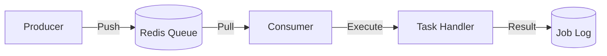

# Job Processing & Scheduling

> Fitur sistem Background Jobs untuk pemrosesan asinkron dan penjadwalan.

---

## Header & Navigasi

- [Kembali ke Ikhtisar Modul](./overview.md)
- [Link ke Spesifikasi API](../../api/background-jobs/api-background-jobs.md)
- [Link ke Skenario Pengujian](../../testing/background-jobs/test-background-jobs.md)

---

## 1. Ikhtisar Fitur (Feature Overview)

- **Deskripsi singkat fitur:** Mekanisme queue (Redis) dan cron scheduling.
- **Peran dalam modul:** Engine utama modul.
- **Nilai bisnis:** Skalabilitas dan Keandalan proses berat.

---

## 2. Cerita Pengguna (User Stories)

| ID        | Peran (Role) | Tujuan (Goal)                       | Manfaat (Benefit)                                                      |
| :-------- | :----------- | :---------------------------------- | :--------------------------------------------------------------------- |
| US-JOB-01 | Sistem       | Menjalankan report bulanan otomatis | Report tersedia tepat waktu tanpa intervensi manual.                   |
| US-JOB-02 | Developer    | Inspect fail jobs di dashboard      | Memudahkan debugging root cause kegagalan proses background.           |
| US-JOB-03 | User         | Request export data besar           | Tidak perlu menunggu loading browser, notifikasi dikirim saat selesai. |

---

## 3. Alur & Aturan Bisnis (Business Flow & Rules)

### 3.1 Alur Bisnis

#### Queue Processing

#### Task Scheduling Logic
Utilizes Cron Expressions (e.g., `0 0 * * *`) for periodic execution with Distributed Lock to prevent duplicate runs.

### 3.2 Aturan Bisnis
- **Idempotency:** Job harus aman jika di-retry.
- **Retry Mechanism:** Exponential Backoff + DLQ (Dead Letter Queue) setelah N kali gagal.
- **Timeout:** Batas waktu eksekusi wajib ada.

---

## 4. Model Data (Data Model)

- **Job Log:** Mencatat riwayat eksekusi (ID, Status, Result, Error).
- **Redis Keys:** Disimpan sebagai Hash/List di Redis.

*(Lihat ERD lengkap di Module Overview jika diperlukan)*

---

## 5. Kepatuhan & Audit (Compliance & Audit)

- **Failed Jobs:** Wajib di-log dan di-retain untuk investigasi.

---

## 6. Tugas Implementasi (Implementation Tasks)

| ID        | Platform | Status | Deskripsi                                          |
| :-------- | :------- | :----- | :------------------------------------------------- |
| JOB-BE-01 | Backend  | Todo   | Setup Infrastruktur Queue (Redis/Bull)             |
| JOB-BE-02 | Backend  | Todo   | Implementasi Base Worker Class                     |
| JOB-BE-03 | Backend  | Todo   | Setup Dashboard UI untuk Queue (misal: Bull Board) |
