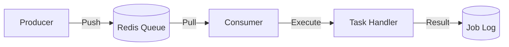
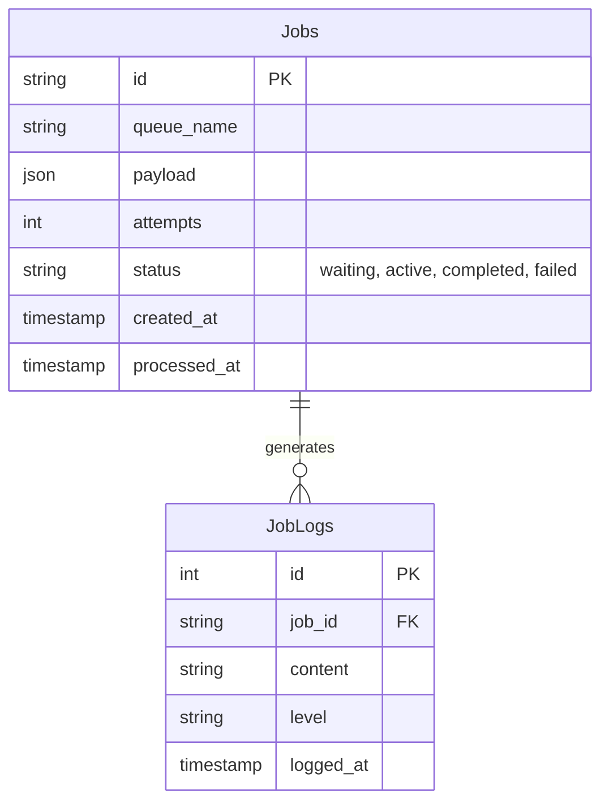

# Job Processing & Scheduling

> Fitur sistem Background Jobs untuk pemrosesan asinkron dan penjadwalan.

---

## Header & Navigation

- [Back to Module Overview](./overview.md)
- [Link to API Specification](../../api/background-jobs/api-background-jobs.md)
- [Link to Testing Scenario](../../testing/background-jobs/test-background-jobs.md)

---

## 1. Feature Overview

- **Deskripsi singkat fitur:** Menyediakan infrastruktur pemrosesan tugas asinkron (*background processing*) yang skalabel dan penjadwalan tugas (*task scheduling*) berbasis waktu.
- **Peran dalam modul:** Bertindak sebagai *central execution engine* untuk operasi *long-running* dan *deferred* guna menjaga responsivitas aplikasi utama.
- **Nilai bisnis:** Menjamin reliabilitas eksekusi proses berat, meningkatkan *throughput* sistem, dan memungkinkan skalabilitas horizontal pada layer pemrosesan.

---

## 2. User Stories

| ID        | Role      | Goal                                                                                    | Benefit                                                                                                      |
| :-------- | :-------- | :-------------------------------------------------------------------------------------- | :----------------------------------------------------------------------------------------------------------- |
| US-JOB-01 | Sistem    | Menjalankan proses agregasi laporan bulanan secara otomatis pada jadwal yang ditentukan | Memastikan ketersediaan data analitik tepat waktu tanpa intervensi manual, mengurangi risiko *human error*.  |
| US-JOB-02 | Developer | Memantau status eksekusi *job* gagal dan melakukan inspeksi *payload* melalui dashboard | Mempercepat *mean-time-to-resolution* (MTTR) untuk insiden di layer pemrosesan background.                   |
| US-JOB-03 | User      | Melakukan permintaan ekspor data volume besar secara asinkron                           | Meningkatkan *user experience* dengan menghindari *blocking* pada UI, memberikan notifikasi saat hasil siap. |

---

## 3. Business Flow & Rules

### 3.1 Business Flow

#### Queue Processing

#### Task Scheduling Logic
Utilizes Cron Expressions (e.g., `0 0 * * *`) for periodic execution with Distributed Lock to prevent duplicate runs.

### 3.2 Business Rules
- **Idempotency:** Job harus aman jika di-retry.
- **Retry Mechanism:** Exponential Backoff + DLQ (Dead Letter Queue) setelah N kali gagal.
- **Timeout:** Batas waktu eksekusi wajib ada.

---

## 4. Data Model

- **Job Log:** Mencatat riwayat eksekusi (ID, Status, Result, Error).
- **Redis Keys:** Disimpan sebagai Hash/List di Redis.

---

## 5. Compliance & Audit

- **Failed Jobs:** Wajib di-log dan di-retain untuk investigasi.

---

## 6. Implementation Tasks

| ID        | Platform | Status | Deskripsi                                          |
| :-------- | :------- | :----- | :------------------------------------------------- |
| JOB-BE-01 | Backend  | Todo   | Setup Infrastruktur Queue (Redis/Bull)             |
| JOB-BE-02 | Backend  | Todo   | Implementasi Base Worker Class                     |
| JOB-BE-03 | Backend  | Todo   | Setup Dashboard UI untuk Queue (misal: Bull Board) |
