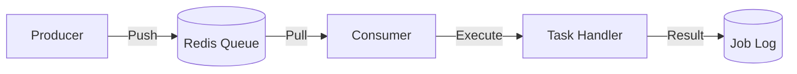

# Feature Specification: Job Processing & Scheduling

> Dokumen ini merinci logika dan spesifikasi sistem Background Jobs (Queue & Scheduler).

---

## Header & Navigation

- [Back to Module Overview](./overview.md)
- [Link ke API Specification](../../api/background-jobs/api-background-jobs.md)

---

## 1. Feature: Queue Processing

### 1.1 Description
Mekanisme pemrosesan tugas asinkron untuk menjaga responsivitas API.

### 1.2 Business Logic
1.  **Enqueue:** Producer (API) mengirim job ke Redis.
2.  **Process:** Worker mengambil job dari Redis.
3.  **Ack/Fail:** Worker menandai job selesai atau gagal.

### 1.3 Retry Mechanism
- Exponential Backoff: Delay bertingkat (1s, 2s, 4s...) untuk retry.
- Dead Letter Queue (DLQ): Job yang gagal N kali dipindah ke DLQ untuk inspeksi manual.

---

## 2. Feature: Task Scheduling

### 2.1 Description
Penjadwalan tugas berulang (Cron Jobs).

### 2.2 Logic
- Menggunakan library scheduler (cth: Bull/Agenda).
- Job didefinisikan dengan Cron Expression (misal: `0 0 * * *` untuk daily midnight).
- Menjamin *single execution* (lock mechanism) agar tidak duplikat jika multiple instances berjalan.

---
