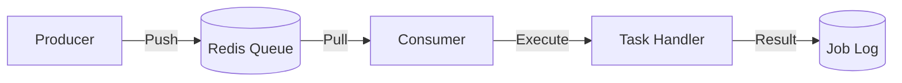
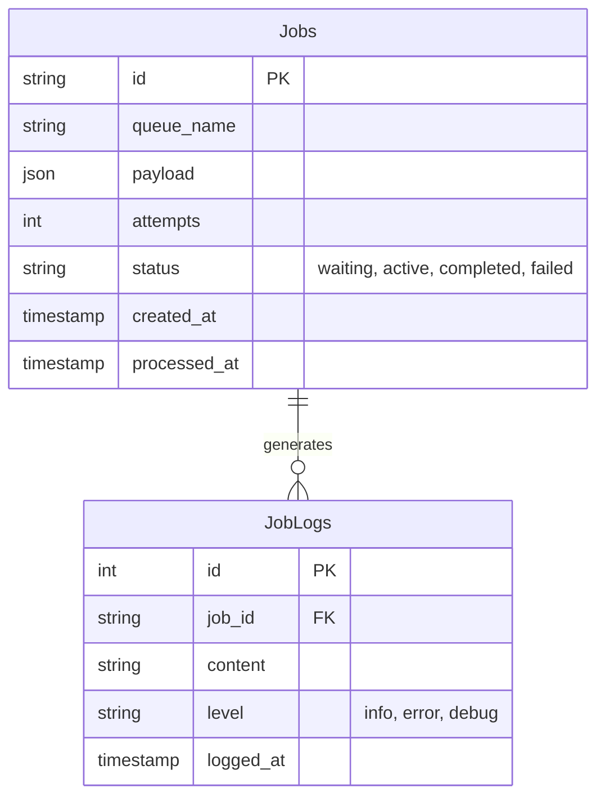

# Job Processing & Scheduling

> Fitur sistem Background Jobs untuk pemrosesan asinkron dan penjadwalan.

---

## Header & Navigation

- [Back to Module Overview](./overview.md)
- [Link to API Specification](../../api/background-jobs/api-background-jobs.md)
- [Link to Testing Scenario](../../testing/background-jobs/test-background-jobs.md)

---

## 1. Feature Overview

- **Deskripsi singkat fitur:** Menyediakan infrastruktur pemrosesan tugas asinkron (*background processing*) yang skalabel dan penjadwalan tugas (*task scheduling*) berbasis waktu.
- **Peran dalam modul:** Bertindak sebagai *central execution engine* untuk operasi *long-running* dan *deferred* guna menjaga responsivitas aplikasi utama.
- **Nilai bisnis:** Menjamin reliabilitas eksekusi proses berat, meningkatkan *throughput* sistem, dan memungkinkan skalabilitas horizontal pada layer pemrosesan.

---

### US-JOB-01 — Menjalankan Report Bulanan Otomatis

**Sebagai** Sistem
**Saya ingin** menjalankan report bulanan otomatis
**Sehingga** data tersedia tepat waktu tanpa intervensi manual

**Acceptance Criteria:**

* Job berjalan sesuai cron (tgl 1, 00:00)
* Retry otomatis jika transient error
* Notifikasi admin jika failed status
* Data tersimpan di DB Report

### US-JOB-02 — Inspect Failed Jobs

**Sebagai** Developer
**Saya ingin** inspect failed jobs
**Sehingga** debugging root cause lebih mudah

**Acceptance Criteria:**

* Dashboard menampilkan list DLQ
* Payload & Stack trace terlihat
* Button retry manual berfungsi
* Filter by type & time

### US-JOB-03 — Request Export Data Besar

**Sebagai** User
**Saya ingin** request export data besar
**Sehingga** browser tidak hanging menunggu proses

**Acceptance Criteria:**

* Notifikasi sukses/gagal dikirim via email
* UI non-blocking
* Link download valid 24 jam
* Format file sesuai (PDF/Excel)

---

## 3. Business Flow & Rules

### 3.1 Business Flow

#### Queue Processing

#### Task Scheduling Logic
Utilizes Cron Expressions (e.g., `0 0 * * *`) for periodic execution with Distributed Lock to prevent duplicate runs.

### 3.2 Business Rules
- **Idempotency:** Job harus aman jika di-retry.
- **Retry Mechanism:** Exponential Backoff + DLQ (Dead Letter Queue) setelah N kali gagal.
- **Timeout:** Batas waktu eksekusi wajib ada.

---

## 4. Data Model

> Diagram Entity Relationship untuk Job Processing.

---

## 5. Compliance & Audit

- **Failed Jobs:** Wajib di-log dan di-retain untuk investigasi.

---

## 6. Implementation Tasks

### 6.1 Backend

| Task ID   | Component      | Status | Description                                     |
| :-------- | :------------- | :----- | :---------------------------------------------- |
| JOB-BE-01 | Infrastructure | Todo   | Setup Queue Driver (Redis/Bull) & Config.       |
| JOB-BE-02 | Service        | Todo   | Implement `JobService` (Dispatch logic).        |
| JOB-BE-03 | Worker         | Todo   | Implement Base Worker Class & Error Handling.   |
| JOB-BE-04 | Worker         | Todo   | Create `MonthlyReportJob` (Scheduled).          |
| JOB-BE-05 | Worker         | Todo   | Create `DataExportJob` (Long running).          |
| JOB-BE-06 | Dashboard      | Todo   | Setup Bull Board (Authentication middleware).   |
| JOB-BE-07 | Routes         | Todo   | Register API logs inspection routes (Optional). |
| JOB-BE-08 | Tests          | Todo   | Create job processing tests.                    |

### 6.2 Frontend

| Task ID   | Component    | Status | Description                                        |
| :-------- | :----------- | :----- | :------------------------------------------------- |
| JOB-FE-01 | Monitoring   | Todo   | Integrate Bull Board into Admin Panel iframe/link. |
| JOB-FE-02 | Notification | Todo   | Handle "Export Ready" notification.                |
