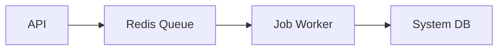

# Ikhtisar Modul: Background Jobs

> Modul infrastruktur untuk pemrosesan asinkron dan terjadwal.

---

## Header & Navigasi

- [Kembali ke Daftar Modul](../../../README.md)
- [Link ke Skenario Pengujian](../../testing/background-jobs/test-background-jobs.md)

---

## 1. Pengantar Modul

### 1.1 Deskripsi Singkat
Modul ini menangani antrian tugas (Queue) dan penjadwalan (Scheduler) untuk mengurangi beban server API utama dan menangani proses yang memakan waktu lama.

### 1.2 Posisi & Peran
- **Tipe:** Support Module.
- **Value:** Performance & Scalability.

---

## 2. Daftar Fitur (Feature List)

| Fitur                                 | Deskripsi                     | Status |
| :------------------------------------ | :---------------------------- | :----- |
| [Job Processing](./job-processing.md) | Queue Worker & Cron Scheduler | Stable |

---

## 3. Arsitektur Level Tinggi

---

## 4. Ketergantungan Global

- **Configuration:** Redis Config.
- **Notification:** Mengirim alert jika job gagal (Optional).

---
