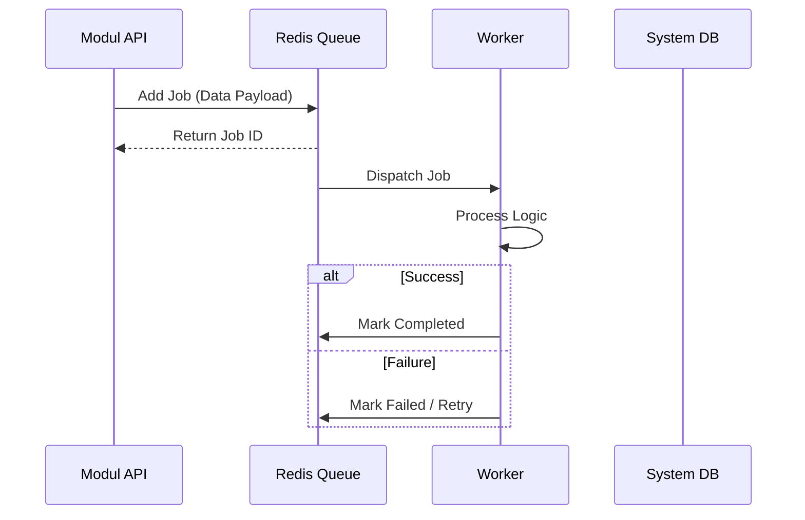
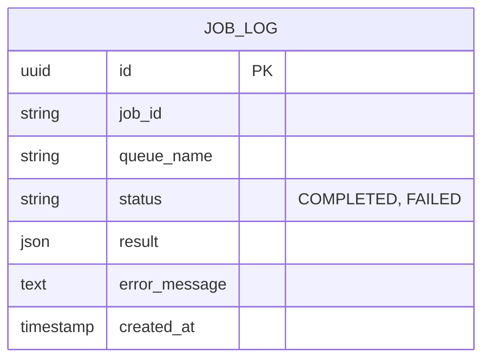

# Ikhtisar Modul: Background Jobs

- [Kembali ke Ikhtisar Modul](#)
- [Link ke Semua Modul](../../../README.md)
- [Link ke Skenario Pengujian](../../../testing/background-jobs/test-background-jobs.md)

---

## 1. Ikhtisar Modul (Module Overview)

- **Deskripsi singkat modul:** Modul Background Jobs bertanggung jawab untuk menangani pemrosesan tugas asinkron, penjadwalan (scheduled tasks), dan pengelolaan antrian (queue management).
- **Posisi modul dalam sistem:** Supporting Core Module. Digunakan oleh modul lain (Notification, Report Generation, Data Export) untuk offload tugas berat.
- **Hubungan dengan domain bisnis utama:** Meningkatkan responsivitas aplikasi dengan memindahkan proses berat ke background worker.

---

## 2. Tujuan & Nilai Bisnis (Purpose & Business Value)

### 2.1 Tanggung Jawab Utama
- Mengelola antrian job (Redis Queue / BullMQ).
- Menjalankan Scheduled Cron Jobs.
- Mekanisme Retry dan Penanganan Error untuk job gagal.
- Monitoring status job (Completed, Failed, Retrying).

### 2.2 Nilai Bisnis
- **Efisiensi Operasional (Operational efficiency):** Server API tidak terbebani oleh proses long-running.
- **Keandalan (Reliability):** Job yang gagal bisa diulang otomatis tanpa kehilangan data.
- **Skalabilitas (Scalability):** Worker bisa di-scale independent dari API server.

---

## 3. Lingkup (Scope)

### 3.1 Dalam Lingkup (In-Scope)
- API Enqueueing Job.
- Dashboard Monitoring Queue (misal: Bull Board).
- Definisi Pemroses Job (Processors): Email, Export, Cleanup.
- Tugas Terjadwal (Scheduled Tasks): Laporan Harian, Pembersihan Bulanan.

### 3.2 Di Luar Lingkup (Out-of-Scope)
- Logika bisnis spesifik job (misal: logika render PDF ada di modul Report, Background Job hanya menjalankannya).

---

## 4. Cerita Pengguna (User Stories)

| ID        | Peran (Role) | Tujuan (Goal)                       | Manfaat (Benefit)                                                      |
| :-------- | :----------- | :---------------------------------- | :--------------------------------------------------------------------- |
| US-JOB-01 | Sistem       | Menjalankan report bulanan otomatis | Report tersedia tepat waktu tanpa intervensi manual.                   |
| US-JOB-02 | Developer    | Inspect fail jobs di dashboard      | Memudahkan debugging root cause kegagalan proses background.           |
| US-JOB-03 | User         | Request export data besar           | Tidak perlu menunggu loading browser, notifikasi dikirim saat selesai. |

---

## 5. Alur & Aturan Bisnis (Business Flow & Rules)

### 5.1 Alur Bisnis (Business Flow)

#### Job Processing Flow

### 5.2 Aturan Bisnis

#### 5.2.1 Aturan Domain
- **Idempotency:** Job harus dirancang agar aman jika dijalankan ulang (misal: jangan kirim email 2x jika retry).
- **Timeout:** Setiap job harus punya batas waktu eksekusi (timeout) agar worker tidak hang.

---

## 6. Model Data (Data Model)

### 6.1 Entity Relationship Diagram (ERD)

Kebanyakan data disimpan di Redis (Transient), namun status log mungkin disimpan di DB.

---

## 7. Spesifikasi API (API Specification)

> Detail spesifikasi API dipisahkan ke dalam dokumen tersendiri di folder `.agent/documents/api/background-jobs/`.
> Silakan rujuk ke file Spesifikasi API terkait.

- [Link ke Spesifikasi API](../../../api/background-jobs/api-background-jobs.md)

---

## 8. Ketergantungan (Dependencies)

### 8.1 Modul yang Dibutuhkan
- **Configuration:** Untuk Redis Connection string.

---

## 9. Titik Integrasi (Integration Points)

### 9.1 Integrasi Masuk
- **Modul Sumber:** Semua Modul.
- **Pola Integrasi:** Message Queue (Redis).

---

## 10. Kepatuhan & Audit

### 10.1 Kebutuhan Jejak Audit
- Log job yang gagal harus di-arsip untuk investigasi.

---

## 11. Tugas Implementasi (Implementation Tasks)

| ID Tugas  | Platform | Status | Deskripsi                                          |
| :-------- | :------- | :----- | :------------------------------------------------- |
| JOB-BE-01 | Backend  | Todo   | Setup Infrastruktur Queue (Redis/Bull)             |
| JOB-BE-02 | Backend  | Todo   | Implementasi Base Worker Class                     |
| JOB-BE-03 | Backend  | Todo   | Setup Dashboard UI untuk Queue (misal: Bull Board) |
