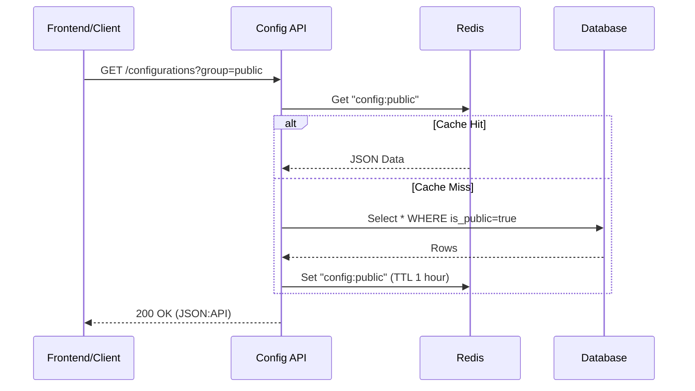
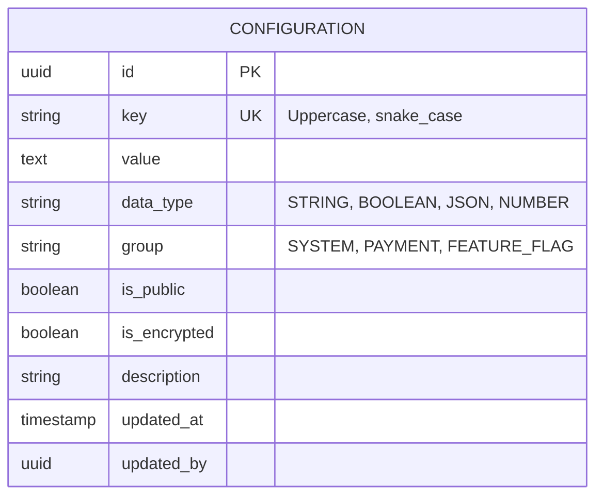

# Module Overview: Configuration System

- [Back to Module Overview](#)
- [Link ke All Modules](../../../README.md)
- [Link ke Scenario Testing](../../testing/configuration/test-configuration.md)

---

## 1. Module Overview

- **Deskripsi singkat modul:** Modul Configuration menyediakan mekanisme terpusat untuk mengelola pengaturan sistem, feature flags, dan parameter aplikasi secara dinamis tanpa perlu melakukan deployment ulang.
- **Posisi modul dalam sistem:** Core / Supporting Module. Menjadi *source of truth* bagi perilaku aplikasi yang dapat dikonfigurasi.
- **Hubungan dengan domain bisnis utama:** Mendukung fleksibilitas operasional dan *Continuous Delivery* melalui feature toggles.

---

## 2. Purpose & Business Value

### 2.1 Tanggung Jawab Utama
- Menyimpan konfigurasi global (misal: Maintenance Mode, Limit Transaksi).
- Mengelola Feature Flags (untuk A/B testing atau roll-out bertahap).
- Menyediakan API bagi Frontend/Mobile untuk mengambil konfigurasi saat runtime.
- Enkripsi nilai sensitif (jika disimpan di DB, meski sebaiknya ENV digunakan untuk rahasia level infrastruktur).

### 2.2 Nilai Bisnis
- **Operational efficiency:** Tim Ops/Admin bisa ubah parameter bisnis tanpa bantuan developer.
- **Risk reduction:** Kill-switch fitur bermasalah secara instan via Feature Flag.
- **Strategic enablement:** Canary release fitur baru ke sebagian user saja.

---

## 3. Scope

### 3.1 In-Scope
- CRUD Konfigurasi (Key-Value pairs).
- Tipe data konfigurasi (String, Boolean, Number, JSON).
- Public vs Private Config (mana yang boleh diekspos ke publik/frontend).
- Caching mechanism (Redis) untuk performa tinggi.
- Audit log perubahan konfigurasi.

### 3.2 Out-of-Scope
- Penyimpanan Credentials infrastruktur (Database URL, AWS Keys) -> Sebaiknya via Environment Variables / Vault.
- User Preferences (ini masuk ke modul User/Notification).

---

## 4. User Stories

| ID        | Role          | Goal                                  | Benefit                                                    |
| :-------- | :------------ | :------------------------------------ | :--------------------------------------------------------- |
| US-CFG-01 | Admin         | Mengaktifkan "Maintenance Mode"       | Mencegah akses user saat perbaikan database.               |
| US-CFG-02 | Product Owner | Menyalakan fitur baru untuk 50% user  | A/B testing fitur baru.                                    |
| US-CFG-03 | Frontend App  | Mengambil list support contact number | Contact center bisa diubah tanpa update aplikasi di store. |
| US-CFG-04 | System        | Cache konfigurasi di memory           | Mengurangi load database pada high traffic.                |

---

## 5. Business Flow & Rules

### 5.1 Business Flow

#### Fetch Configuration Flow

### 5.2 Business Rules & Functional Requirements

#### 5.2.1 Domain Rules
- **Key Uniqueness:** Key konfigurasi harus unik (misal: `PAYMENT_GATEWAY_TIMEOUT`).
- **Immutability:** Key tidak boleh diubah namanya setelah dibuat (hanya value yang boleh berubah), untuk menjaga kompatibilitas kode.

#### 5.2.2 Financial / Operational Rules
- Perubahan pada konfigurasi kritikal (misal: fee transaksi) memerlukan *Approval* (Maker-Checker principle) - *Optional feature*.

---

## 6. Data Model

### 6.1 Entity Relationship Diagram (ERD)

### 6.2 Entity Definition
- **Key:** Identifier unik, misal `SYSTEM_MAINTENANCE_MODE`.
- **Value:** Nilai, disimpan sebagai text, di-cast sesuai `data_type` saat diambil.
- **Is Public:** Menentukan apakah boleh dikirim ke endpoint publik (tanpa auth atau user token biasa).

---

## 7. API Specification

> Detail spesifikasi API dipisahkan ke dalam dokumen tersendiri di folder `.agent/api/configuration/`.

- [Link ke API Specification](../../api/configuration/api-configurations.md)

---

## 8. Dependencies

### 8.1 Required Modules
- **IAM Module:** Untuk otorisasi Admin saat mengubah konfigurasi.

### 8.2 Optional Modules
- None.

---

## 9. Integration Points

### 9.1 Inbound Integration
- **Source:** All Modules.
- **Data:** Membaca config via internal service method (bukan HTTP call jika satu monolith).
- **Pattern:** Library call / Dependency Injection.

### 9.2 Outbound Integration
- None.

---

## 10. Compliance & Audit

### 10.1 Audit Trail Requirements
- Setiap perubahan value **WAJIB** dicatat: `old_value`, `new_value`, `actor`, `timestamp`.

---

## 11. Data Ownership & Lifecycle

### 11.1 Entity Ownership
- **Owner:** Tech Lead / Product Owner.
- **Write:** Admin (Super Admin).

---

## 12. Extensibility Notes

### 12.1 Configuration
- Module ini sendiri adalah pusat konfigurasi.

---

## 13. Mandatory Invariants
- Configuration Key `SYSTEM_MAINTENANCE_MODE` harus selalu ada dengan default `false`.

---

## 14. UI/UX Requirements

### 14.1 Web / Admin
- Table view semua konfigurasi dengan fitur search/filter.
- Edit modal dengan validasi tipe data (misal: jika Boolean, tampilkan Toggle Switch).

---

## 15. Implementation Tasks

**Strict Rule:** Every backend task that involves a user interface must have a corresponding frontend task.

| Task ID   | Platform | Status | Description                                   |
| :-------- | :------- | :----- | :-------------------------------------------- |
| CFG-BE-01 | Backend  | Todo   | Create Configuration Table & CRUD API         |
| CFG-BE-02 | Backend  | Todo   | Implement Caching Layer (Redis)               |
| CFG-BE-03 | Backend  | Todo   | Implement Public Endpoint for FE              |
| CFG-FE-01 | Frontend | Todo   | Create Admin Config Management Page           |
| CFG-FE-02 | Frontend | Todo   | Integrate Global State with Public Config API |
