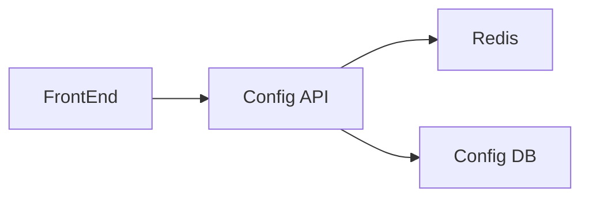

# Ikhtisar Modul: Configuration

> Modul untuk pengaturan sistem dinamis dan feature switching.

---

## Header & Navigasi

- [Kembali ke Daftar Modul](../../../README.md)
- [Link ke Skenario Pengujian](../../testing/configuration/test-configuration.md)

---

## 1. Pengantar Modul

### 1.1 Deskripsi Singkat
Modul Configuration menyediakan mekanisme terpusat untuk mengelola pengaturan sistem, feature flags, dan parameter aplikasi secara dinamis tanpa perlu deploy ulang.

### 1.2 Posisi & Peran
- **Tipe:** Core Module.
- **Value:** Operational Efficiency & Reliability.

---

## 2. Daftar Fitur (Feature List)

| Fitur                                      | Deskripsi                                | Status |
| :----------------------------------------- | :--------------------------------------- | :----- |
| [System Configuration](./system-config.md) | Manajemen Dynamic Config & Feature Flags | Stable |

---

## 3. Arsitektur Level Tinggi

---

## 4. Ketergantungan Global

- **Database:** PostgreSQL.
- **Cache:** Redis (Critical for performance).
- **IAM:** Untuk otorisasi Admin.

---
