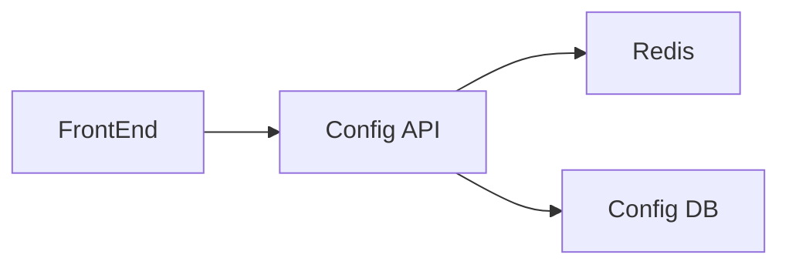

# Module Overview: Configuration

> Modul untuk pengaturan sistem dinamis dan feature switching.

---

## Header & Navigation

- [Back to Module List](../../../README.md)
- [Link to Testing Scenario](../../testing/configuration/test-configuration.md)

---

## 1. Module Introduction

### 1.1 Brief Description
Modul Configuration menyediakan mekanisme terpusat untuk mengelola pengaturan sistem, feature flags, dan parameter aplikasi secara dinamis tanpa perlu deploy ulang.

### 1.2 Position & Role
- **Tipe:** Core Module.
- **Value:** Operational Efficiency & Reliability.

---

## 2. Feature List

| Fitur                                      | Deskripsi                                | Status |
| :----------------------------------------- | :--------------------------------------- | :----- |
| [System Configuration](./system-config.md) | Manajemen Dynamic Config & Feature Flags | Stable |

---

## 3. High-Level Architecture

---

## 4. Global Dependencies

- **Database:** PostgreSQL.
- **Cache:** Redis (Critical for performance).
- **IAM:** Untuk otorisasi Admin.

---
