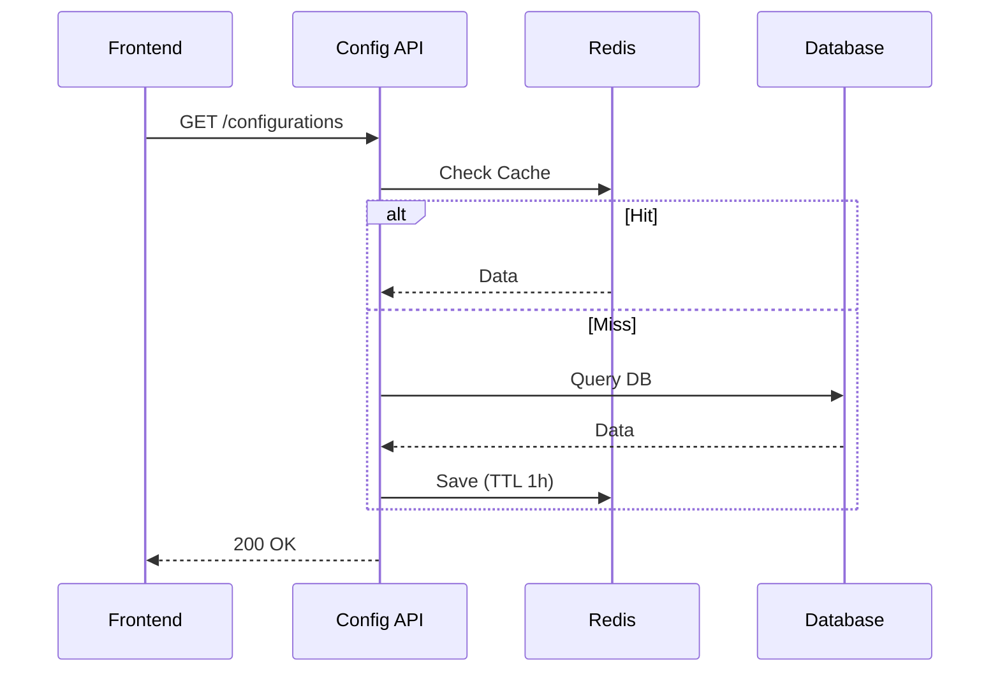
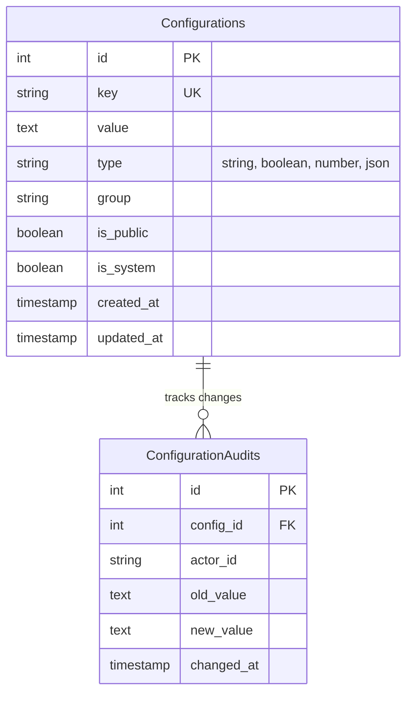

# System Configuration

> Fitur untuk mengelola pengaturan sistem terpusat, feature flags, dan parameter aplikasi dinamis.

---

## Header & Navigation

- [Back to Module Overview](./overview.md)
- [Link to API Specification](../../api/configuration/api-configurations.md)
- [Link to Testing Scenario](../../testing/configuration/test-configuration.md)

---

## 1. Feature Overview

- **Deskripsi singkat fitur:** Menyediakan layanan manajemen konfigurasi terpusat yang mendukung penyimpanan Key-Value statis dan dinamis dengan strategi *caching* berlapis.
- **Peran dalam modul:** Bertindak sebagai *dynamic control plane* yang memungkinkan perubahan perilaku aplikasi secara *runtime* tanpa perlu *redeployment*.
- **Nilai bisnis:** Meningkatkan *business agility* melalui kapabilitas *feature toggling* (A/B testing) dan *live configuration updates* yang aman.

---

## 2. User Stories

### US-CFG-01 — Maintenance Mode

**Sebagai** Admin
**Saya ingin** mengaktifkan "Maintenance Mode" secara global
**Sehingga** user tidak mengakses sistem saat perbaikan database

**Acceptance Criteria:**

* Switch On/Off available in Admin Panel
* API returns 503 (except whitelist)
* Informatif maintenance page
* Audit log recorded

### US-CFG-02 — Feature Flag (Canary/A-B Testing)

**Sebagai** Product Owner
**Saya ingin** enable feature flag (Canary)
**Sehingga** validasi fitur baru sebelum rilis global

**Acceptance Criteria:**

* Config rollout percentage (e.g. 50%)
* Whitelist User ID
* Toggle runtime tanpa redeploy
* Otomatis aktif/nonaktif sesuai logic

### US-CFG-03 — Dynamic Contact Info

**Sebagai** Frontend App
**Saya ingin** fetch config contacts dynamic
**Sehingga** informasi layanan pelanggan selalu akurat

**Acceptance Criteria:**

* API return JSON contact info
* Client-side caching
* Real-time update reflection

### US-CFG-04 — Configuration Caching

**Sebagai** Sistem
**Saya ingin** caching configuration
**Sehingga** kurangi beban DB saat high traffic

**Acceptance Criteria:**

* Read-through caching (Redis)
* Auto-invalidation on Update
* TTL fallback wajar
* Latency < 50ms

---

## 3. Business Flow & Rules

### 3.1 Business Flow

#### Fetch Configuration Flow

### 3.2 Business Rules
- **Immutability:** Key tidak boleh diubah namanya setelah dibuat.
- **Data Types:** Supports String, Boolean, Number, JSON.
- **Cache Invalidation:** Update DB -> Hapus Cache Key.

---

## 4. Data Model

- **Configuration:** Key (Unique), Value, Type (String/Bool/JSON/Number), IsPublic, Group.

---

## 5. Compliance & Audit

- **Audit Trail:** Mencatat `old_value`, `new_value`, `actor` saat update konfigurasi.

---

## 6. Implementation Tasks

### 6.1 Backend

| Task ID   | Component  | Status | Description                                                  |
| :-------- | :--------- | :----- | :----------------------------------------------------------- |
| CFG-BE-01 | Migration  | Todo   | Create `configurations` and `configuration_audits` tables.   |
| CFG-BE-02 | Model      | Todo   | Setup `Configuration` model (Casts, Auditable).              |
| CFG-BE-03 | Service    | Todo   | Implement `ConfigService` with Redis Caching (Read-through). |
| CFG-BE-04 | Controller | Todo   | Implement `ConfigController` (CRUD Admin & Public Fetch).    |
| CFG-BE-05 | Routes     | Todo   | Register API routes.                                         |
| CFG-BE-06 | Tests      | Todo   | Create Unit Test (Cache Logic) and Feature Test.             |

### 6.2 Frontend

| Task ID   | Component   | Status | Description                                         |
| :-------- | :---------- | :----- | :-------------------------------------------------- |
| CFG-FE-01 | API Service | Todo   | Create `ConfigService` wrapper.                     |
| CFG-FE-02 | State       | Todo   | Setup Global Config Store (Pinia) to fetch on boot. |
| CFG-FE-03 | Page        | Todo   | Create Admin `ConfigManager` page.                  |
| CFG-FE-04 | Component   | Todo   | Create `ConfigEditor` form with type validation.    |
