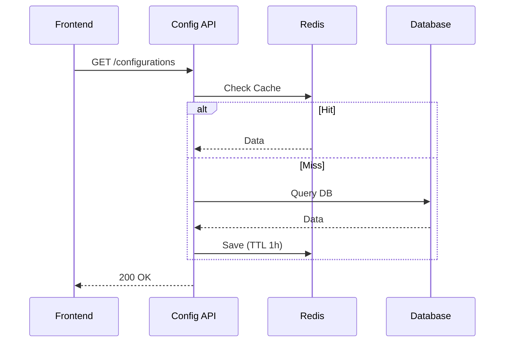

# System Configuration

> Fitur untuk mengelola pengaturan sistem terpusat, feature flags, dan parameter aplikasi dinamis.

---

## Header & Navigation

- [Back to Module Overview](./overview.md)
- [Link to API Specification](../../api/configuration/api-configurations.md)
- [Link to Testing Scenario](../../testing/configuration/test-configuration.md)

---

## 1. Feature Overview

- **Deskripsi singkat fitur:** Manajemen Key-Value pair statis dan dinamis dengan dukungan caching.
- **Peran dalam modul:** Inti dari fleksibilitas operasional aplikasi.
- **Nilai bisnis:** Memungkinkan perubahan perilaku sistem tanpa deployment dan mendukung A/B Testing via Feature Flags.

---

## 2. User Stories

| ID        | Peran (Role)  | Tujuan (Goal)                         | Manfaat (Benefit)                                          |
| :-------- | :------------ | :------------------------------------ | :--------------------------------------------------------- |
| US-CFG-01 | Admin         | Mengaktifkan "Maintenance Mode"       | Mencegah akses user saat perbaikan database.               |
| US-CFG-02 | Product Owner | Menyalakan fitur baru untuk 50% user  | A/B testing fitur baru.                                    |
| US-CFG-03 | Frontend App  | Mengambil list support contact number | Contact center bisa diubah tanpa update aplikasi di store. |
| US-CFG-04 | System        | Cache konfigurasi di memory           | Mengurangi load database pada high traffic.                |

---

## 3. Business Flow & Rules

### 3.1 Business Flow

#### Fetch Configuration Flow

### 3.2 Business Rules
- **Immutability:** Key tidak boleh diubah namanya setelah dibuat.
- **Data Types:** Supports String, Boolean, Number, JSON.
- **Cache Invalidation:** Update DB -> Hapus Cache Key.

---

## 4. Data Model

- **Configuration:** Key (Unique), Value, Type (String/Bool/JSON/Number), IsPublic, Group.

*(Lihat ERD lengkap di Module Overview jika ada)*

---

## 5. Compliance & Audit

- **Audit Trail:** Mencatat `old_value`, `new_value`, `actor` saat update konfigurasi.

---

## 6. Implementation Tasks

| ID     | Platform | Status | Deskripsi                             |
| :----- | :------- | :----- | :------------------------------------ |
| CFG-01 | Backend  | Todo   | Create Configuration Table & CRUD API |
| CFG-02 | Backend  | Todo   | Implement Caching Layer (Redis)       |
| CFG-03 | Frontend | Todo   | Create Admin Config Management Page   |
