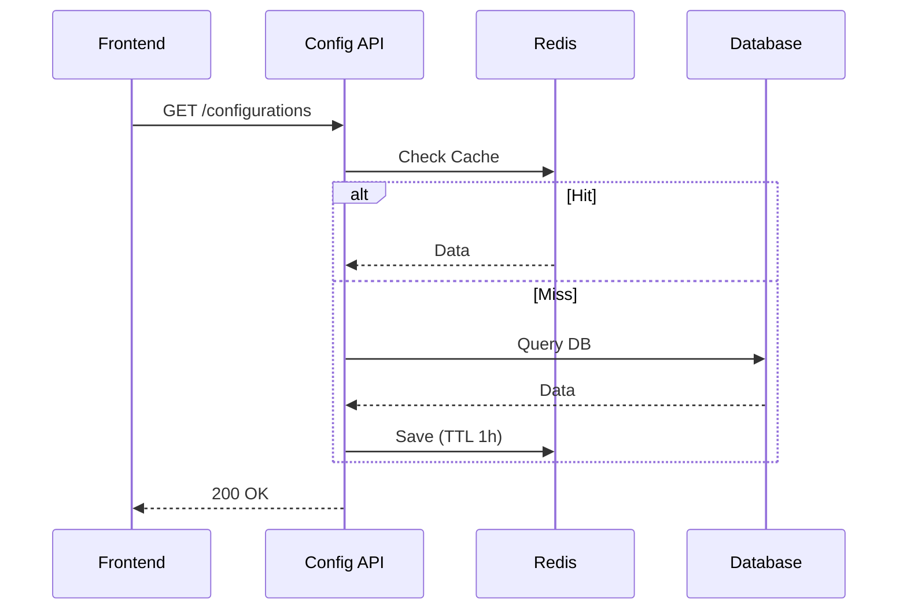
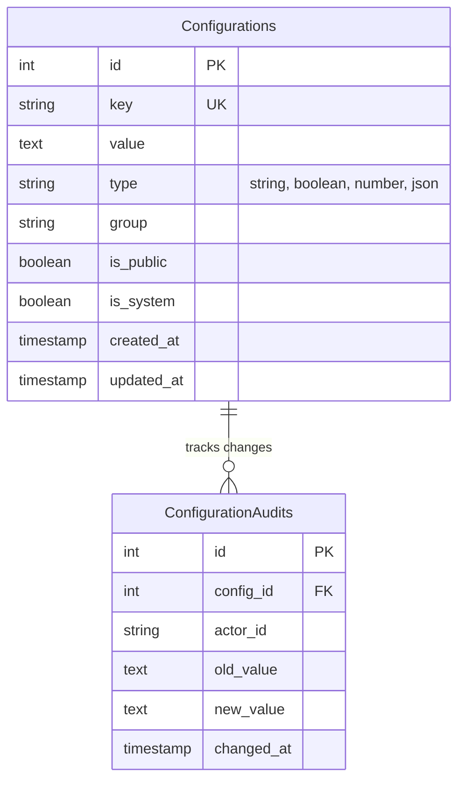

# System Configuration

> Fitur untuk mengelola pengaturan sistem terpusat, feature flags, dan parameter aplikasi dinamis.

---

## Header & Navigation

- [Back to Module Overview](./overview.md)
- [Link to API Specification](../../api/configuration/api-configurations.md)
- [Link to Testing Scenario](../../testing/configuration/test-configuration.md)

---

## 1. Feature Overview

- **Deskripsi singkat fitur:** Menyediakan layanan manajemen konfigurasi terpusat yang mendukung penyimpanan Key-Value statis dan dinamis dengan strategi *caching* berlapis.
- **Peran dalam modul:** Bertindak sebagai *dynamic control plane* yang memungkinkan perubahan perilaku aplikasi secara *runtime* tanpa perlu *redeployment*.
- **Nilai bisnis:** Meningkatkan *business agility* melalui kapabilitas *feature toggling* (A/B testing) dan *live configuration updates* yang aman.

---

## 2. User Stories

### US-CFG-01 — Maintenance Mode

**Sebagai** Admin
**Saya ingin** mengaktifkan "Maintenance Mode" secara global
**Sehingga** user tidak mengakses sistem saat perbaikan database

**Acceptance Criteria:**

* Switch On/Off tersedia di Admin Panel
* Semua request API (kecuali whitelist IP) mengembalikan 503 Service Unavailable
* Halaman maintenance informatif ditampilkan ke user
* Perubahan status dicatat di audit log

### US-CFG-02 — Feature Flag (Canary/A-B Testing)

**Sebagai** Product Owner
**Saya ingin** menyalakan fitur baru hanya untuk sebagian user
**Sehingga** saya dapat memvalidasi fitur sebelum rilis global

**Acceptance Criteria:**

* Konfigurasi rollout percentage (misal: 50%)
* Konfigurasi whitelist user ID spesifik
* Fitur otomatis aktif/nonaktif sesuai logic flag di runtime
* Tidak perlu redeploy untuk mengubah toggle

### US-CFG-03 — Dynamic Contact Info

**Sebagai** Frontend App
**Saya ingin** mengambil daftar kontak bantuan terbaru dari server
**Sehingga** informasi layanan pelanggan selalu akurat

**Acceptance Criteria:**

* API endpoint mengembalikan JSON konfigurasi kontak
* Data di-cache di sisi client untuk performa
* Perubahan di server terefleksi di client tanpa update aplikasi

### US-CFG-04 — Configuration Caching

**Sebagai** Sistem
**Saya ingin** menyimpan konfigurasi aktif di memori (cache)
**Sehingga** beban database berkurang saat trafik tinggi

**Acceptance Criteria:**

* Read-through caching strategy (Redis)
* Cache invalidation otomatis saat config di-update di DB
* TTL (Time To Live) yang wajar sebagai fallback
* Response time API config < 50ms

---

## 3. Business Flow & Rules

### 3.1 Business Flow

#### Fetch Configuration Flow

### 3.2 Business Rules
- **Immutability:** Key tidak boleh diubah namanya setelah dibuat.
- **Data Types:** Supports String, Boolean, Number, JSON.
- **Cache Invalidation:** Update DB -> Hapus Cache Key.

---

## 4. Data Model

- **Configuration:** Key (Unique), Value, Type (String/Bool/JSON/Number), IsPublic, Group.

---

## 5. Compliance & Audit

- **Audit Trail:** Mencatat `old_value`, `new_value`, `actor` saat update konfigurasi.

---

## 6. Implementation Tasks

| ID     | Platform | Status | Deskripsi                             |
| :----- | :------- | :----- | :------------------------------------ |
| CFG-01 | Backend  | Todo   | Create Configuration Table & CRUD API |
| CFG-02 | Backend  | Todo   | Implement Caching Layer (Redis)       |
| CFG-03 | Frontend | Todo   | Create Admin Config Management Page   |
