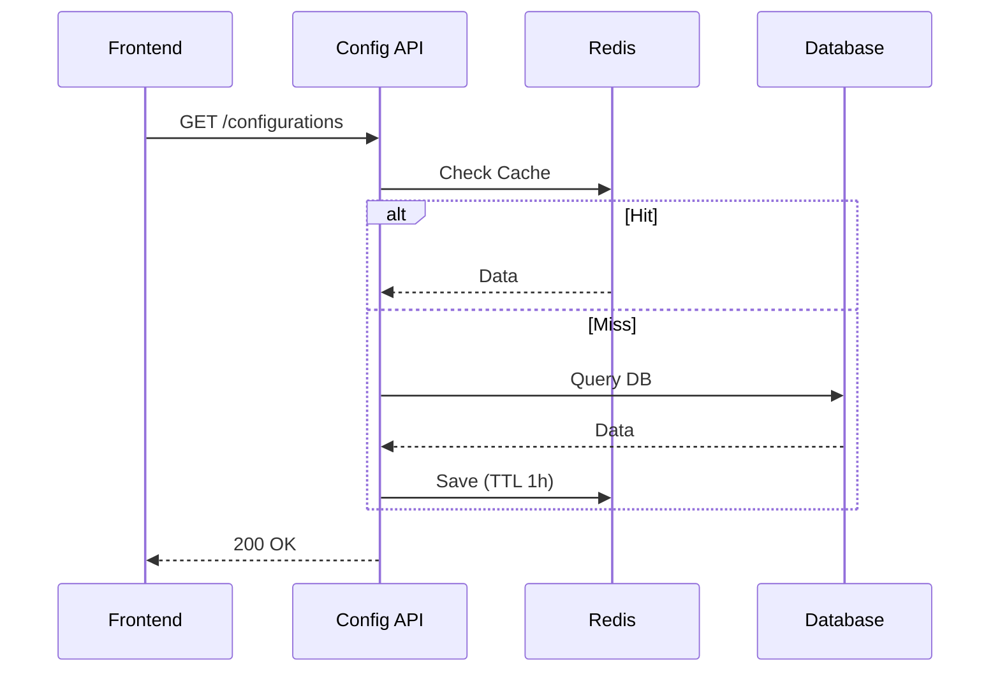
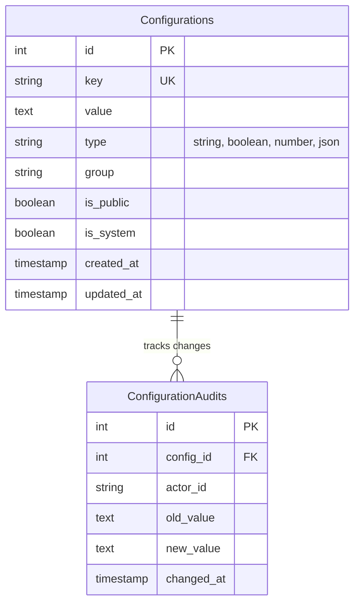

# System Configuration

> Fitur untuk mengelola pengaturan sistem terpusat, feature flags, dan parameter aplikasi dinamis.

---

## Header & Navigation

- [Back to Module Overview](./overview.md)
- [Link to API Specification](../../api/configuration/api-configurations.md)
- [Link to Testing Scenario](../../testing/configuration/test-configuration.md)

---

## 1. Feature Overview

- **Deskripsi singkat fitur:** Menyediakan layanan manajemen konfigurasi terpusat yang mendukung penyimpanan Key-Value statis dan dinamis dengan strategi *caching* berlapis.
- **Peran dalam modul:** Bertindak sebagai *dynamic control plane* yang memungkinkan perubahan perilaku aplikasi secara *runtime* tanpa perlu *redeployment*.
- **Nilai bisnis:** Meningkatkan *business agility* melalui kapabilitas *feature toggling* (A/B testing) dan *live configuration updates* yang aman.

---

## 2. User Stories

| ID        | Peran (Role)  | Tujuan (Goal)                                                                      | Manfaat (Benefit)                                                                                           |
| :-------- | :------------ | :--------------------------------------------------------------------------------- | :---------------------------------------------------------------------------------------------------------- |
| US-CFG-01 | Admin         | Mengaktifkan "Maintenance Mode" secara global melalui dashboard admin              | Membatasi akses pengguna selama jendela pemeliharaan kritis untuk mencegah korupsi data.                    |
| US-CFG-02 | Product Owner | Mengelola peluncuran fitur baru secara bertahap (*canary release*) ke 50% pengguna | Meminimalkan risiko dampak negatif peluncuran fitur baru melalui validasi pasar yang terkontrol.            |
| US-CFG-03 | Frontend App  | Mengambil daftar kontak bantuan terbaru secara dinamis saat aplikasi dibuka        | Memastikan pengguna selalu mendapatkan informasi layanan pelanggan yang akurat tanpa perlu update aplikasi. |
| US-CFG-04 | System        | Menyimpan konfigurasi aktif di memori (*cache*) untuk akses latensi rendah         | Mengurangi beban I/O database secara signifikan pada kondisi *high traffic*.                                |

---

## 3. Business Flow & Rules

### 3.1 Business Flow

#### Fetch Configuration Flow

### 3.2 Business Rules
- **Immutability:** Key tidak boleh diubah namanya setelah dibuat.
- **Data Types:** Supports String, Boolean, Number, JSON.
- **Cache Invalidation:** Update DB -> Hapus Cache Key.

---

## 4. Data Model

- **Configuration:** Key (Unique), Value, Type (String/Bool/JSON/Number), IsPublic, Group.

---

## 5. Compliance & Audit

- **Audit Trail:** Mencatat `old_value`, `new_value`, `actor` saat update konfigurasi.

---

## 6. Implementation Tasks

| ID     | Platform | Status | Deskripsi                             |
| :----- | :------- | :----- | :------------------------------------ |
| CFG-01 | Backend  | Todo   | Create Configuration Table & CRUD API |
| CFG-02 | Backend  | Todo   | Implement Caching Layer (Redis)       |
| CFG-03 | Frontend | Todo   | Create Admin Config Management Page   |
