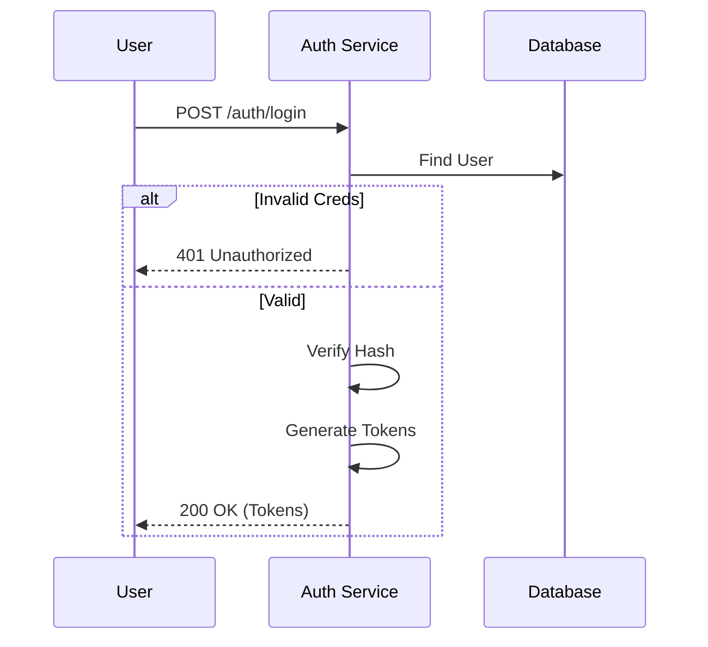

# Feature Specification: Authentication

> Dokumen ini merinci logika dan spesifikasi fitur Authentication (Login, Register, Reset Password).

---

## Header & Navigation

- [Back to Module Overview](./overview.md)
- [Link ke API Specification](../../api/iam-security/api-authentication.md)

---

## 1. Feature Description

### 1.1 Description
Fitur inti untuk menangani verifikasi identitas pengguna (siapa mereka) dan pengelolaan sesi akses aman menggunakan JWT (JSON Web Token).

### 1.2 Business Logic

#### Login Flow
1. User input credential (Email/Password).
2. API verifikasi password hash (Bcrypt/Argon2).
3. Jika valid, return Access Token (1 jam) & Refresh Token (30 hari).

#### Register Flow
1. Cek ketersediaan Email.
2. Validate Password policy.
3. Hash password -> Simpan User -> Return 201.

### 1.3 Data Handling
- **Password Policy:** Min 8 chars, 1 Uppercase, 1 Lowercase, 1 Number.
- **Hashing:** Password **WAJIB** di-hash sebelum disimpan.
- **Tokens:** Disimpan di client side (HttpOnly Cookie recommended atau Secure Storage).

---

## 2. Technical Details

### 2.1 Dependencies
- **Email Service:** Untuk mengirim link 'Forgot Password'.
- **Crypto Library:** Bcrypt / Argon2.

### 2.2 Configuration
- `JWT_SECRET`: Kunci rahasia signing token.
- `ACCESS_TOKEN_TTL`: Durasi token (default 60m).
- `REFRESH_TOKEN_TTL`: Durasi refresh (default 30d).

---

## 3. Implementation Tasks Summary

> Tugas detail telah diagregasi di `tasks/implementation-tasks.md`.

- [Backend] Implement Login, Register, Refresh Token endpoints.
- [Frontend] Implement Login & Register Pages.
- [Backend] Implement Forgot/Reset Password flow.
- [Frontend] Implement Reset Password UI.
