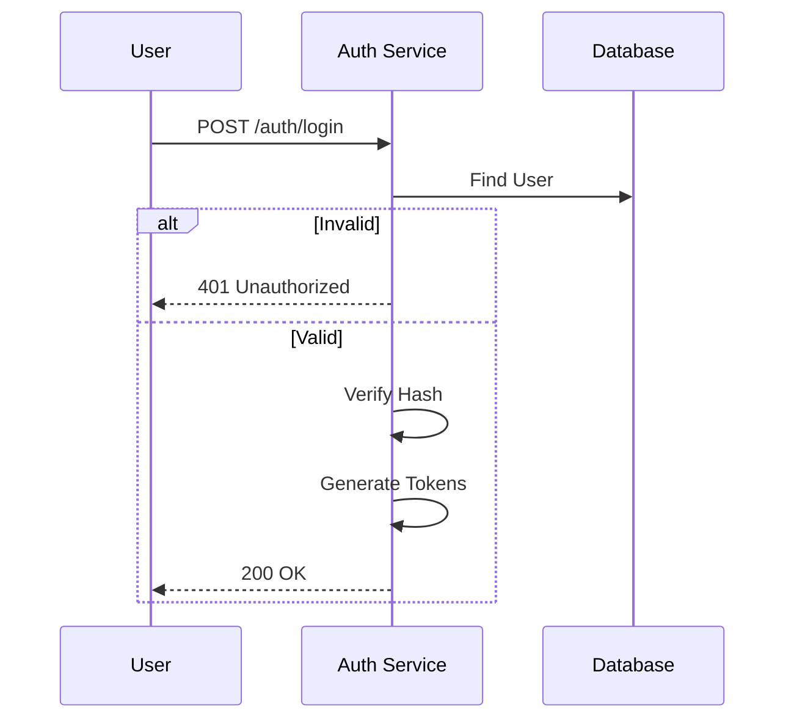
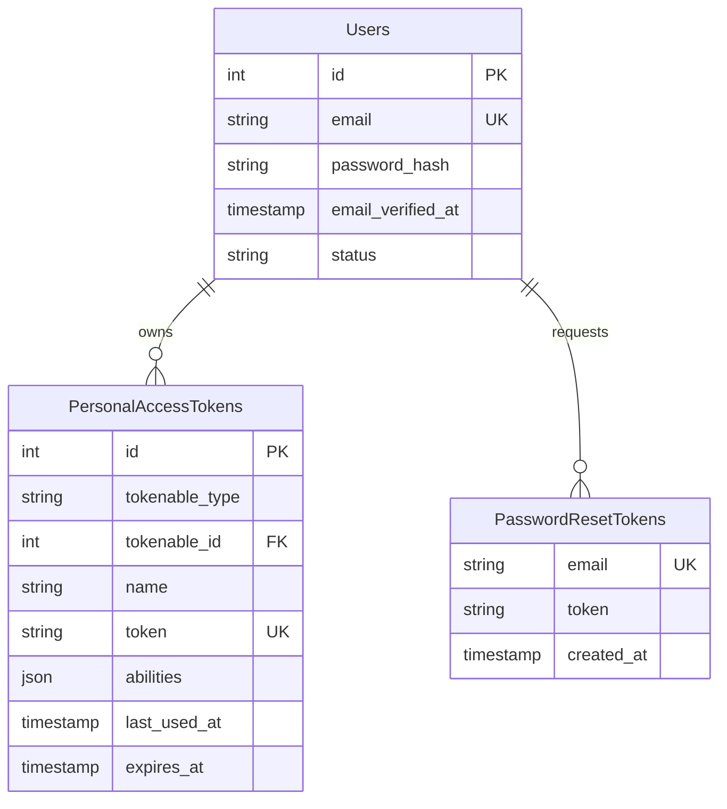

# Authentication

> Fitur untuk menangani verifikasi identitas pengguna (siapa mereka) dan pengelolaan sesi akses.

---

## Header & Navigation

- [Back to Module Overview](./overview.md)
- [Link to API Specification](../../api/iam-security/api-authentication.md)
- [Link to Testing Scenario](../../testing/iam-security/test-authentication.md)

---

## 1. Feature Overview

- **Deskripsi singkat fitur:** Menyediakan layanan otentikasi komprehensif yang mencakup registrasi akun, verifikasi identitas (Login), pemulihan akses (*Account Recovery*), dan manajemen sesi berbasis token.
- **Peran dalam modul:** Berfungsi sebagai gerbang pertahanan utama (*primary defense gateway*) yang memvalidasi setiap subjek yang mencoba mengakses sumber daya sistem.
- **Nilai bisnis:** Melindungi aset digital perusahaan dari akses tidak sah serta memberikan pengalaman pengguna yang aman dan *seamless* melalui standar keamanan modern.

---

## 2. User Stories

### US-UM-01 — Login Pengguna

**Sebagai** User
**Saya ingin** login ke sistem menggunakan email dan password
**Sehingga** saya dapat mengakses fitur sesuai hak akses saya

**Acceptance Criteria:**

* User dapat login dengan email & password valid
* Jika kredensial salah, sistem menampilkan pesan error
* Jika akun tidak aktif, login ditolak
* Session dibuat setelah login berhasil

### US-UM-02 — Logout Pengguna

**Sebagai** User
**Saya ingin** logout dari sistem
**Sehingga** akun saya tetap aman saat selesai digunakan

**Acceptance Criteria:**

* Session dihapus saat logout
* User diarahkan ke halaman login
* Token/API key (jika ada) dinonaktifkan

### US-UM-04 — Aktivasi Akun User

**Sebagai** User
**Saya ingin** mengaktifkan akun melalui email
**Sehingga** saya bisa login ke sistem

**Acceptance Criteria:**

* User menerima email aktivasi
* Link aktivasi memiliki masa berlaku
* Setelah aktivasi, status user menjadi aktif

### US-UM-10 — Ganti Password

**Sebagai** User
**Saya ingin** mengganti password
**Sehingga** akun saya tetap aman

**Acceptance Criteria:**

* Password lama harus valid
* Password baru memenuhi policy keamanan
* User otomatis logout setelah ganti password

### US-UM-11 — Reset Password

**Sebagai** User
**Saya ingin** reset password jika lupa
**Sehingga** saya bisa kembali login

**Acceptance Criteria:**

* Email reset password dikirim
* Token reset memiliki expiry
* Password lama tidak berlaku setelah reset

---

## 3. Business Flow & Rules

### 3.1 Business Flow

#### Login Flow

### 3.2 Business Rules
- **Unique Email:** Setiap pengguna harus memiliki email yang unik.
- **Strong Password:** Minimal 8 karakter, huruf besar, kecil, dan angka.
- **Token Expiry:** Access Token (1 jam), Refresh Token (30 hari).

---

## 4. Data Model

- **Users:** Menyimpan Email dan Password Hash.
- **Tokens:** Menyimpan Refresh Token dan Reset Token.

---

## 5. Compliance & Audit

- **Encryption:** Password wajib di-hash (Bcrypt/Argon2).
- **Audit:** Mencatat setiap upaya login (sukses/gagal) dan IP Address.

---

## 6. Implementation Tasks

| ID     | Platform | Status | Deskripsi                                         |
| :----- | :------- | :----- | :------------------------------------------------ |
| IAM-02 | Backend  | Todo   | Implement JSON:API Authentication endpoints.      |
| IAM-03 | Frontend | Todo   | Implement Login, Register, Forgot Password Pages. |
