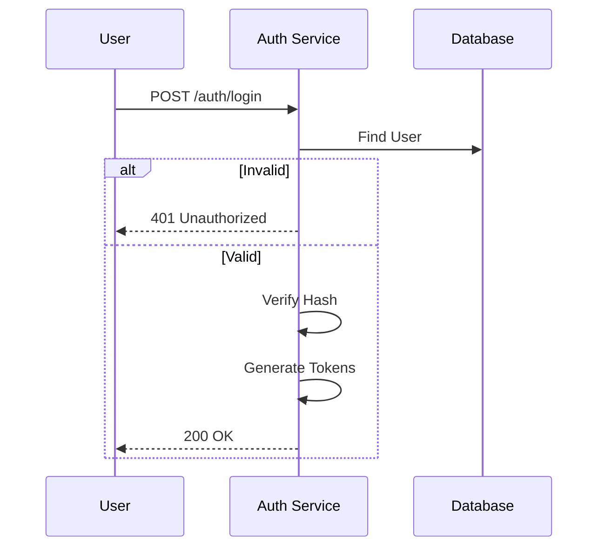

# Authentication

> Fitur untuk menangani verifikasi identitas pengguna (siapa mereka) dan pengelolaan sesi akses.

---

## Header & Navigation

- [Back to Module Overview](./overview.md)
- [Link to API Specification](../../api/iam-security/api-authentication.md)
- [Link to Testing Scenario](../../testing/iam-security/test-authentication.md)

---

## 1. Feature Overview

- **Deskripsi singkat fitur:** Menangani Login, Register, Forgot Password, dan Token Management.
- **Peran dalam modul:** Gerbang utama keamanan sistem.
- **Nilai bisnis:** Mencegah akses tidak sah (Security) dan memberikan pengalaman login yang aman (UX).

---

## 2. User Stories

| ID    | Peran (Role) | Tujuan (Goal)              | Manfaat (Benefit)                         |
| :---- | :----------- | :------------------------- | :---------------------------------------- |
| US-01 | Guest        | Mendaftar akun baru        | Dapat mengakses fitur sistem              |
| US-02 | Guest        | Melakukan login            | Mendapatkan akses ke akun pribadi         |
| US-03 | Guest        | Mereset password yang lupa | Memulihkan akses ke akun                  |
| US-07 | User         | Melakukan logout           | Mengamankan akun saat selesai menggunakan |
| US-08 | User         | Refresh Token              | Memperpanjang sesi tanpa login ulang      |

---

## 3. Business Flow & Rules

### 3.1 Business Flow

#### Login Flow

### 3.2 Business Rules
- **Unique Email:** Setiap pengguna harus memiliki email yang unik.
- **Strong Password:** Minimal 8 karakter, huruf besar, kecil, dan angka.
- **Token Expiry:** Access Token (1 jam), Refresh Token (30 hari).

---

## 4. Data Model

- **Users:** Menyimpan Email dan Password Hash.
- **Tokens:** Menyimpan Refresh Token dan Reset Token.

*(Lihat ERD lengkap di Module Overview jika diperlukan)*

---

## 5. Compliance & Audit

- **Encryption:** Password wajib di-hash (Bcrypt/Argon2).
- **Audit:** Mencatat setiap upaya login (sukses/gagal) dan IP Address.

---

## 6. Implementation Tasks

| ID     | Platform | Status | Deskripsi                                         |
| :----- | :------- | :----- | :------------------------------------------------ |
| IAM-02 | Backend  | Todo   | Implement JSON:API Authentication endpoints.      |
| IAM-03 | Frontend | Todo   | Implement Login, Register, Forgot Password Pages. |
