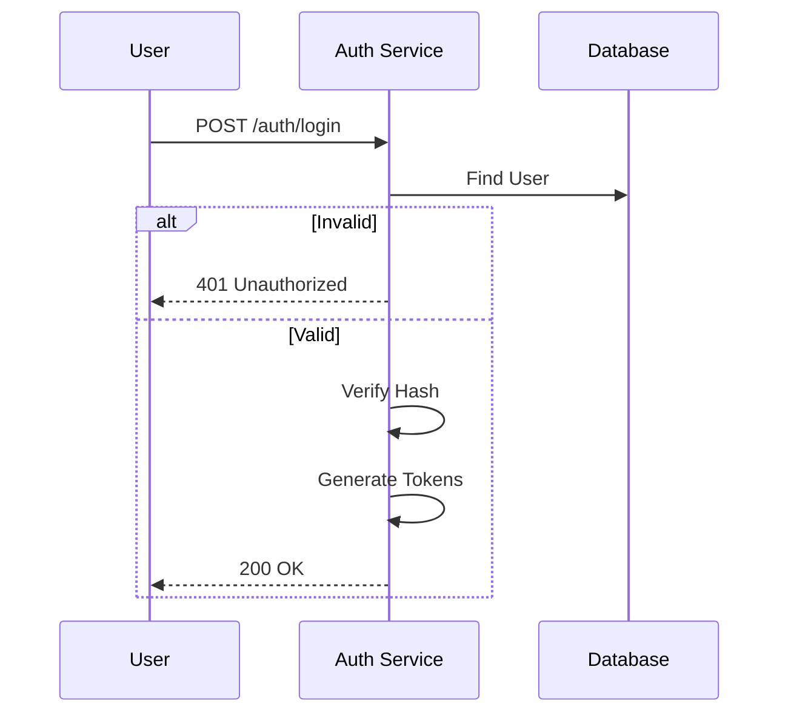
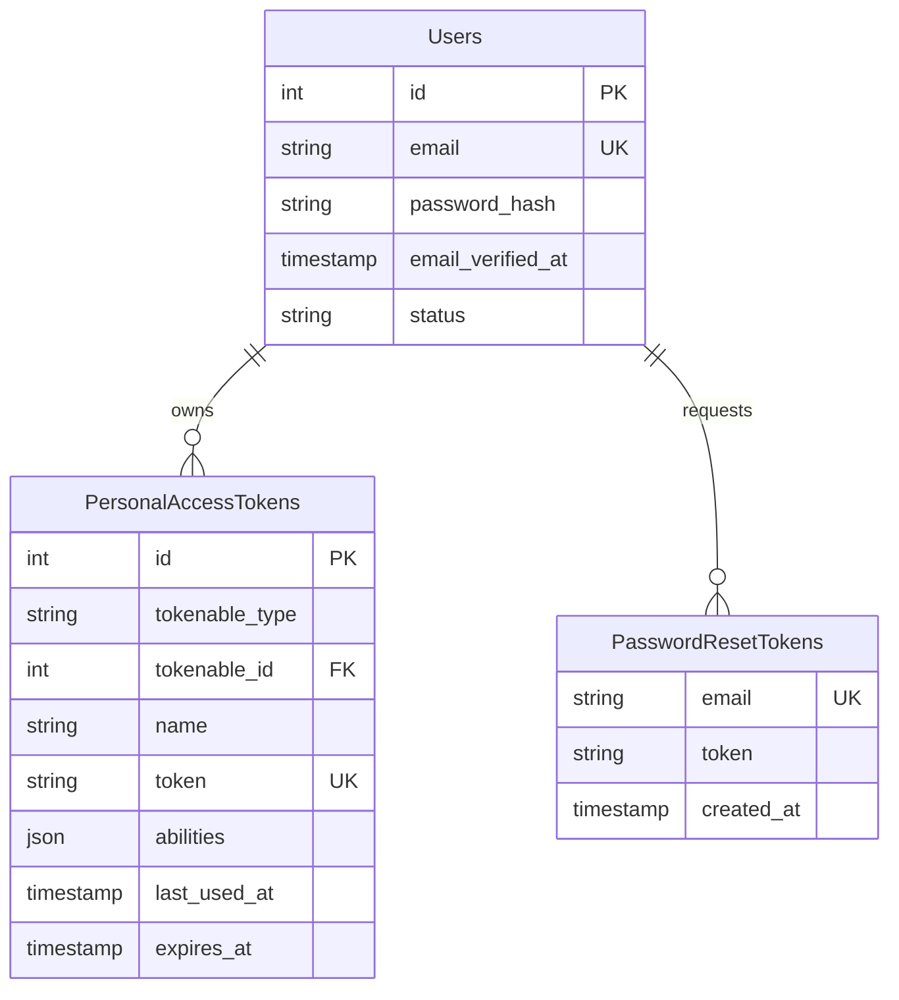

# Authentication

> Fitur untuk menangani verifikasi identitas pengguna (siapa mereka) dan pengelolaan sesi akses.

---

## Header & Navigation

- [Back to Module Overview](./overview.md)
- [Link to API Specification](../../api/iam-security/api-authentication.md)
- [Link to Testing Scenario](../../testing/iam-security/test-authentication.md)

---

## 1. Feature Overview

- **Deskripsi singkat fitur:** Menyediakan layanan otentikasi komprehensif yang mencakup registrasi akun, verifikasi identitas (Login), pemulihan akses (*Account Recovery*), dan manajemen sesi berbasis token.
- **Peran dalam modul:** Berfungsi sebagai gerbang pertahanan utama (*primary defense gateway*) yang memvalidasi setiap subjek yang mencoba mengakses sumber daya sistem.
- **Nilai bisnis:** Melindungi aset digital perusahaan dari akses tidak sah serta memberikan pengalaman pengguna yang aman dan *seamless* melalui standar keamanan modern.

---

## 2. User Stories

| US-01 | Guest | Mendaftarkan identitas digital baru (Registrasi) | Mendapatkan kredensial akses yang sah untuk memanfaatkan fitur platform. |
| US-02 | Guest | Melakukan verifikasi kredensial (Login) untuk mendapatkan akses sesi | Mengakses data pribadi dan fitur terlindungi sesuai hak akses. |
| US-03 | Guest | Menginisiasi prosedur pemulihan akun saat kehilangan kredensial | Memulihkan akses ke akun tanpa harus menghubungi layanan pelanggan manual. |
| US-07 | User | Mengakhiri sesi aktif secara aman (Logout) | Mencegah penyalahgunaan sesi oleh pihak ketiga setelah selesai penggunaan. |
| US-08 | User | Memperbarui otorisasi sesi (*Refresh Token*) tanpa intervensi manual | Menjaga kontinuitas pengalaman pengguna (*UX*) tanpa mengurangi postur keamanan. |

---

## 3. Business Flow & Rules

### 3.1 Business Flow

#### Login Flow

### 3.2 Business Rules
- **Unique Email:** Setiap pengguna harus memiliki email yang unik.
- **Strong Password:** Minimal 8 karakter, huruf besar, kecil, dan angka.
- **Token Expiry:** Access Token (1 jam), Refresh Token (30 hari).

---

## 4. Data Model

- **Users:** Menyimpan Email dan Password Hash.
- **Tokens:** Menyimpan Refresh Token dan Reset Token.

---

## 5. Compliance & Audit

- **Encryption:** Password wajib di-hash (Bcrypt/Argon2).
- **Audit:** Mencatat setiap upaya login (sukses/gagal) dan IP Address.

---

## 6. Implementation Tasks

| ID     | Platform | Status | Deskripsi                                         |
| :----- | :------- | :----- | :------------------------------------------------ |
| IAM-02 | Backend  | Todo   | Implement JSON:API Authentication endpoints.      |
| IAM-03 | Frontend | Todo   | Implement Login, Register, Forgot Password Pages. |
