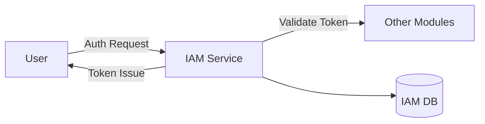

# TEMPLATE IKHTISAR MODUL (Module Overview): IAM & Security

> Modul fondasi untuk identitas, otentikasi, dan otorisasi.

---

## Header & Navigasi

- [Kembali ke Daftar Modul](../../../README.md)
- [Link ke Skenario Pengujian](../../testing/iam-security/test-authentication.md)

---

## 1. Pengantar Modul

### 1.1 Deskripsi Singkat
Modul IAM & Security bertanggung jawab atas manajemen identitas pengguna, otentikasi (verifikasi identitas), dan otorisasi (hak akses) dalam sistem.

### 1.2 Posisi & Peran
- **Tipe:** Core Module.
- **Value:** Melindungi data bisnis dan memastikan hanya pihak berwenang yang memiliki akses.

---

## 2. Daftar Fitur (Feature List)

| Fitur                                                | Deskripsi                                    | Status |
| :--------------------------------------------------- | :------------------------------------------- | :----- |
| [Authentication](./authentication.md)                | Login, Register, Forgot Password, Token Mgmt | Stable |
| [User Management](./user-management.md)              | CRUD User, Suspend/Activate                  | Stable |
| [Role & Permission](./role-permission-management.md) | RBAC Management (Roles, Permissions)         | Stable |

---

## 3. Arsitektur Level Tinggi

---

## 4. Ketergantungan Global

- **Database:** PostgreSQL (Users, Roles tables).
- **Services:** Email Service (untuk reset password).
- **Global Config:** JWT Secrets, Token TTL.

---
