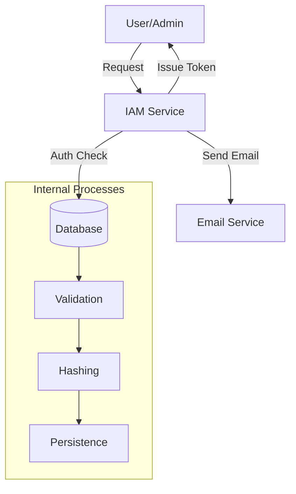
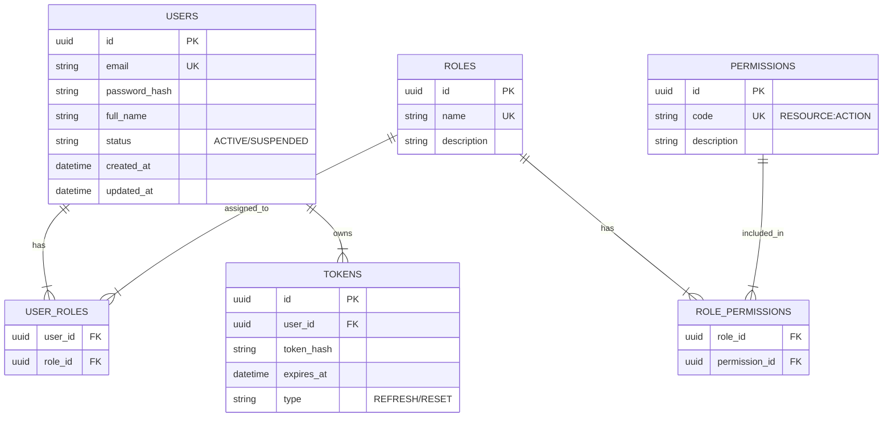

# Ikhtisar Modul: IAM & Security

> Dokumen ini memberikan gambaran umum untuk modul Identity and Access Management (IAM) & Security.

---

## Header & Navigasi

- [Kembali ke Ikhtisar Modul](#)
- [Link ke Semua Modul](../../../README.md)
- [Link ke Skenario Pengujian](../../../testing/iam-security/test-authentication.md)

---

## 1. Ikhtisar Modul (Module Overview)

- **Deskripsi singkat modul:** Modul IAM & Security bertanggung jawab atas manajemen identitas pengguna, otentikasi (verifikasi identitas), dan otorisasi (hak akses) dalam sistem.
- **Posisi modul dalam sistem:** Core Module. Modul ini menjadi fondasi keamanan bagi modul-modul lain.
- **Hubungan dengan domain bisnis utama:** Melindungi data bisnis dan memastikan bahwa fitur hanya diakses oleh pihak yang berwenang.

---

## 2. Tujuan & Nilai Bisnis (Purpose & Business Value)

### 2.1 Tanggung Jawab Utama
- Mengelola data pengguna, peran, dan hak akses.
- Menangani proses Login, Register, dan keamanan akun.
- Menyediakan mekanisme otentikasi (Token-based) untuk modul lain.

### 2.2 Nilai Bisnis
- **Kepatuhan (Compliance):** Memenuhi standar keamanan data dan privasi pengguna (misal: GDPR/PDP).
- **Pengurangan Risiko (Risk reduction):** Mencegah akses tidak sah yang berpotensi merugikan bisnis.
- **Efisiensi Operasional (Operational efficiency):** Sentralisasi manajemen akses memudahkan administrasi.
- **Akurasi Data (Data accuracy):** Memastikan integritas data identitas pengguna.
- **Pemberdayaan Strategis (Strategic enablement):** Memungkinkan implementasi fitur berbasis peran (RBAC) di seluruh sistem.

---

## 3. Lingkup (Scope)

### 3.1 Dalam Lingkup (In-Scope)
- **Authentication:** Login, Register, Forgot/Reset Password, Logout, Refresh Token.
- **User Management:** CRUD Users, Activation/Deactivation.
- **Role & Permission:** CRUD Roles, Permission Assignment, Role Assignment.
- **Security:** Password Hashing, JWT Token Generation & Validation.

### 3.2 Di Luar Lingkup (Out-of-Scope)
- **Profile Management:** Detail profil pengguna (alamat, bio, dll) mungkin ditangani modul User Profile terpisah, namun data akun dasar ada di sini.
- **Third-party OAuth (MVP):** Login via Google/Facebook (fase selanjutnya).
- **MFA (Multi-Factor Authentication):** Belum termasuk dalam scope MVP.

---

## 4. Cerita Pengguna (User Stories)

Daftar kebutuhan berbasis role.

| ID    | Role  | Goal                               | Benefit                                             |
| :---- | :---- | :--------------------------------- | :-------------------------------------------------- |
| US-01 | Guest | Mendaftar akun baru                | Dapat mengakses fitur sistem                        |
| US-02 | Guest | Melakukan login                    | Mendapatkan akses ke akun pribadi                   |
| US-03 | Guest | Mereset password yang lupa         | Memulihkan akses ke akun                            |
| US-04 | Admin | Membuat Role baru                  | Mengelompokkan hak akses pengguna                   |
| US-05 | Admin | Menetapkan Permission ke Role      | Mengatur apa yang bisa dilakukan oleh Role tertentu |
| US-06 | Admin | Mengelola User (Edit/Delete/Block) | Menjaga keamanan dan validitas data pengguna        |
| US-07 | User  | Melakukan logout                   | Mengamankan akun saat selesai menggunakan           |
| US-08 | User  | Refresh Token                      | Memperpanjang sesi tanpa login ulang                |
| US-09 | Admin | Melihat daftar user                | Memantau pertumbuhan pengguna                       |
| US-10 | User  | Mengupdate profil sendiri          | Menjaga data diri tetap akurat                      |
| US-11 | Admin | Assign Role ke User                | Memberikan wewenang kepada user                     |

---

## 5. Alur & Aturan Bisnis (Business Flow & Rules)

### 5.1 Alur Bisnis (Business Flow)
Berikut adalah diagram konteks level tinggi untuk modul IAM. Untuk detail alur (Login, Register, dsb), lihat spesifikasi masing-masing fitur.

Detail Flows:
- [Authentication Flows](./authentication.md#2-business-flow)
- [User Management Flows](./user-management.md#2-business-flow)
- [Role Assignment Flows](./role-permission-management.md#2-business-flow)

### 5.2 Aturan Bisnis

#### 5.2.1 Aturan Domain
- **Unique Email:** Setiap pengguna harus memiliki email yang unik.
- **Strong Password:** Password minimal 8 karakter, mengandung huruf besar, kecil, dan angka.
- **Token Expiry:** Access token berlaku 1 jam, Refresh token berlaku 30 hari.

#### 5.2.2 Financial / Operational Rules
- N/A for this module.

---

## 6. Model Data (Data Model)

### 6.1 Entity Relationship Diagram (ERD)

### 6.2 Definisi Entitas
- **Users:** Entitas utama pengguna.
- **Roles:** Definisi peran (e.g., Admin, Editor, Viewer).
- **Permissions:** Granular access control (e.g., `ARTICLE:CREATE`).
- **Tokens:** Menyimpan refresh token atau reset password token untuk validasi.

---

## 7. Spesifikasi API (API Specification)

> Detail spesifikasi API dipisahkan ke dalam dokumen tersendiri.

- [Link ke Spesifikasi API](../../../api/iam-security/api-authentication.md)

---

## 8. Ketergantungan (Dependencies)

### 8.1 Modul yang Dibutuhkan
- **Database Module:** Koneksi ke database (PostgreSQL direkomendasikan).
- **Email Service:** Diperlukan untuk mengirim email verifikasi dan reset password.

### 8.2 Modul Opsional
- **Notification Service:** Jika ingin mengirim notifikasi login via SMS/WA.

### 8.3 Ketergantungan Data
- **Masukan Data (Data inbound):** User input (Email, Password).
- **Entitas yang direferensikan:** None (IAM is foundational).

---

## 9. Titik Integrasi (Integration Points)

### 9.1 Integrasi Masuk
- **Modul Sumber:** Semua modul yang membutuhkan otentikasi.
- **Data:** Bearer Token (JWT).
- **Pola Integrasi:** Synchronous HTTP Call (Middleware Validation).

### 9.2 Integrasi Keluar
- **Modul Target:** Email Service.
- **Data yang diekspos:** User Email, Token Link.

### 9.3 Event yang Diterbitkan
- **Nama Event:** `USER_CREATED`
- **Pemicu:** Pendaftaran sukses.
- **Payload:** `{ "user_id": "...", "email": "..." }`
- **Subscriber:** User Profile Module, Analytics.

---

## 10. Kepatuhan & Audit

### 10.1 Kebutuhan Jejak Audit
- **Audited fields:** Login attempts, Password changes, Role changes.
- **Actor:** User ID or IP Address.
- **Timestamp:** UTC.

---

## 11. Tugas Implementasi (Implementation Tasks)

| ID Tugas | Platform | Status | Deskripsi                                                         |
| :------- | :------- | :----- | :---------------------------------------------------------------- |
| IAM-01   | Backend  | Todo   | Setup database schema (Users, Roles, Permissions).                |
| IAM-02   | Backend  | Todo   | Implement JSON:API compliant Authentication endpoints.            |
| IAM-03   | Frontend | Todo   | Implement Login, Register, Forgot Password Pages.                 |
| IAM-04   | Backend  | Todo   | Implement JSON:API compliant User Management endpoints.           |
| IAM-05   | Frontend | Todo   | Implement User Management Dashboard (List, Create, Edit, Delete). |
| IAM-06   | Backend  | Todo   | Implement JSON:API compliant Role & Permission endpoints.         |
| IAM-07   | Frontend | Todo   | Implement Role & Permission Management UI.                        |
