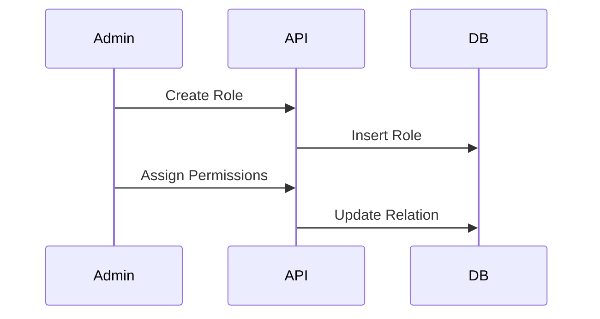

# Role & Permission Management

> Fitur untuk mengelola Role-Based Access Control (RBAC).

---

## Header & Navigation

- [Back to Module Overview](./overview.md)
- [Link to API Specification](../../api/iam-security/api-role-permission-management.md)
- [Link to Testing Scenario](../../testing/iam-security/test-authentication.md)

---

## 1. Feature Overview

- **Deskripsi singkat fitur:** Manajemen Roles, Permissions, dan Assignment.
- **Peran dalam modul:** Definisi Hak Akses.
- **Nilai bisnis:** Granular Access Control dan Fleksibilitas wewenang.

---

## 2. User Stories

| ID    | Peran (Role) | Tujuan (Goal)                 | Manfaat (Benefit)                                   |
| :---- | :----------- | :---------------------------- | :-------------------------------------------------- |
| US-04 | Admin        | Membuat Role baru             | Mengelompokkan hak akses pengguna                   |
| US-05 | Admin        | Menetapkan Permission ke Role | Mengatur apa yang bisa dilakukan oleh Role tertentu |
| US-11 | Admin        | Assign Role ke User           | Memberikan wewenang kepada user                     |

---

## 3. Business Flow & Rules

### 3.1 Business Flow

### 3.2 Business Rules
- **Super Admin:** Role spesial yang tidak bisa dihapus.
- **Immutable permissions:** Permission code didefinisikan di code.

---

## 4. Data Model

- **Roles, Permissions, RolePermissions, UserRoles.**

---

## 5. Compliance & Audit

- **Audit:** Perubahan hak akses Role adalah tindakan kritis yang wajib dicatat.

---

## 6. Implementation Tasks

| ID     | Platform | Status | Deskripsi                                                 |
| :----- | :------- | :----- | :-------------------------------------------------------- |
| IAM-06 | Backend  | Todo   | Implement JSON:API compliant Role & Permission endpoints. |
| IAM-07 | Frontend | Todo   | Implement Role & Permission Management UI.                |
