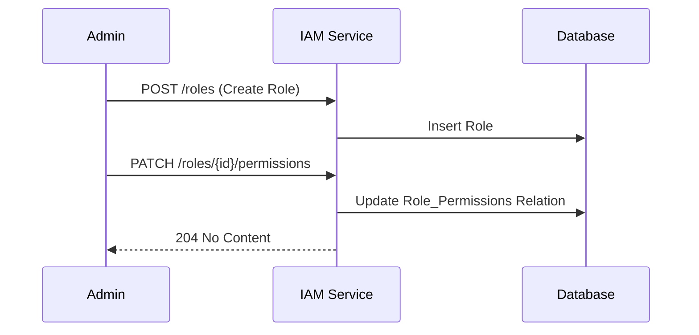

# Feature Specification: Role & Permission Management

> Dokumen ini merinci logika dan spesifikasi fitur RBAC (Role-Based Access Control).

---

## Header & Navigation

- [Back to Module Overview](./overview.md)
- [Link ke API Specification](../../api/iam-security/api-role-permission-management.md)

---

## 1. Feature Description

### 1.1 Description
Mekanisme kontrol akses granular di mana hak akses (Permission) dikelompokkan ke dalam Peran (Role), dan Role diberikan kepada User.

### 1.2 Business Logic
1.  **Define Roles:** Admin membuat role (e.g., Editor, Viewer).
2.  **Assign Permissions:** Admin memilih permission apa saja yang dimiliki Role tersebut.
3.  **Check Access:** Middleware mengecek `User -> Roles -> Permissions` saat request masuk.

### 1.3 Data Handling
- **Super Admin:** Role spesial yang memiliki akses `*` (wildcard) atau bypass check.
- **Immutability:** Permission code (misal `USER:CREATE`) didefinisikan di kode/seed database dan tidak dapat diubah via UI Admin.

---

## 2. Technical Details

### 2.1 Dependencies
- **Database:** Tabel `roles`, `permissions`, `role_permissions`, `user_roles`.
- **Middleware:** `AuthMiddleware` untuk intercept request dan validasi scope.

### 2.2 Configuration
- `SUPER_ADMIN_ROLE_NAME`: Nama role super admin (default: `SUPER_ADMIN`).

---

## 3. Implementation Tasks Summary

> Tugas detail telah diagregasi di `tasks/implementation-tasks.md`.

- [Backend] CRUD Roles & Permissions endpoints.
- [Backend] Implementation of Relationship endpoints (Assign Perms to Role).
- [Frontend] Role Management UI & Permission Assignment Checkbox.
- [Backend] Permission Seeder logic.
