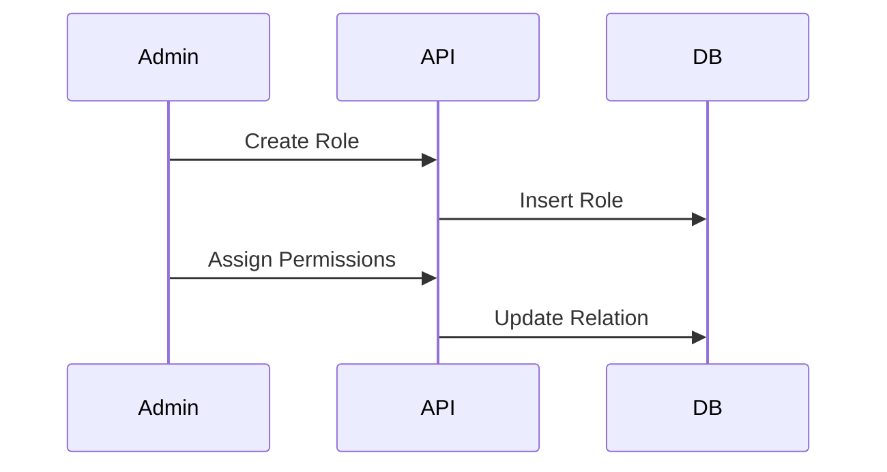
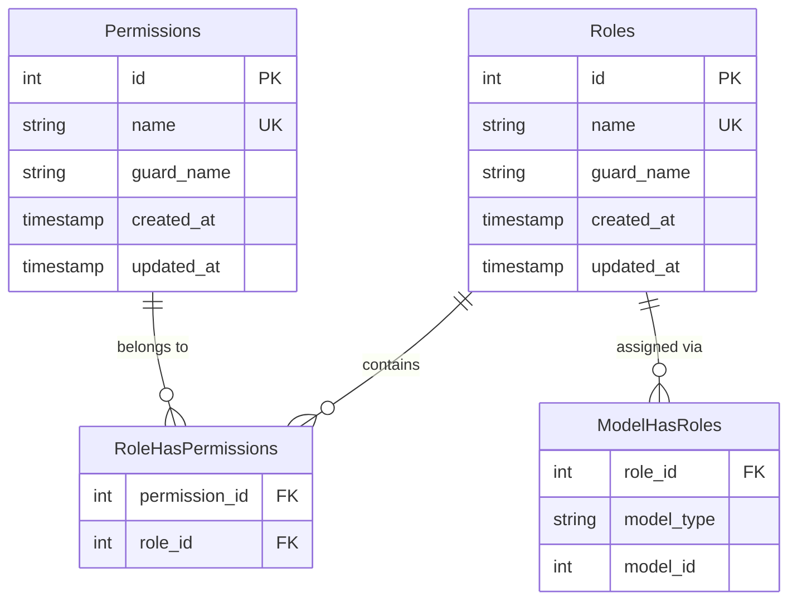

# Role & Permission Management

> Fitur untuk mengelola Role-Based Access Control (RBAC).

---

## Header & Navigation

- [Back to Module Overview](./overview.md)
- [Link to API Specification](../../api/iam-security/api-role-permission-management.md)
- [Link to Testing Scenario](../../testing/iam-security/test-authentication.md)

---

## 1. Feature Overview

- **Deskripsi singkat fitur:** Menyediakan kontrol akses berbasis peran (*Role-Based Access Control* - RBAC) yang memungkinkan definisi peran dan penetapan izin secara granular.
- **Peran dalam modul:** Bertindak sebagai *Authorization Policy Engine* yang menentukan "siapa boleh melakukan apa" dalam sistem.
- **Nilai bisnis:** Meminimalkan risiko *privilege escalation* dan menyederhanakan administrasi akses pengguna yang kompleks.

---

## 2. User Stories

### US-UM-05 — Manajemen Role

**Sebagai** Admin
**Saya ingin** membuat dan mengelola role
**Sehingga** hak akses user dapat diatur dengan fleksibel

**Acceptance Criteria:**

* Admin dapat create, update, delete role
* Role memiliki nama dan deskripsi
* Role tidak bisa dihapus jika masih digunakan user

### US-UM-06 — Assign Role ke User

**Sebagai** Admin
**Saya ingin** menetapkan role ke user
**Sehingga** user hanya bisa mengakses fitur tertentu

**Acceptance Criteria:**

* Satu user bisa memiliki satu atau lebih role
* Perubahan role langsung berlaku
* Sistem mencatat audit log perubahan role

### US-UM-07 — Manajemen Permission

**Sebagai** Admin
**Saya ingin** mengatur permission per role
**Sehingga** kontrol akses lebih granular

**Acceptance Criteria:**

* Permission berbasis action (create, read, update, delete)
* Permission bisa diaktifkan / dinonaktifkan
* Permission berlaku real-time

### US-UM-08 — Validasi Hak Akses

**Sebagai** Sistem
**Saya ingin** memvalidasi permission setiap request
**Sehingga** user tidak bisa mengakses fitur tanpa izin

**Acceptance Criteria:**

* API menolak request tanpa permission
* UI menyembunyikan menu yang tidak diizinkan
* Error code 403 untuk akses ilegal

---

## 3. Business Flow & Rules

### 3.1 Business Flow

### 3.2 Business Rules
- **Super Admin:** Role spesial yang tidak bisa dihapus.
- **Immutable permissions:** Permission code didefinisikan di code.

---

## 4. Data Model

- **Roles & Permissions:** Entitas utama.
- **RoleHasPermissions:** Tabel pivot untuk relasi Many-to-Many antara Role dan Permission.
- **ModelHasRoles:** Tabel polimorfik untuk assign Role ke User (atau model lain).

## 5. Compliance & Audit

- **Audit:** Perubahan hak akses Role adalah tindakan kritis yang wajib dicatat.

---

## 6. Implementation Tasks

| ID     | Platform | Status | Deskripsi                                                 |
| :----- | :------- | :----- | :-------------------------------------------------------- |
| IAM-06 | Backend  | Todo   | Implement JSON:API compliant Role & Permission endpoints. |
| IAM-07 | Frontend | Todo   | Implement Role & Permission Management UI.                |
