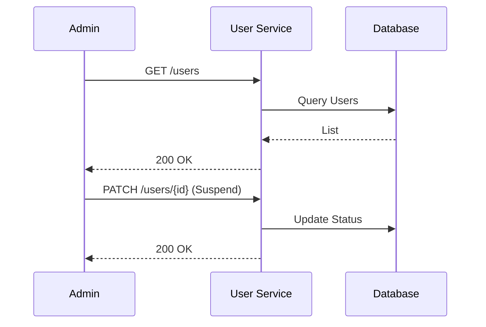

# User Management

> Fitur administratif untuk mengelola daur hidup dan data pengguna.

---

## Header & Navigasi

- [Kembali ke Ikhtisar Modul](./overview.md)
- [Link ke Spesifikasi API](../../api/iam-security/api-user-management.md)
- [Link ke Skenario Pengujian](../../testing/iam-security/test-authentication.md)

---

## 1. Ikhtisar Fitur (Feature Overview)

- **Deskripsi singkat fitur:** CRUD User, Aktivasi, dan Blokir User.
- **Peran dalam modul:** Administrasi data pengguna.
- **Nilai bisnis:** Kontrol penuh admin terhadap siapa yang bisa mengakses sistem.

---

## 2. Cerita Pengguna (User Stories)

| ID    | Peran (Role) | Tujuan (Goal)                      | Manfaat (Benefit)                            |
| :---- | :----------- | :--------------------------------- | :------------------------------------------- |
| US-06 | Admin        | Mengelola User (Edit/Delete/Block) | Menjaga keamanan dan validitas data pengguna |
| US-09 | Admin        | Melihat daftar user                | Memantau pertumbuhan pengguna                |
| US-10 | User         | Mengupdate profil sendiri          | Menjaga data diri tetap akurat               |

---

## 3. Alur & Aturan Bisnis (Business Flow & Rules)

### 3.1 Alur Bisnis

#### Admin Manage User

### 3.2 Aturan Bisnis
- **Admin Only:** Hanya role Admin yang bisa melihat list user.
- **Self Update:** User hanya bisa edit profil sendiri.

---

## 4. Model Data (Data Model)

- **Users:** Entitas utama.

---

## 5. Kepatuhan & Audit (Compliance & Audit)

- **Audit:** Mencatat Admin ID yang melakukan perubahan status user.

---

## 6. Tugas Implementasi (Implementation Tasks)

| ID     | Platform | Status | Deskripsi                                                         |
| :----- | :------- | :----- | :---------------------------------------------------------------- |
| IAM-04 | Backend  | Todo   | Implement JSON:API compliant User Management endpoints.           |
| IAM-05 | Frontend | Todo   | Implement User Management Dashboard (List, Create, Edit, Delete). |
