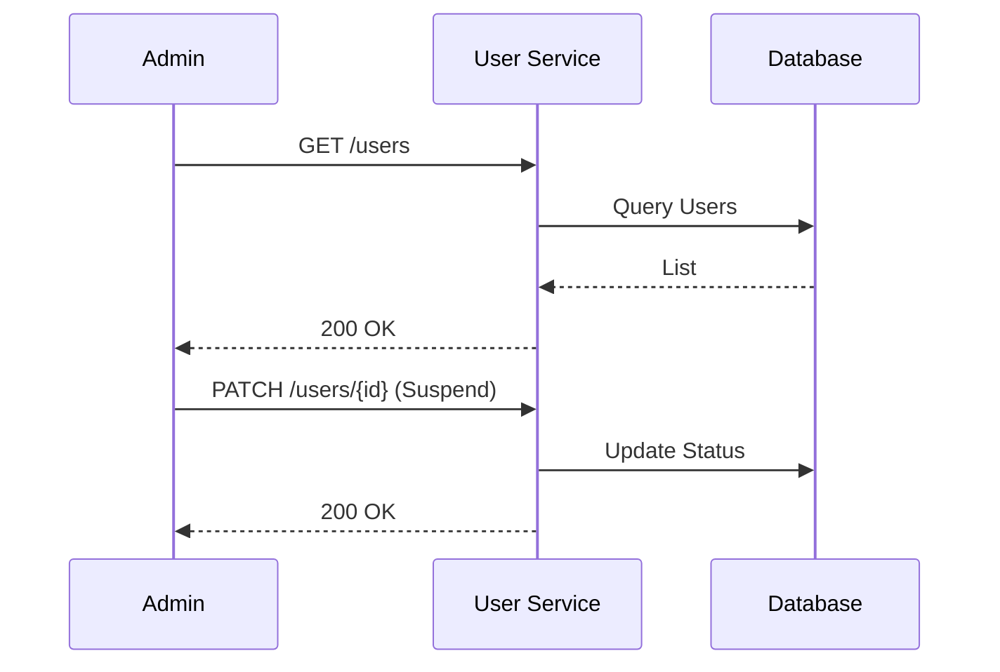
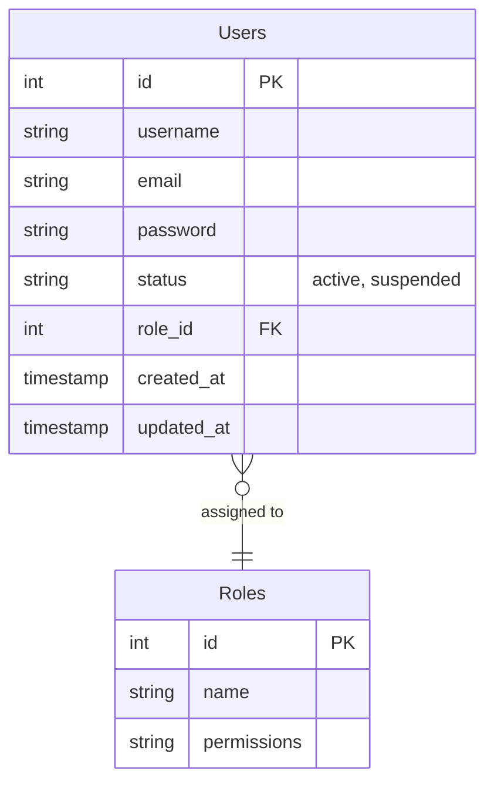

# User Management

> Fitur administratif untuk mengelola akun dan data pengguna.

---

## Header & Navigation

- [Back to Module Overview](./overview.md)
- [Link to API Specification](../../api/iam-security/api-user-management.md)
- [Link to Testing Scenario](../../testing/iam-security/test-authentication.md)

---

## 1. Feature Overview

- **Deskripsi singkat fitur:** Menyediakan kapabilitas manajemen *lifecycle* pengguna *end-to-end* (CRUD), termasuk mekanisme aktivasi, penangguhan akun (*suspend*), dan pemulihan akses (account recovery).
- **Peran dalam modul:** Bertindak sebagai *authoritative source* untuk identitas dan status pengguna di dalam ekosistem IAM Security.
- **Nilai bisnis:** Memberikan kontrol terpusat kepada administrator untuk memastikan keamanan akses sistem melalui manajemen identitas yang ketat dan *auditable*.

---

## 2. User Stories

### US-UM-03 — Membuat Akun User Baru

**Sebagai** Admin
**Saya ingin** membuat akun user baru
**Sehingga** user dapat menggunakan sistem

**Acceptance Criteria:**

* Admin dapat mengisi data user (nama, email, role)
* Email harus unik
* Password awal digenerate otomatis / di-set admin
* Status awal user: *inactive / pending*

### US-UM-09 — Melihat & Update Profil

**Sebagai** User
**Saya ingin** melihat dan memperbarui profil saya
**Sehingga** data saya tetap akurat

**Acceptance Criteria:**

* User dapat update nama, foto, kontak
* Email tidak bisa diubah tanpa verifikasi
* Validasi input diterapkan

### US-UM-12 — Blokir User

**Sebagai** Admin
**Saya ingin** memblokir user
**Sehingga** user tersebut tidak dapat mengakses sistem

**Acceptance Criteria:**

* Status user menjadi suspended
* User tidak bisa login
* Riwayat login tetap tersimpan

### US-UM-13 — Audit Log Aktivitas User

**Sebagai** Admin
**Saya ingin** melihat aktivitas user
**Sehingga** saya dapat memantau keamanan sistem

**Acceptance Criteria:**

* Tercatat login, logout, update data, perubahan role
* Audit log tidak bisa diedit
* Bisa difilter berdasarkan user & waktu

### US-UM-14 — Skalabilitas User

**Sebagai** Sistem
**Saya ingin** mendukung ribuan user aktif
**Sehingga** performa tetap stabil

**Acceptance Criteria:**

* Query user dioptimalkan
* Pagination diterapkan
* Response time < 500ms untuk list user

### US-UM-15 — Keamanan Data User

**Sebagai** Sistem
**Saya ingin** menyimpan data user secara aman
**Sehingga** data tidak bocor

**Acceptance Criteria:**

* Password di-hash (bcrypt/argon2)
* Data sensitif dienkripsi
* Akses API menggunakan token

---

## 3. Business Flow & Rules

### 3.1 Business Flow

#### Admin Manage User

### 3.2 Business Rules
- **Admin Only:** Hanya role Admin yang bisa melihat list user.
- **Self Update:** User hanya bisa edit profil sendiri.

---

## 4. Data Model

- **Users:** Entitas utama.

---

## 5. Compliance & Audit

- **Audit:** Mencatat Admin ID yang melakukan perubahan status user.

---

## 6. Implementation Tasks

### 6.1 Backend

| Task ID   | Component  | Status | Description                                                     |
| :-------- | :--------- | :----- | :-------------------------------------------------------------- |
| IAM-BE-01 | Migration  | Todo   | Create `users` table with standard timestamps & soft deletes.   |
| IAM-BE-02 | Seeder     | Todo   | Create `UserSeeder` for Admin & Public role.                    |
| IAM-BE-03 | Model      | Todo   | Setup `User` model arguments (fillable, cast, relations).       |
| IAM-BE-04 | Repository | Todo   | Implement `UserRepository` (Interface & Implementation).        |
| IAM-BE-05 | Service    | Todo   | Implement `UserService` (Business Logic for Suspend/Activate).  |
| IAM-BE-06 | Controller | Todo   | Implement `UserController` (Resource Controller) with JSON:API. |
| IAM-BE-07 | Routes     | Todo   | Register routes in `api.php`.                                   |
| IAM-BE-08 | Tests      | Todo   | Create Feature Test (Positive/Negative/Permission).             |

### 6.2 Frontend

| Task ID   | Component   | Status | Description                                            |
| :-------- | :---------- | :----- | :----------------------------------------------------- |
| IAM-FE-01 | State       | Todo   | Setup Pinia Store / Context for User.                  |
| IAM-FE-02 | API Service | Todo   | Create `UserService` (Axios wrapper).                  |
| IAM-FE-03 | Component   | Todo   | Create `UserListTable` component.                      |
| IAM-FE-04 | Component   | Todo   | Create `UserForm` component (Add/Edit).                |
| IAM-FE-05 | Page        | Todo   | Implement `UserIndex`, `UserCreate`, `UserEdit` pages. |
| IAM-FE-06 | Integration | Todo   | Connect UI to API & Handle errors.                     |
