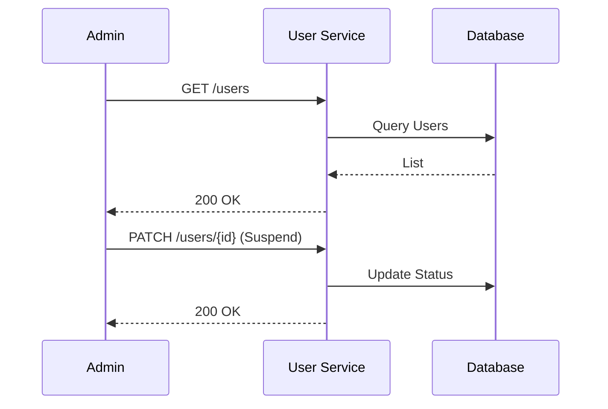
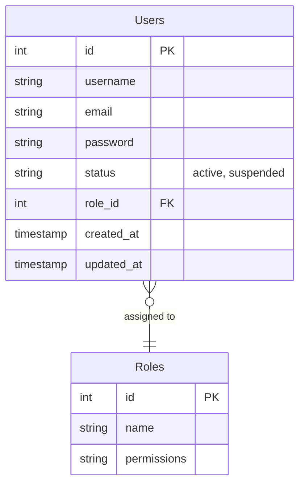

# User Management

> Fitur administratif untuk mengelola akun dan data pengguna.

---

## Header & Navigation

- [Back to Module Overview](./overview.md)
- [Link to API Specification](../../api/iam-security/api-user-management.md)
- [Link to Testing Scenario](../../testing/iam-security/test-authentication.md)

---

## 1. Feature Overview

- **Deskripsi singkat fitur:** Menyediakan kapabilitas manajemen *lifecycle* pengguna *end-to-end* (CRUD), termasuk mekanisme aktivasi, penangguhan akun (*suspend*), dan pemulihan akses (account recovery).
- **Peran dalam modul:** Bertindak sebagai *authoritative source* untuk identitas dan status pengguna di dalam ekosistem IAM Security.
- **Nilai bisnis:** Memberikan kontrol terpusat kepada administrator untuk memastikan keamanan akses sistem melalui manajemen identitas yang ketat dan *auditable*.

---

## 2. User Stories

| ID    | Peran (Role) | Tujuan (Goal)                                                                               | Manfaat (Benefit)                                                                                    |
| :---- | :----------- | :------------------------------------------------------------------------------------------ | :--------------------------------------------------------------------------------------------------- |
| US-06 | Admin        | Melakukan manajemen *lifecycle* akun pengguna (*Modify, Suspend, Revoke*)                   | Memastikan integritas data, kepatuhan keamanan, dan mitigasi risiko akses tidak sah segera.          |
| US-09 | Admin        | Mengakses direktori pengguna terpusat dengan kapabilitas *filtering* dan *searching* lanjut | Meningkatkan efisiensi operasional dalam audit, pemantauan, dan pelaporan basis pengguna organisasi. |
| US-10 | User         | Mengelola informasi profil akun, preferensi, dan kredensial keamanan secara mandiri         | Mengurangi beban operasional tim support melalui *self-service* dan menjamin akurasi data personal.  |

---

## 3. Business Flow & Rules

### 3.1 Business Flow

#### Admin Manage User

### 3.2 Business Rules
- **Admin Only:** Hanya role Admin yang bisa melihat list user.
- **Self Update:** User hanya bisa edit profil sendiri.

---

## 4. Data Model

- **Users:** Entitas utama.

---

## 5. Compliance & Audit

- **Audit:** Mencatat Admin ID yang melakukan perubahan status user.

---

## 6. Implementation Tasks

| ID     | Platform | Status | Deskripsi                                                         |
| :----- | :------- | :----- | :---------------------------------------------------------------- |
| IAM-04 | Backend  | Todo   | Implement JSON:API compliant User Management endpoints.           |
| IAM-05 | Frontend | Todo   | Implement User Management Dashboard (List, Create, Edit, Delete). |
