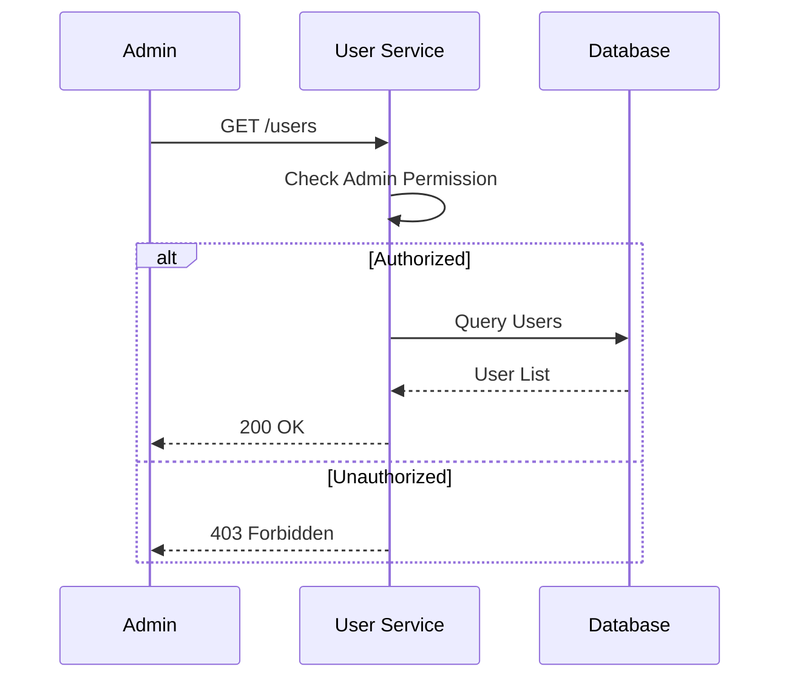

# Feature Specification: User Management

> Dokumen ini merinci logika dan spesifikasi fitur User Management (CRUD User Admin).

---

## Header & Navigation

- [Back to Module Overview](./overview.md)
- [Link ke API Specification](../../api/iam-security/api-user-management.md)

---

## 1. Feature Description

### 1.1 Description
Fitur administratif untuk administrator mengelola daur hidup pengguna, termasuk melihat daftar, mengubah status (Suspend/Activate), dan memperbarui profil.

### 1.2 Business Logic
1.  **List Users:** Admin meminta daftar user dengan pagination/filter.
2.  **Suspend:** Admin menonaktifkan user yang melanggar aturan.
3.  **Update:** Admin memperbarui data user.

### 1.3 Data Handling
- **Immutable Fields:** Email tidak dapat diubah tanpa proses verifikasi ulang.
- **Role Requirement:** Hanya role `ADMIN` yang dapat mengakses endpoint ini.

---

## 2. Technical Details

### 2.1 Dependencies
- **Database:** Tabel `users`.
- **IAM Service:** Untuk pengecekan permission `USER:READ`, `USER:UPDATE`.

### 2.2 Configuration
- `MAX_PAGE_SIZE`: Batas maksimal pagination (default 100).

---

## 3. Implementation Tasks Summary

> Tugas detail telah diagregasi di `tasks/implementation-tasks.md`.

- [Backend] Implement `GET /users` with filters.
- [Frontend] Implement Admin User List Page.
- [Backend] Implement `PATCH /users/:id` (Suspend/Update).
- [Frontend] Implement Edit User Modal & Confirmation.
