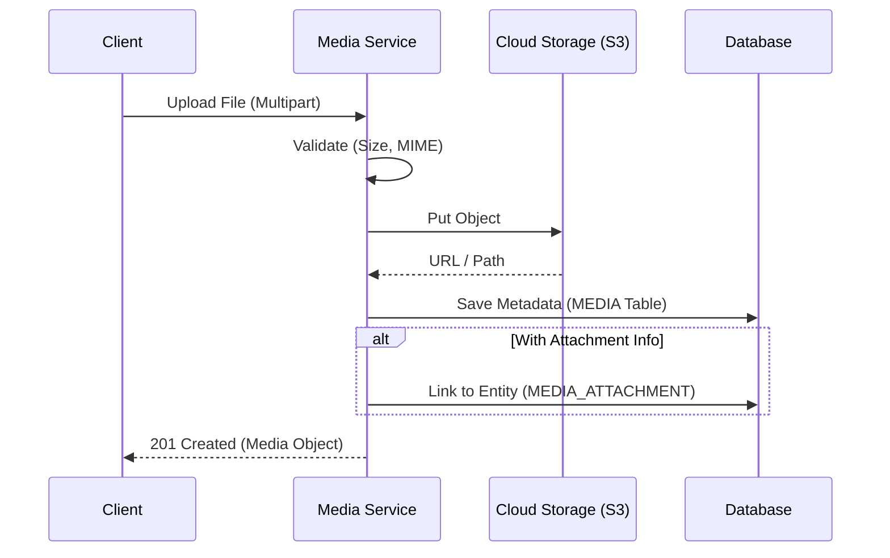
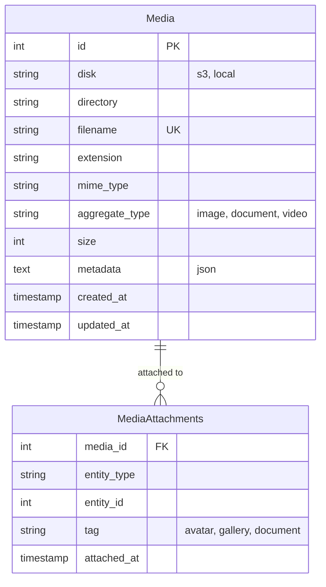

# File Management

> Fitur pengelolaan file, upload, dan retrieval media.

---

## Header & Navigation

- [Back to Module Overview](./overview.md)
- [Link to API Specification](../../api/media-management/api-media-management.md)
- [Link to Testing Scenario](../../testing/media-management/test-media-management.md)

---

## 1. Feature Overview

- **Deskripsi singkat fitur:** Menyediakan layanan manajemen aset digital terpusat yang mencakup pengunggahan (*upload*), penyimpanan multi-provider, transformasi media, dan manajemen metadata.
- **Peran dalam modul:** Bertindak sebagai *unified storage interface* yang mengabstraksi kompleksitas driver penyimpanan fisik.
- **Nilai bisnis:** Mengoptimalkan biaya penyimpanan melalui strategi kompresi/retensi dan memastikan ketersediaan aset tinggi (*high availability*).

---

## 2. User Stories

### US-MED-01 — Upload Avatar Pengguna

**Sebagai** User
**Saya ingin** Upload Avatar Pengguna
**Sehingga** Akun lebih personal dan dikenali

**Acceptance Criteria:**

* Format: JPG, PNG, WEBP
* Max size: 2MB
* Auto-crop rasio 1:1
* Magic bytes validation

### US-MED-02 — Kelola Galeri Produk

**Sebagai** Admin
**Saya ingin** Kelola Galeri Produk
**Sehingga** Katalog penjualan terlihat menarik

**Acceptance Criteria:**

* Multi-upload support
* Drag & Drop reorder
* Set Featured Image
* Delete obsolete images

### US-MED-03 — Auto Resize & Thumbnail

**Sebagai** Sistem
**Saya ingin** Auto Resize & Thumbnail
**Sehingga** Loading page lebih cepat

**Acceptance Criteria:**

* Varian: Original, Medium (800px), Thumb (200px)
* Auto-compression
* Standardized naming convention

### US-MED-04 — Lampiran Dokumen Transaksi

**Sebagai** User
**Saya ingin** Lampiran Dokumen Transaksi
**Sehingga** Administrasi transaksi valid

**Acceptance Criteria:**

* Format: PDF, DOCX
* Browser Preview
* Secure Signed URL download
* Antivirus scan on upload

## 3. Business Flow & Rules

### 3.1 Business Flow

#### Upload & Attach Flow

### 3.2 Business Rules
- **Max File Size:** 5MB (Img), 20MB (Doc).
- **Allowed Types:** JPG, PNG, WEBP, PDF.
- **Cleanup:** Temp files akan dihapus jika tidak di-link dalam 24 jam.

---

## 4. Data Model

> Diagram Entity Relationship untuk Media Management.

- **Media:** Metadata file (Filename, Size, URL, Disk).
- **MediaAttachment:** Tabel pivot polimorfik (Entity Type, Entity ID).

---

## 5. Compliance & Audit

- **Access Control:** File privat hanya bisa diakses via Presigned URL/Proxy.

---

## 6. Implementation Tasks

### 6.1 Backend

| Task ID   | Component      | Status | Description                                          |
| :-------- | :------------- | :----- | :--------------------------------------------------- |
| MED-BE-01 | Infrastructure | Todo   | Setup Flysystem (S3/Local) & Multer/Formidable.      |
| MED-BE-02 | Migration      | Todo   | Create `media` and `media_attachments` tables.       |
| MED-BE-03 | Model          | Todo   | Setup `Media` model with accessors (URL).            |
| MED-BE-04 | Service        | Todo   | Implement `MediaService` (Upload, Optimize, Delete). |
| MED-BE-05 | Controller     | Todo   | Implement `MediaController` (Upload Endpoint).       |
| MED-BE-06 | Routes         | Todo   | Register API routes.                                 |
| MED-BE-07 | Tests          | Todo   | Create Upload & Storage Tests.                       |

### 6.2 Frontend

| Task ID   | Component | Status | Description                                    |
| :-------- | :-------- | :----- | :--------------------------------------------- |
| MED-FE-01 | Component | Todo   | Create `FileUploader` (Drag & Drop, Progress). |
| MED-FE-02 | Component | Todo   | Create `ImageGallery` selector.                |
| MED-FE-03 | Service   | Todo   | Create `MediaService` api wrapper.             |
