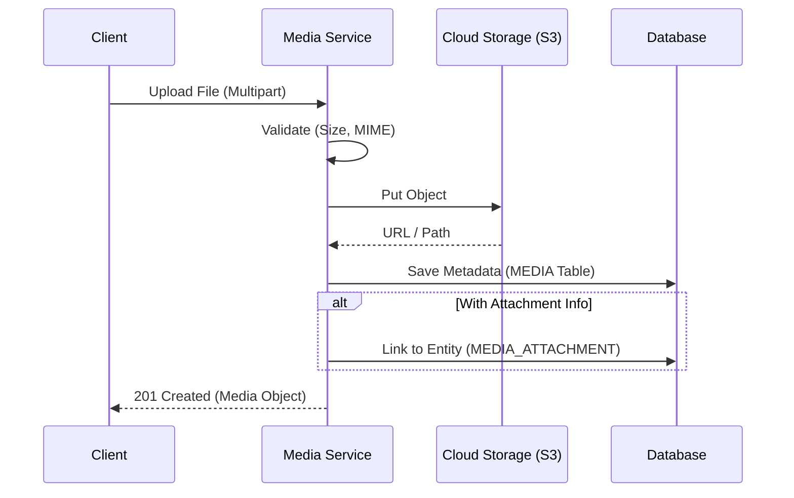
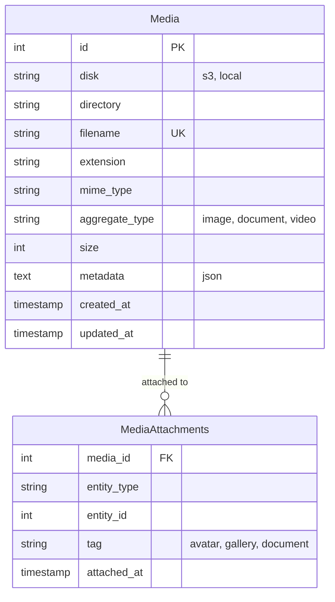

# File Management

> Fitur pengelolaan file, upload, dan retrieval media.

---

## Header & Navigation

- [Back to Module Overview](./overview.md)
- [Link to API Specification](../../api/media-management/api-media-management.md)
- [Link to Testing Scenario](../../testing/media-management/test-media-management.md)

---

## 1. Feature Overview

- **Deskripsi singkat fitur:** Menyediakan layanan manajemen aset digital terpusat yang mencakup pengunggahan (*upload*), penyimpanan multi-provider, transformasi media, dan manajemen metadata.
- **Peran dalam modul:** Bertindak sebagai *unified storage interface* yang mengabstraksi kompleksitas driver penyimpanan fisik.
- **Nilai bisnis:** Mengoptimalkan biaya penyimpanan melalui strategi kompresi/retensi dan memastikan ketersediaan aset tinggi (*high availability*).

---

## 2. User Stories

| ID        | Peran (Role) | Tujuan (Goal)                                                              | Manfaat (Benefit)                                                                             |
| :-------- | :----------- | :------------------------------------------------------------------------- | :-------------------------------------------------------------------------------------------- |
| US-MED-01 | User         | Mengunggah foto profil (*avatar*) untuk personalisasi akun                 | Membangun identitas visual pengguna di dalam ekosistem aplikasi.                              |
| US-MED-02 | Admin        | Mengelola galeri gambar produk untuk katalog penjualan                     | Meningkatkan konversi penjualan melalui representasi visual produk yang berkualitas tinggi.   |
| US-MED-03 | Sistem       | Melakukan *resizing* dan pembuatan *thumbnail* secara otomatis saat upload | Meningkatkan kinerja muat halaman (*load time*) dengan menyajikan ukuran gambar yang optimal. |
| US-MED-04 | User         | Melampirkan dokumen pendukung (PDF/Doc) pada transaksi                     | Memungkinkan verifikasi manual dan audit trail kepatuhan transaksi.                           |

---

## 3. Business Flow & Rules

### 3.1 Business Flow

#### Upload & Attach Flow

### 3.2 Business Rules
- **Max File Size:** 5MB (Img), 20MB (Doc).
- **Allowed Types:** JPG, PNG, WEBP, PDF.
- **Cleanup:** Temp files akan dihapus jika tidak di-link dalam 24 jam.

---

## 4. Data Model

- **Media:** Metadata file (Filename, Size, URL, Disk).
- **MediaAttachment:** Tabel pivot polimorfik (Entity Type, Entity ID).

---

## 5. Compliance & Audit

- **Access Control:** File privat hanya bisa diakses via Presigned URL/Proxy.

---

## 6. Implementation Tasks

| ID        | Platform | Status | Deskripsi                                       |
| :-------- | :------- | :----- | :---------------------------------------------- |
| MED-BE-01 | Backend  | Todo   | Setup Storage Driver (Flysystem/Multer)         |
| MED-BE-02 | Backend  | Todo   | API Upload File & Validation                    |
| MED-BE-03 | Backend  | Todo   | Database Schema Migration (Media & Attachments) |
| MED-FE-01 | Frontend | Todo   | Komponen Upload (Drag & Drop, Progress Bar)     |
