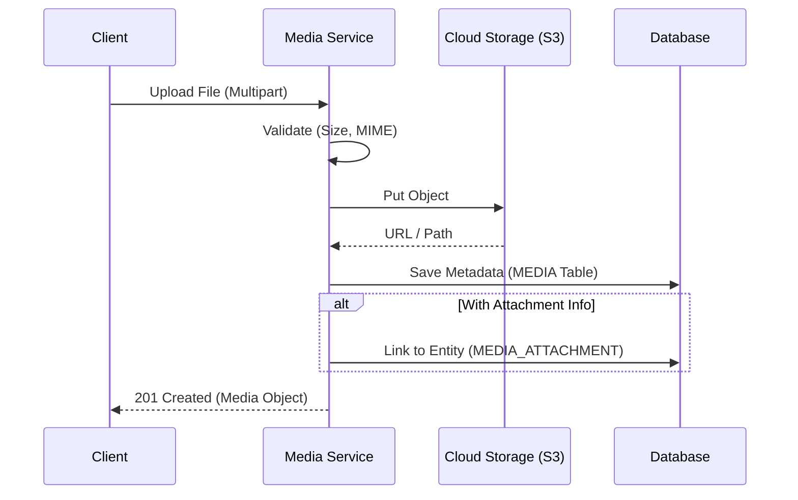
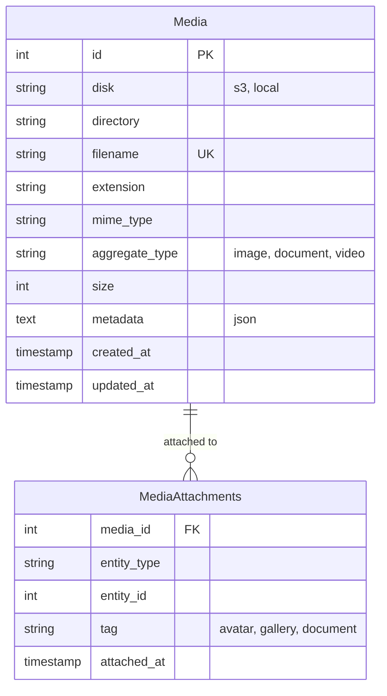

# File Management

> Fitur pengelolaan file, upload, dan retrieval media.

---

## Header & Navigation

- [Back to Module Overview](./overview.md)
- [Link to API Specification](../../api/media-management/api-media-management.md)
- [Link to Testing Scenario](../../testing/media-management/test-media-management.md)

---

## 1. Feature Overview

- **Deskripsi singkat fitur:** Menyediakan layanan manajemen aset digital terpusat yang mencakup pengunggahan (*upload*), penyimpanan multi-provider, transformasi media, dan manajemen metadata.
- **Peran dalam modul:** Bertindak sebagai *unified storage interface* yang mengabstraksi kompleksitas driver penyimpanan fisik.
- **Nilai bisnis:** Mengoptimalkan biaya penyimpanan melalui strategi kompresi/retensi dan memastikan ketersediaan aset tinggi (*high availability*).

---

## 2. User Stories

### US-MED-01 — Upload Avatar Pengguna

**Sebagai** User
**Saya ingin** mengunggah foto profil (*avatar*)
**Sehingga** akun saya lebih personal dan mudah dikenali

**Acceptance Criteria:**

* Format yang didukung: JPG, PNG, WEBP
* Maksimal ukuran file: 2MB
* Gambar otomatis di-crop menjadi rasio 1:1
* Validasi magic bytes untuk mencegah upload script berbahaya

### US-MED-02 — Kelola Galeri Produk

**Sebagai** Admin
**Saya ingin** mengelola galeri gambar produk
**Sehingga** katalog penjualan terlihat menarik

**Acceptance Criteria:**

* Admin dapat upload multiple images sekaligus
* Fitur reorder (drag & drop) urutan gambar
* Set gambar utama (featured image)
* Hapus gambar yang usang

### US-MED-03 — Auto Resize & Thumbnail

**Sebagai** Sistem
**Saya ingin** membuat thumbnail otomatis saat upload
**Sehingga** loading halaman lebih cepat dengan ukuran gambar optimal

**Acceptance Criteria:**

* Generate varian ukuran: original, medium (800px), thumb (200px)
* Kompresi otomatis tanpa mengurangi kualitas visual secara signifikan
* Nama file output distandarisasi dan unik

### US-MED-04 — Lampiran Dokumen Transaksi

**Sebagai** User
**Saya ingin** melampirkan dokumen pendukung (PDF) pada transaksi
**Sehingga** administrasi transaksi valid dan audit-able

**Acceptance Criteria:**

* Format yang didukung: PDF, DOCX
* Preview dokumen tersedia di browser
* Link download secure (signed URL)
* Scan antivirus berjalan saat upload

---

## 3. Business Flow & Rules

### 3.1 Business Flow

#### Upload & Attach Flow

### 3.2 Business Rules
- **Max File Size:** 5MB (Img), 20MB (Doc).
- **Allowed Types:** JPG, PNG, WEBP, PDF.
- **Cleanup:** Temp files akan dihapus jika tidak di-link dalam 24 jam.

---

## 4. Data Model

- **Media:** Metadata file (Filename, Size, URL, Disk).
- **MediaAttachment:** Tabel pivot polimorfik (Entity Type, Entity ID).

---

## 5. Compliance & Audit

- **Access Control:** File privat hanya bisa diakses via Presigned URL/Proxy.

---

## 6. Implementation Tasks

| ID        | Platform | Status | Deskripsi                                       |
| :-------- | :------- | :----- | :---------------------------------------------- |
| MED-BE-01 | Backend  | Todo   | Setup Storage Driver (Flysystem/Multer)         |
| MED-BE-02 | Backend  | Todo   | API Upload File & Validation                    |
| MED-BE-03 | Backend  | Todo   | Database Schema Migration (Media & Attachments) |
| MED-FE-01 | Frontend | Todo   | Komponen Upload (Drag & Drop, Progress Bar)     |
