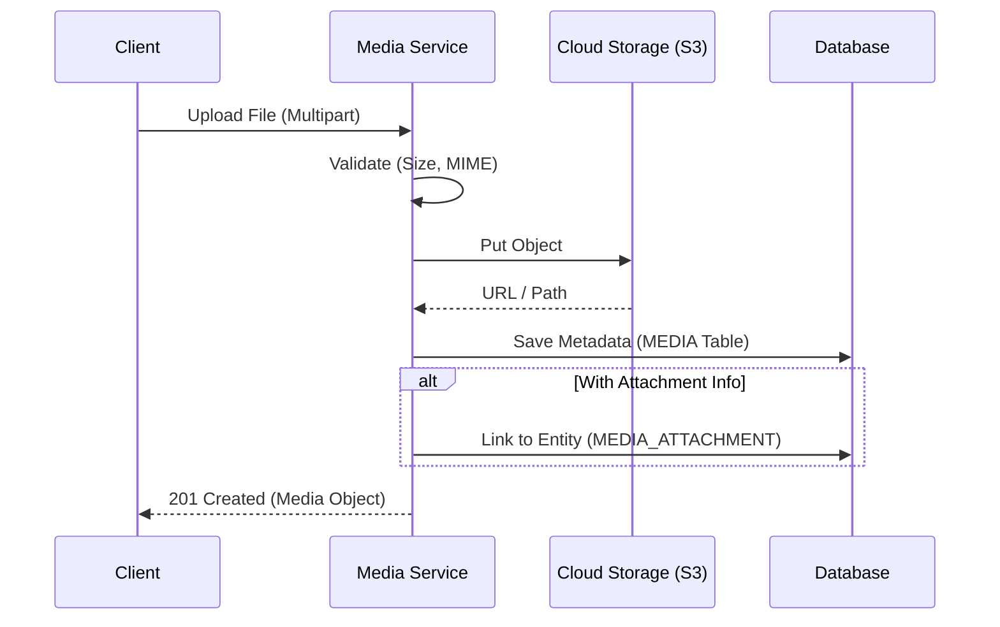

# File Management

> Fitur pengelolaan file, upload, dan retrieval media.

---

## Header & Navigation

- [Back to Module Overview](./overview.md)
- [Link to API Specification](../../api/media-management/api-media-management.md)
- [Link to Testing Scenario](../../testing/media-management/test-media-management.md)

---

## 1. Feature Overview

- **Deskripsi singkat fitur:** Layanan upload, penyimpanan (multi-provider), dan metadata file.
- **Peran dalam modul:** Fitur inti Media Management.
- **Nilai bisnis:** Sentralisasi penyimpanan aset dan efisiensi storage.

---

## 2. User Stories

| ID        | Peran (Role) | Tujuan (Goal)                        | Manfaat (Benefit)                    |
| :-------- | :----------- | :----------------------------------- | :----------------------------------- |
| US-MED-01 | User         | Mengupload foto profil avatar        | Identitas visual di aplikasi.        |
| US-MED-02 | Admin        | Mengupload gambar produk             | Memperjelas katalog bagi pembeli.    |
| US-MED-03 | Sistem       | Generate thumbnail otomatis          | Mempercepat loading halaman listing. |
| US-MED-04 | User         | Melampirkan bukti transfer (dokumen) | Verifikasi pembayaran manual.        |

---

## 3. Business Flow & Rules

### 3.1 Business Flow

#### Upload & Attach Flow

### 3.2 Business Rules
- **Max File Size:** 5MB (Img), 20MB (Doc).
- **Allowed Types:** JPG, PNG, WEBP, PDF.
- **Cleanup:** Temp files akan dihapus jika tidak di-link dalam 24 jam.

---

## 4. Data Model

- **Media:** Metadata file (Filename, Size, URL, Disk).
- **MediaAttachment:** Tabel pivot polimorfik (Entity Type, Entity ID).

*(Lihat ERD lengkap di Module Overview jika diperlukan)*

---

## 5. Compliance & Audit

- **Access Control:** File privat hanya bisa diakses via Presigned URL/Proxy.

---

## 6. Implementation Tasks

| ID        | Platform | Status | Deskripsi                                       |
| :-------- | :------- | :----- | :---------------------------------------------- |
| MED-BE-01 | Backend  | Todo   | Setup Storage Driver (Flysystem/Multer)         |
| MED-BE-02 | Backend  | Todo   | API Upload File & Validation                    |
| MED-BE-03 | Backend  | Todo   | Database Schema Migration (Media & Attachments) |
| MED-FE-01 | Frontend | Todo   | Komponen Upload (Drag & Drop, Progress Bar)     |
