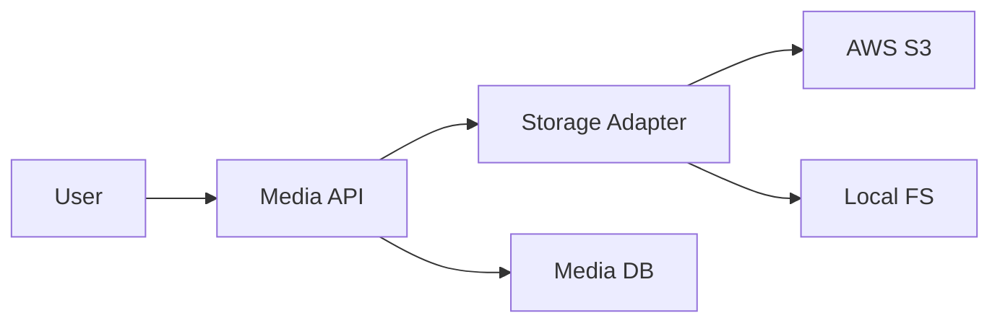

# Module Overview: Media Management

> Modul terpusat untuk penyimpanan dan pengelolaan aset digital.

---

## Header & Navigation

- [Back to Module List](../../../README.md)
- [Link to Testing Scenario](../../testing/media-management/test-media-management.md)

---

## 1. Module Introduction

### 1.1 Brief Description
Modul ini menangani upload, penyimpanan (Storage Abstraction), dan retrieval file dengan dukungan relasi polimorfik ke entitas lain.

### 1.2 Position & Role
- **Tipe:** Core Support Module.
- **Value:** Unified Asset Management.

---

## 2. Feature List

| Fitur                                   | Deskripsi                              | Status |
| :-------------------------------------- | :------------------------------------- | :----- |
| [File Management](./file-management.md) | Upload, Storage, & Polymorphic Linking | Stable |

---

## 3. High-Level Architecture

---

## 4. Global Dependencies

- **Configuration:** Storage Credentials.
- **Libs:** Flysystem / Multer / Sharp (Image Processing).

---
