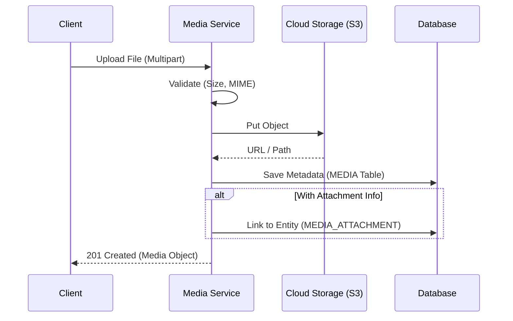
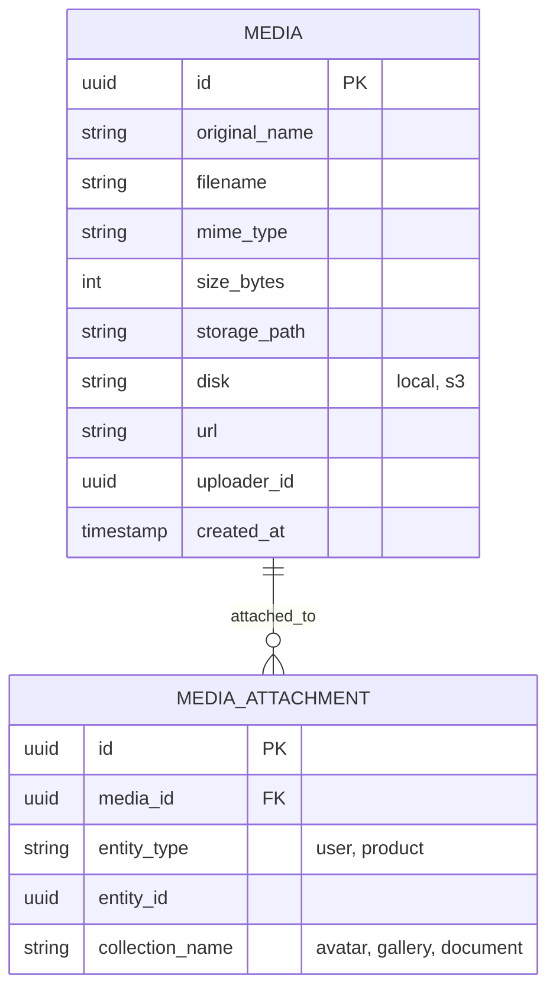

# Ikhtisar Modul: Media Management

- [Kembali ke Ikhtisar Modul](#)
- [Link ke Semua Modul](../../../README.md)
- [Link ke Skenario Pengujian](../../../testing/media-management/test-media-management.md)

---

## 1. Ikhtisar Modul (Module Overview)

- **Deskripsi singkat modul:** Modul Media Management menyediakan layanan terpusat untuk menangani pengunggahan (upload), penyimpanan (storage), dan pengambilan (retrieval) aset digital seperti gambar, dokumen, dan video. Modul ini mendukung relasi polimorfik sehingga entitas apapun (User, Product, Post) dapat memiliki lampiran tanpa perlu kolom blob/file khusus di tabel mereka sendiri.
- **Posisi modul dalam sistem:** Core Module Pendukung (Shared Kernel).
- **Hubungan dengan domain bisnis utama:** Digunakan oleh hampir semua fitur yang memerlukan lampiran file (Avatar Profil, Katalog Produk, Bukti Transaksi).

---

## 2. Tujuan & Nilai Bisnis (Purpose & Business Value)

### 2.1 Tanggung Jawab Utama
- Menangani proses upload file (Multipart/Form-data).
- Abstraksi penyimpanan fies (Local, S3, GCS, MinIO).
- Mengelola metadata file (Ukuran, Tipe MIME, Dimensi Gambar).
- Menyediakan URL publik atau Signed URL untuk akses aman.
- Menghubungkan file ke entitas domain via Polymorphic Association.

### 2.2 Nilai Bisnis
- **Efisiensi Storage:** Mencegah duplikasi file yang sama.
- **Keamanan:** Kontrol akses terpusat untuk file sensitif (misal: KTP vs Foto Profil Publik).
- **Maintainability:** Satu tempat untuk mengubah provider storage (misal: migrasi dari Local ke S3 tidak mengubah kode module lain).
- **Konsistensi:** Format penamaan dan validasi file seragam di seluruh aplikasi.

---

## 3. Lingkup (Scope)

### 3.1 Dalam Lingkup (In-Scope)
- API Upload & Delete File.
- Manajemen Media Library.
- Image Processing dasar (Resize/Thumbnail) saat upload.
- Dukungan Multi-provider Storage.
- Relasi Polimorfik (`entity_type`, `entity_id`).

### 3.2 Di Luar Lingkup (Out-of-Scope)
- Streaming Video Kompleks (HLS/DASH) - gunakan layanan khusus.
- Document Editing (seperti Google Docs) - hanya penyimpanan.

---

## 4. Cerita Pengguna (User Stories)

| ID        | Peran (Role) | Tujuan (Goal)                        | Manfaat (Benefit)                    |
| :-------- | :----------- | :----------------------------------- | :----------------------------------- |
| US-MED-01 | User         | Mengupload foto profil avatar        | Identitas visual di aplikasi.        |
| US-MED-02 | Admin        | Mengupload gambar produk             | Memperjelas katalog bagi pembeli.    |
| US-MED-03 | Sistem       | Generate thumbnail otomatis          | Mempercepat loading halaman listing. |
| US-MED-04 | User         | Melampirkan bukti transfer (dokumen) | Verifikasi pembayaran manual.        |

---

## 5. Alur & Aturan Bisnis (Business Flow & Rules)

### 5.1 Alur Bisnis (Business Flow)

#### Upload & Attach Flow

### 5.2 Aturan Bisnis

#### 5.2.1 Aturan Domain
- **Agnostik Entitas:** Modul media tidak boleh bergantung pada tabel `users` atau `products`.
- **Ownership:** Media yang privat hanya boleh diakses oleh pemilik (`uploader_id`) atau Admin.

#### 5.2.2 Aturan Operasional
- **Max File Size:** 5MB untuk gambar, 20MB untuk dokumen.
- **Allowed Types:** JPG, PNG, WEBP, PDF.
- **Cleanup:** File sementara (temp) yang tidak di-attach dalam 24 jam akan dihapus cron job.

---

## 6. Model Data (Data Model)

### 6.1 Entity Relationship Diagram (ERD)

---

## 7. Spesifikasi API (API Specification)

> Detail spesifikasi API dipisahkan ke dalam dokumen tersendiri di folder `.agent/documents/api/media-management/`.

- [Link ke Spesifikasi API](../../../api/media-management/api-media-management.md)

---

## 8. Ketergantungan (Dependencies)

### 8.1 Modul yang Dibutuhkan
- **Configuration:** Untuk menyimpan kredensial Storage (AWS Keys).

---

## 9. Titik Integrasi (Integration Points)

### 9.1 Integrasi Masuk
- **Sumber:** Semua Modul (Frontend/Mobile).
- **Pola:** REST API Upload.

---

## 10. Kepatuhan & Audit

### 10.1 Keamanan Data
- File sensitif tidak boleh dapat diakses publik (no public read bucket). Gunakan Presigned URL.

---

## 11. Tugas Implementasi (Implementation Tasks)

| ID Tugas  | Platform | Status | Deskripsi                                       |
| :-------- | :------- | :----- | :---------------------------------------------- |
| MED-BE-01 | Backend  | Todo   | Setup Storage Driver (Flysystem/Multer)         |
| MED-BE-02 | Backend  | Todo   | API Upload File & Validation                    |
| MED-BE-03 | Backend  | Todo   | Database Schema Migration (Media & Attachments) |
| MED-FE-01 | Frontend | Todo   | Komponen Upload (Drag & Drop, Progress Bar)     |
