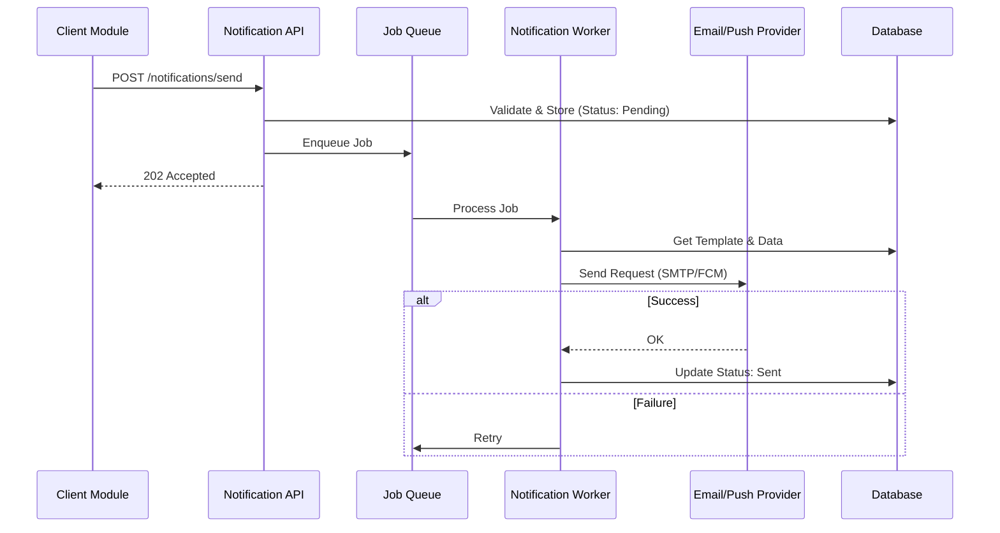

# Notification System

> Fitur pengelolaan dan pengiriman notifikasi multi-channel.

---

## Header & Navigation

- [Back to Module Overview](./overview.md)
- [Link to API Specification](../../api/notification/api-notifications.md)
- [Link to Testing Scenario](../../testing/notification/test-notification.md)

---

## 1. Feature Overview

- **Deskripsi singkat fitur:** Orkestra pengiriman notifikasi *omni-channel* (Email, Push, SMS, WebSocket) dengan manajemen antrian dan templat terpusat.
- **Peran dalam modul:** Bertindak sebagai *Communication Hub* yang menjembatani sistem dengan pengguna akhir.
- **Nilai bisnis:** Meningkatkan *retention* dan *engagement* pengguna melalui komunikasi transaksional dan promosi yang tepat waktu dan relevan.

---

## 2. User Stories

| ID        | Peran (Role) | Tujuan (Goal)                                                                    | Manfaat (Benefit)                                                                                                  |
| :-------- | :----------- | :------------------------------------------------------------------------------- | :----------------------------------------------------------------------------------------------------------------- |
| US-NOT-01 | System       | Mengirimkan kode OTP melalui Email/SMS untuk verifikasi 2FA                      | Menjamin keamanan akses akun pengguna melalui verifikasi kepemilikan kontak yang valid.                            |
| US-NOT-02 | User         | Menerima pembaruan status pesanan secara *real-time*                             | Memberikan kepastian informasi dan transparansi proses kepada pengguna.                                            |
| US-NOT-04 | User         | Mengakses riwayat notifikasi terdahulu melalui pusat notifikasi (*in-app*)       | Memungkinkan pengguna meninjau kembali informasi penting yang mungkin terlewat.                                    |
| US-NOT-05 | System       | Melakukan percobaan pengiriman ulang (*retry*) otomatis pada kegagalan sementara | Memastikan reliabilitas penyampaian pesan kritis (*delivery guarantee*) meskipun terjadi gangguan jaringan sesaat. |

---

## 3. Business Flow & Rules

### 3.1 Business Flow

#### Sending Notification Flow

### 3.2 Business Rules
- **User Preference:** Jangan kirim jika user Opt-Out.
- **Rate Limit:** Limit OTP (misal 10/jam).
- **Retention:** Log disimpan 1 tahun.

---

## 4. Data Model

- **Notification:** Log pesan (Type, Channel, Status).
- **Template:** Blueprint pesan (`Hello {{name}}`).
- **UserPreference:** Opt-in/out settings.

```mermaid
erDiagram
    Notifications {
        uuid id PK
        string type
        string notifiable_type
        int notifiable_id
        text data
        timestamp read_at
        timestamp created_at
        timestamp updated_at
    }

    NotificationTemplates {
        string code PK
        string channel "mail, database, broadcast"
        text content
        boolean is_active
    }

    UserPreferences {
        int user_id FK
        string channel
        boolean is_enabled
    }

    Notifications }o--|| NotificationTemplates : "uses"
```

---

## 5. Compliance & Audit

- **Anti-Spam:** Hormati Unsubscribe.
- **Security:** Masking OTP di log.

---

## 6. Implementation Tasks

| ID        | Platform | Status | Deskripsi                                       |
| :-------- | :------- | :----- | :---------------------------------------------- |
| NOT-BE-01 | Backend  | Todo   | Setup Notification Service & Queue (Redis/Bull) |
| NOT-BE-02 | Backend  | Todo   | Implement Provider Adapters (Email, Push)       |
| NOT-BE-03 | Backend  | Todo   | Implement API `POST /send` & `GET /list`        |
| NOT-FE-01 | Frontend | Todo   | Implement Notification Bell & Badge             |
| NOT-FE-02 | Frontend | Todo   | Implement Notification List Page                |
