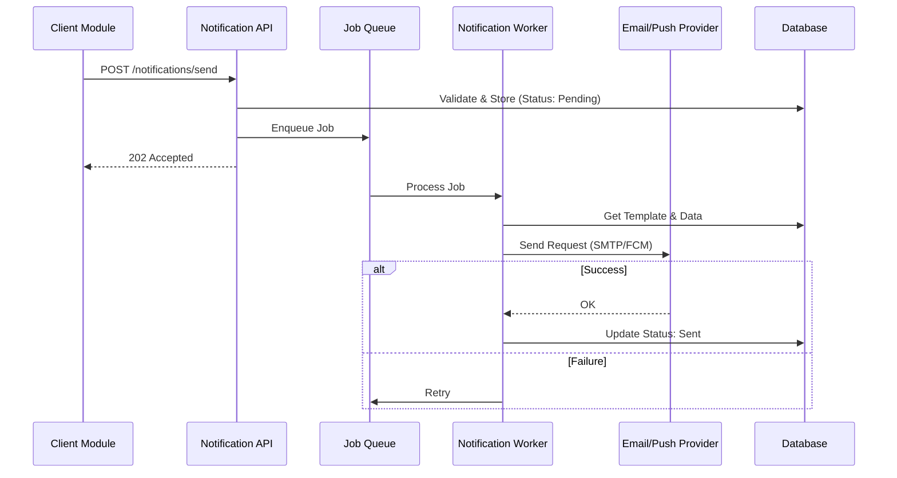
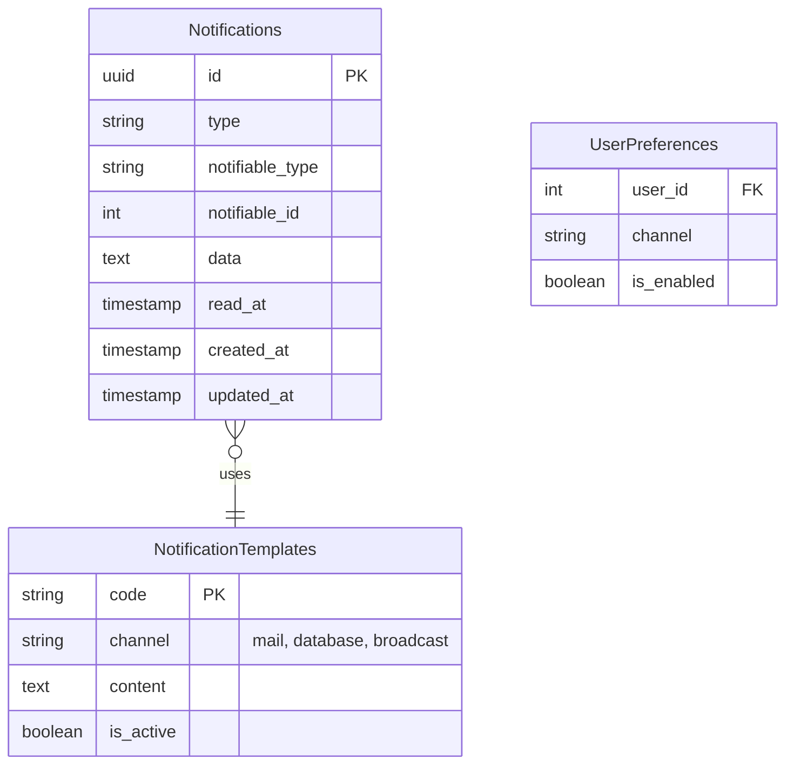

# Notification System

> Fitur pengelolaan dan pengiriman notifikasi multi-channel.

---

## Header & Navigation

- [Back to Module Overview](./overview.md)
- [Link to API Specification](../../api/notification/api-notifications.md)
- [Link to Testing Scenario](../../testing/notification/test-notification.md)

---

## 1. Feature Overview

- **Deskripsi singkat fitur:** Orkestra pengiriman notifikasi *omni-channel* (Email, Push, SMS, WebSocket) dengan manajemen antrian dan templat terpusat.
- **Peran dalam modul:** Bertindak sebagai *Communication Hub* yang menjembatani sistem dengan pengguna akhir.
- **Nilai bisnis:** Meningkatkan *retention* dan *engagement* pengguna melalui komunikasi transaksional dan promosi yang tepat waktu dan relevan.

---

## 2. User Stories

### US-NOT-01 — Kirim Kode OTP (2FA)

**Sebagai** Sistem
**Saya ingin** mengirimkan kode OTP via Email/SMS
**Sehingga** user dapat memverifikasi identitasnya

**Acceptance Criteria:**

* Support multi-channel (Email, WhatsApp, SMS)
* Kode OTP berlaku singkat (misal: 2 menit)
* Rate limiting diterapkan untuk mencegah spam
* Template pesan dapat dikonfigurasi

### US-NOT-02 — Update Status Pesanan Real-time

**Sebagai** User
**Saya ingin** menerima notifikasi saat status pesanan berubah
**Sehingga** saya mengetahui progres pembelian saya

**Acceptance Criteria:**

* Notifikasi Push / WebSocket ke aplikasi client
* Trigger otomatis saat event perubahan status terjadi di backend
* Notifikasi tersimpan di inbox aplikasi

### US-NOT-04 — Riwayat Notifikasi (Inbox)

**Sebagai** User
**Saya ingin** melihat riwayat notifikasi saya
**Sehingga** saya tidak ketinggalan info penting

**Acceptance Criteria:**

* List notifikasi dengan status read/unread
* Fitur "Mark as Read"
* Pagination untuk list notifikasi
* Grouping notifikasi berdasarkan kategori (Promo, Transaksi, System)

### US-NOT-05 — Auto Retry Delivery

**Sebagai** Sistem
**Saya ingin** mencoba kirim ulang notifikasi jika gagal
**Sehingga** pesan kritis tetap tersampaikan meski jaringan gangguan

**Acceptance Criteria:**

* Exponential backoff strategy untuk retry
* Maksimal percobaan: 3 kali
* Log error detail jika gagal permanen
* Mekanisme fallback channel (misal: WA gagal -> kirim SMS)

---

## 3. Business Flow & Rules

### 3.1 Business Flow

#### Sending Notification Flow

### 3.2 Business Rules
- **User Preference:** Jangan kirim jika user Opt-Out.
- **Rate Limit:** Limit OTP (misal 10/jam).
- **Retention:** Log disimpan 1 tahun.

---

## 4. Data Model

> Diagram Entity Relationship untuk Notification System.

- **Notification:** Log pesan (Type, Channel, Status).
- **Template:** Blueprint pesan (`Hello {{name}}`).
- **UserPreference:** Opt-in/out settings.

---

## 5. Compliance & Audit

- **Anti-Spam:** Hormati Unsubscribe.
- **Security:** Masking OTP di log.

---

## 6. Implementation Tasks

### 6.1 Backend

| Task ID   | Component  | Status | Description                                                                  |
| :-------- | :--------- | :----- | :--------------------------------------------------------------------------- |
| NOT-BE-01 | Migration  | Todo   | Create `notifications` table (UUID, polymorphic) & `notification_templates`. |
| NOT-BE-02 | Seeder     | Todo   | Seed default templates (OTP, Welcome Email).                                 |
| NOT-BE-03 | Model      | Todo   | Setup `Notification` model with cast & relationships.                        |
| NOT-BE-04 | Service    | Todo   | Implement `NotificationService` (Channel Strategy Pattern).                  |
| NOT-BE-05 | Queue      | Todo   | Setup `SendNotificationJob` with retry logic.                                |
| NOT-BE-06 | Controller | Todo   | Implement `NotificationController` (Send, List, Mark Read).                  |
| NOT-BE-07 | Routes     | Todo   | Register API routes.                                                         |
| NOT-BE-08 | Tests      | Todo   | Create Feature Test (Mocking Providers).                                     |

### 6.2 Frontend

| Task ID   | Component   | Status | Description                                            |
| :-------- | :---------- | :----- | :----------------------------------------------------- |
| NOT-FE-01 | State       | Todo   | Setup Notification Store (Pinia) & WebSocket listener. |
| NOT-FE-02 | API Service | Todo   | Create `NotificationService` (Axios wrapper).          |
| NOT-FE-03 | Component   | Todo   | Create `NotificationBell` with badge count.            |
| NOT-FE-04 | Component   | Todo   | Create `NotificationList` dropdown/page.               |
| NOT-FE-05 | Integration | Todo   | Connect Bell & List to Realtime Store.                 |
