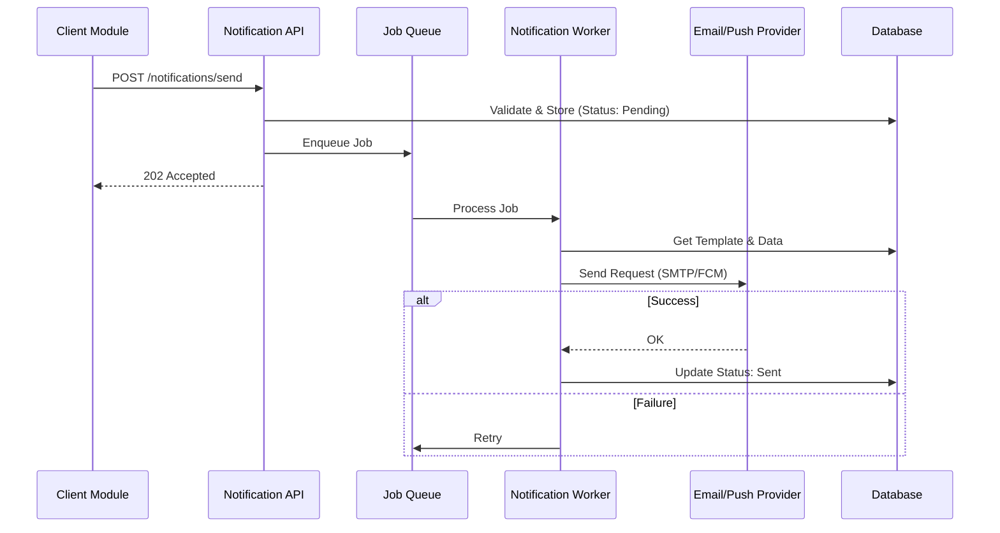

# Notification System

> Fitur pengelolaan dan pengiriman notifikasi multi-channel.

---

## Header & Navigasi

- [Kembali ke Ikhtisar Modul](./overview.md)
- [Link ke Spesifikasi API](../../api/notification/api-notifications.md)
- [Link ke Skenario Pengujian](../../testing/notification/test-notification.md)

---

## 1. Ikhtisar Fitur (Feature Overview)

- **Deskripsi singkat fitur:** Pengiriman Email, Push, SMS, dan In-App Notification.
- **Peran dalam modul:** Hub komunikasi sistem.
- **Nilai bisnis:** User Engagement & Transactional Reliability.

---

## 2. Cerita Pengguna (User Stories)

| ID        | Peran (Role) | Tujuan (Goal)                          | Manfaat (Benefit)                           |
| :-------- | :----------- | :------------------------------------- | :------------------------------------------ |
| US-NOT-01 | System       | Mengirim OTP via Email/SMS             | User dapat memverifikasi identitas.         |
| US-NOT-02 | User         | Menerima notifikasi status pesanan     | User mengetahui update transaksi mereka.    |
| US-NOT-04 | User         | Melihat riwayat notifikasi di aplikasi | User tidak ketinggalan informasi penting.   |
| US-NOT-05 | System       | Retry pengiriman jika gagal            | Memastikan pesan sampai walau ada gangguan. |

---

## 3. Alur & Aturan Bisnis (Business Flow & Rules)

### 3.1 Alur Bisnis

#### Sending Notification Flow

### 3.2 Aturan Bisnis
- **User Preference:** Jangan kirim jika user Opt-Out.
- **Rate Limit:** Limit OTP (misal 10/jam).
- **Retention:** Log disimpan 1 tahun.

---

## 4. Model Data (Data Model)

- **Notification:** Log pesan (Type, Channel, Status).
- **Template:** Blueprint pesan (`Hello {{name}}`).
- **UserPreference:** Opt-in/out settings.

*(Lihat ERD lengkap di Module Overview jika diperlukan)*

---

## 5. Kepatuhan & Audit (Compliance & Audit)

- **Anti-Spam:** Hormati Unsubscribe.
- **Security:** Masking OTP di log.

---

## 6. Tugas Implementasi (Implementation Tasks)

| ID        | Platform | Status | Deskripsi                                       |
| :-------- | :------- | :----- | :---------------------------------------------- |
| NOT-BE-01 | Backend  | Todo   | Setup Notification Service & Queue (Redis/Bull) |
| NOT-BE-02 | Backend  | Todo   | Implement Provider Adapters (Email, Push)       |
| NOT-BE-03 | Backend  | Todo   | Implement API `POST /send` & `GET /list`        |
| NOT-FE-01 | Frontend | Todo   | Implement Notification Bell & Badge             |
| NOT-FE-02 | Frontend | Todo   | Implement Notification List Page                |
