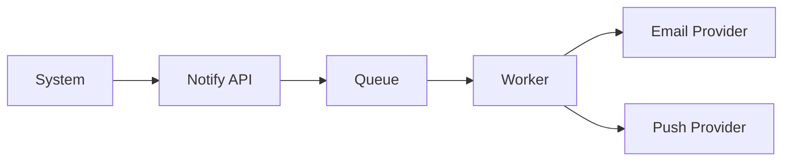

# Module Overview: Notification

> Modul komunikasi terpusat untuk Email, Push, SMS, dan In-App.

---

## Header & Navigation

- [Back to Module List](../../../README.md)
- [Link to Testing Scenario](../../testing/notification/test-notification.md)

---

## 1. Module Introduction

### 1.1 Brief Description
Modul ini mengelola template dan pengiriman pesan transaksional/promosi ke pengguna melalui berbagai kanal (Omnichannel).

### 1.2 Position & Role
- **Tipe:** Core Support Module.
- **Value:** User Engagement.

---

## 2. Feature List

| Fitur                                           | Deskripsi                      | Status |
| :---------------------------------------------- | :----------------------------- | :----- |
| [Notification System](./notification-system.md) | Sending, Templating, & History | Stable |

---

## 3. High-Level Architecture

---

## 4. Global Dependencies

- **IAM:** Validasi User ID.
- **Configuration:** Credentials Provider.

---
