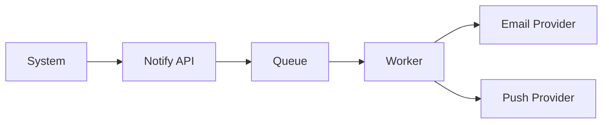

# Ikhtisar Modul: Notification

> Modul komunikasi terpusat untuk Email, Push, SMS, dan In-App.

---

## Header & Navigasi

- [Kembali ke Daftar Modul](../../../README.md)
- [Link ke Skenario Pengujian](../../testing/notification/test-notification.md)

---

## 1. Pengantar Modul

### 1.1 Deskripsi Singkat
Modul ini mengelola template dan pengiriman pesan transaksional/promosi ke pengguna melalui berbagai kanal (Omnichannel).

### 1.2 Posisi & Peran
- **Tipe:** Core Support Module.
- **Value:** User Engagement.

---

## 2. Daftar Fitur (Feature List)

| Fitur                                           | Deskripsi                      | Status |
| :---------------------------------------------- | :----------------------------- | :----- |
| [Notification System](./notification-system.md) | Sending, Templating, & History | Stable |

---

## 3. Arsitektur Level Tinggi

---

## 4. Ketergantungan Global

- **IAM:** Validasi User ID.
- **Configuration:** Credentials Provider.

---
