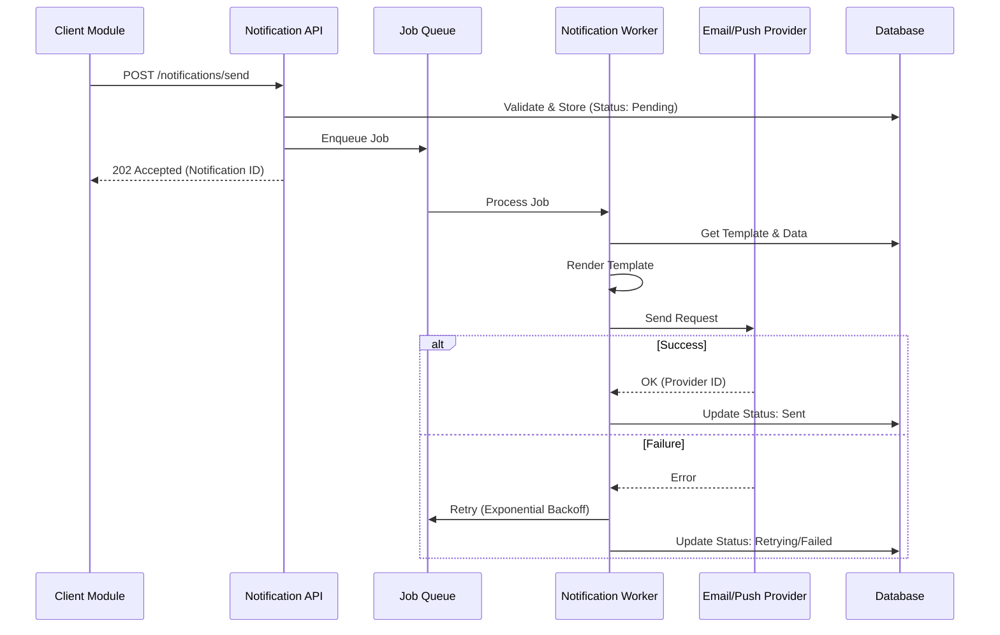
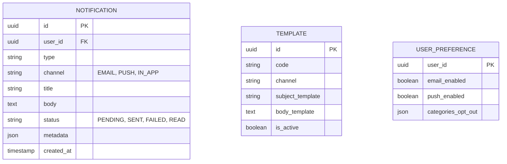

# Module Overview: Notification System

- [Back to Module Overview](#)
- [Link ke All Modules](../../../README.md)
- [Link ke Scenario Testing](../../../testing/notification/overview.md)

---

## 1. Module Overview

- **Deskripsi singkat modul:** Modul Notification bertanggung jawab untuk mengelola dan mengirimkan notifikasi kepada pengguna melalui berbagai saluran (Email, Push Notification, SMS, dan In-App Notification). Modul ini menyediakan antarmuka terpusat bagi modul lain untuk mengirim pesan tanpa perlu mengetahui detail implementasi penyedia layanan (provider).
- **Posisi modul dalam sistem:** Core / Supporting Module. Digunakan oleh hampir semua modul lain (IAM untuk OTP, Order untuk status pesanan, dll).
- **Hubungan dengan domain bisnis utama:** Mendukung *User Engagement* dan *Transactional Communication*.

---

## 2. Purpose & Business Value

### 2.1 Tanggung Jawab Utama
- Mengelola template notifikasi.
- Mengirim pesan transactional dan promotional.
- Melacak status pengiriman (Sent, Delivered, Failed, Read).
- Mengelola preferensi notifikasi pengguna.

### 2.2 Nilai Bisnis
- **Compliance:** Menyimpan log komunikasi untuk audit.
- **Risk reduction:** Memastikan pesan kritis (OTP, Security Alert) terkirim.
- **Operational efficiency:** Sentralisasi pengelolaan template mengurangi duplikasi kode.
- **Data accuracy:** Tracking status pengiriman yang akurat.
- **Strategic enablement:** Memungkinkan kampanye marketing melalui push notification.

---

## 3. Scope

### 3.1 In-Scope
- Pengiriman Email (via SMTP/API Provider seperti SendGrid/AWS SES).
- Pengiriman Push Notification (via FCM/APNS).
- In-App Notification (disimpan di database dan diambil via API).
- Manajemen Template (HTML/Text dengan variabel dinamis).
- Queueing system untuk pengiriman asinkron.
- Retry mechanism untuk pengiriman yang gagal.

### 3.2 Out-of-Scope
- Chatting antar user (Real-time chat).
- Marketing Automation logic yang kompleks (Campaign management ada di modul Marketing).
- Provider-specific billing management.

---

## 4. User Stories

| ID        | Role   | Goal                                   | Benefit                                                     |
| :-------- | :----- | :------------------------------------- | :---------------------------------------------------------- |
| US-NOT-01 | System | Mengirim OTP via Email/SMS             | User dapat memverifikasi identitas.                         |
| US-NOT-02 | User   | Menerima notifikasi status pesanan     | User mengetahui update transaksi mereka.                    |
| US-NOT-03 | Admin  | Membuat template email baru            | Pesan keluar konsisten dengan branding.                     |
| US-NOT-04 | User   | Melihat riwayat notifikasi di aplikasi | User tidak ketinggalan informasi penting.                   |
| US-NOT-05 | System | Retry pengiriman jika gagal            | Memastikan pesan sampai meski ada gangguan jaringan sesaat. |

---

## 5. Business Flow & Rules

### 5.1 Business Flow

#### Sending Notification Flow

### 5.2 Business Rules & Functional Requirements

#### 5.2.1 Domain Rules
- Setiap notifikasi harus memiliki `type` (misal: `OTP`, `ORDER_UPDATE`, `PROMO`).
- Email harus memiliki `subject` dan `body`.
- Push notification harus memiliki `title` dan `body`.
- User yang opt-out dari tipe notifikasi tertentu (misal: Marketing) tidak boleh dikirimi pesan tipe tersebut.

#### 5.2.2 Financial / Operational Rules
- Rate limiting: Maksimal 10 OTP per jam per user.
- Retention: Log notifikasi disimpan selama 1 tahun.

---

## 6. Data Model

### 6.1 Entity Relationship Diagram (ERD)

### 6.2 Entity Definition
- **Notification:** Record utama setiap pesan yang dikirim.
- **Template:** Blueprint pesan dengan placeholder `{{variable}}`.

---

## 7. API Specification

> Detail spesifikasi API dipisahkan ke dalam dokumen tersendiri di folder `.agent/api/notification/`.

- [Link ke API Specification](../../api/notification/api-notifications.md)

---

## 8. Dependencies

### 8.1 Required Modules
- **IAM Module:** Untuk validasi `user_id` penerima.
- **Configuration Module:** Untuk menyimpan API Key provider (SendGrid, Firebase).

### 8.2 Optional Modules
- None.

---

## 9. Integration Points

### 9.1 Inbound Integration
- **Source:** All Modules.
- **Data:** `user_id`, `template_code`, `data_payload`.
- **Pattern:** REST API (`POST /notifications/send`) atau Event Bus.

### 9.2 Outbound Integration
- **Target:** External Providers (SendGrid, FCM).
- **Data:** Email content, device token.

---

## 10. Compliance & Audit

### 10.1 Regulatory Compliance
- **GDPR:** User berhak "be forgotten" (anonymize log).
- **Anti-Spam:** Harus menghormati Unsubscribe link.

### 10.2 Audit Trail Requirements
- Mencatat kapan pesan dikirim dan diterima provider.
- Mencatat siapa yang mengubah template.

---

## 11. Data Ownership & Lifecycle

### 11.1 Entity Ownership
- **Owner:** System.
- **Read:** User (hanya notifikasi miliknya), Admin.

### 11.2 Lifecycle Status
- `PENDING` -> `QUEUED` -> `SENT` -> `READ` (untuk In-App).
- `PENDING` -> `FAILED`.

---

## 12. Extensibility Notes

### 12.1 Configuration
- Provider dapat diganti lewat Configuration tanpa ubah kode (adapter pattern).

---

## 13. Mandatory Invariants
- Notifikasi `OTP` tidak boleh di-cache atau di-log kontennya secara plaintext (masking).

---

## 14. UI/UX Requirements

### 14.1 Web / Admin
- Dashboard status pengiriman.
- Editor Template (WYSIWYG).

### 14.2 Mobile
- In-App Notification Center (List, Badge Count, Mark as Read).

---

## 15. Implementation Tasks

**Strict Rule:** Every backend task that involves a user interface must have a corresponding frontend task.

| Task ID   | Platform | Status | Description                                     |
| :-------- | :------- | :----- | :---------------------------------------------- |
| NOT-BE-01 | Backend  | Todo   | Setup Notification Service & Queue (Redis/Bull) |
| NOT-BE-02 | Backend  | Todo   | Implement Provider Adapters (Email, Push)       |
| NOT-BE-03 | Backend  | Todo   | Implement API `POST /send` & `GET /list`        |
| NOT-FE-01 | Frontend | Todo   | Implement Notification Bell & Badge             |
| NOT-FE-02 | Frontend | Todo   | Implement Notification List Page                |
| NOT-FE-03 | Frontend | Todo   | Implement Admin Template Editor                 |
