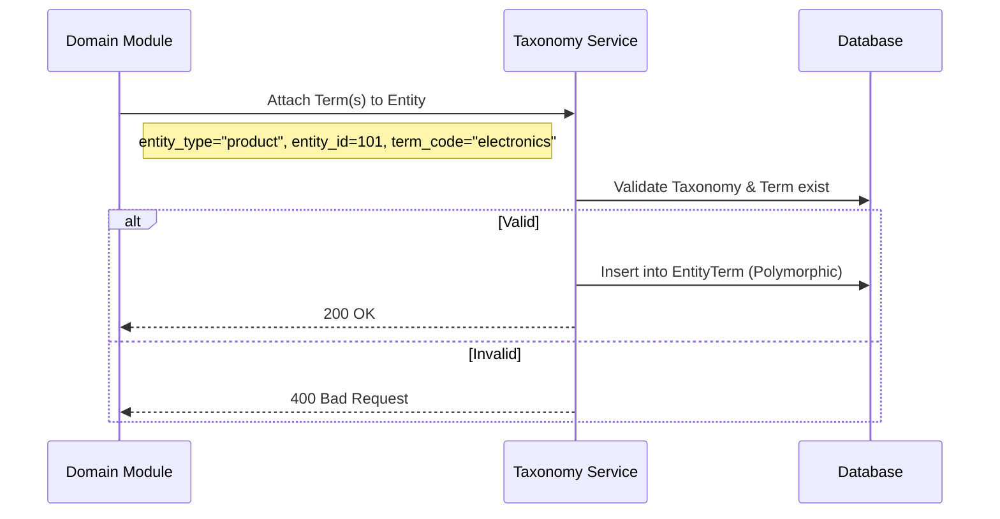
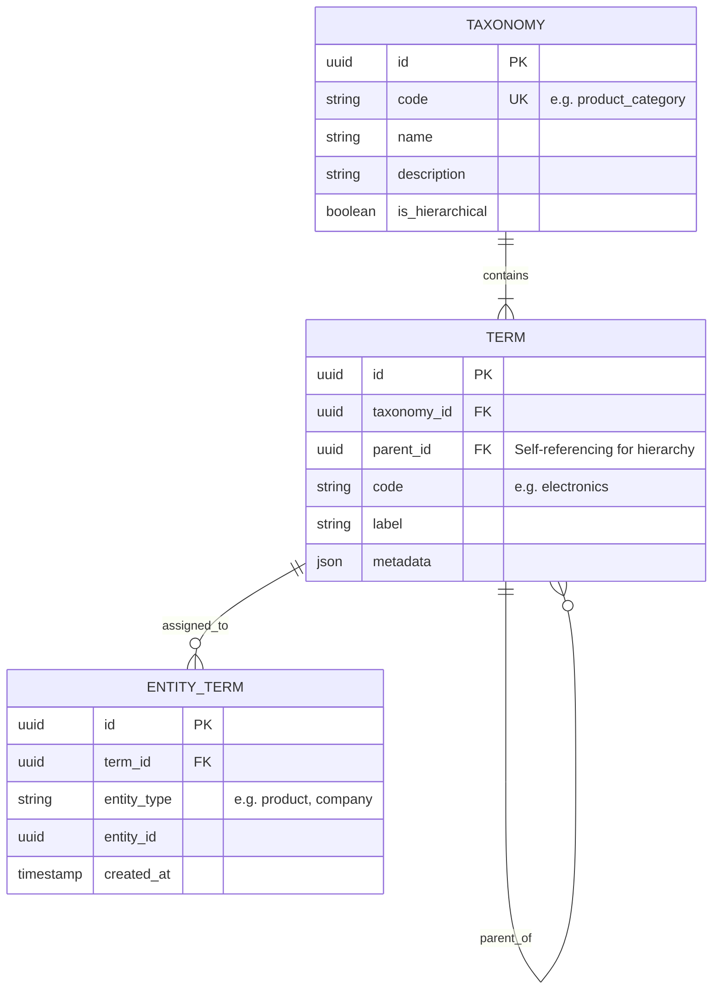

# Ikhtisar Modul: Taxonomy

- [Kembali ke Ikhtisar Modul](#)
- [Link ke Semua Modul](../../../README.md)
- [Link ke Skenario Pengujian](../../../testing/taxonomy/test-taxonomy.md)

---

## 1. Ikhtisar Modul (Module Overview)

- **Deskripsi singkat modul:** Modul Taxonomy menyediakan **sistem klasifikasi terpusat, dapat digunakan kembali, dan agnostik entitas** untuk aplikasi. Modul ini bertindak sebagai satu-satunya sumber kebenaran (single source of truth) untuk kategori, tag, label, dan skill.
- **Posisi modul dalam sistem:** Core Module Pendukung (Shared Kernel).
- **Hubungan dengan domain bisnis utama:** Digunakan oleh Produk, Perusahaan, Karyawan, dan konten lainnya untuk klasifikasi.

---

## 2. Tujuan & Nilai Bisnis (Purpose & Business Value)

### 2.1 Tanggung Jawab Utama
- Mendefinisikan dan mengelola taksonomi (namespace seperti `product_category`).
- Mengelola istilah/term taksonomi (nilai seperti `Elektronik`).
- Mendukung definisi hierarkis (Parent-Child).
- Melampirkan term ke entitas apa pun melalui asosiasi polimorfik.

### 2.2 Nilai Bisnis
- **Skalabilitas (Scalability):** Menghilangkan redundansi tabel kategori di setiap domain (Tidak ada lagi tabel `product_categories`, `company_categories` yang terpisah).
- **Konsistensi (Consistency):** Penamaan dan struktur tag yang konsisten di seluruh sistem.
- **Fleksibilitas (Flexibility):** Mudah menambah tipe klasifikasi baru tanpa migrasi database di tabel domain.

---

## 3. Lingkup (Scope)

### 3.1 Dalam Lingkup (In-Scope)
- Manajemen Taxonomies & Terms.
- Term Hierarkis (Parent-Child).
- Pelampiran Entitas (Polimorfik).
- Aturan Validasi (misal: satu entitas max 5 tags).

### 3.2 Di Luar Lingkup (Out-of-Scope)
- Logika bisnis dari domain pengguna (misal: Harga Produk berdasarkan Kategori itu urusan modul Produk).
- Perilaku UI (Modul Taxonomy hanya sebagai penyedia data).

---

## 4. Cerita Pengguna (User Stories)

| ID        | Peran (Role) | Tujuan (Goal)                             | Manfaat (Benefit)                                        |
| :-------- | :----------- | :---------------------------------------- | :------------------------------------------------------- |
| US-TAX-01 | Admin        | Membuat Taxonomy baru (misal: "Skill")    | Mempersiapkan sistem untuk fitur baru (Profil Karyawan). |
| US-TAX-02 | Admin        | Menambah Term pada Taxonomy               | Menyediakan opsi pilihan bagi pengguna.                  |
| US-TAX-03 | Sistem       | Attach Term "Javascript" ke Karyawan A    | Klasifikasi skill tanpa mengubah tabel Employee.         |
| US-TAX-04 | Pengguna     | Memfilter Produk berdasarkan "Elektronik" | Menemukan item yang relevan dengan cepat.                |

---

## 5. Alur & Aturan Bisnis (Business Flow & Rules)

### 5.1 Alur Bisnis (Business Flow)

#### Alur Pelampiran Term (Term Attachment Flow)

### 5.2 Aturan Bisnis

#### 5.2.1 Aturan Domain
- **Kode Stabil (Stable Codes):** Taxonomy dan Term harus menggunakan `code` (slug) yang stabil, bukan hanya ID.
- **Agnostik Entitas (Entity Agnostic):** Modul ini tidak boleh bergantung pada class `Product` atau `User`. Gunakan string `entity_type`.
- **Dilarang Hardcoding:** ID tidak boleh di-hardcode di kode aplikasi.

---

## 6. Model Data (Data Model)

### 6.1 Entity Relationship Diagram (ERD)

---

## 7. Spesifikasi API (API Specification)

> Detail spesifikasi API dipisahkan ke dalam dokumen tersendiri.

- [Link ke Spesifikasi API](../../../api/taxonomy/api-taxonomy.md)

---

## 8. Ketergantungan (Dependencies)

### 8.1 Modul yang Dibutuhkan
- **Database:** Penyimpanan relasional.

---

## 9. Titik Integrasi (Integration Points)

### 9.1 Integrasi Masuk
- **Sumber:** Semua Modul.
- **Pola:** Panggilan API / Antarmuka Layanan untuk mengambil/mengatur terms.

---

## 10. Kepatuhan & Audit

### 10.1 Kebutuhan Jejak Audit
- Perubahan struktur Taxonomy (tambah/hapus term) harus dicatat admin-nya.

---

## 11. Tugas Implementasi (Implementation Tasks)

| ID Tugas  | Platform | Status | Deskripsi                                                      |
| :-------- | :------- | :----- | :------------------------------------------------------------- |
| TAX-BE-01 | Backend  | Todo   | Buat API CRUD Taxonomy & Terms                                 |
| TAX-BE-02 | Backend  | Todo   | Implementasi Logika Pelampiran Polimorfik                      |
| TAX-BE-03 | Backend  | Todo   | Optimasi Query (hindari N+1 saat mengambil entitas dengan tag) |
| TAX-FE-01 | Frontend | Todo   | Buat Manajer Taxonomy (UI Admin)                               |
| TAX-FE-02 | Frontend | Todo   | Buat Komponen "Tag Input" yang dapat digunakan kembali         |
