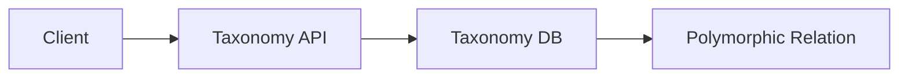

# Ikhtisar Modul: Taxonomy

> Modul klasifikasi universal untuk pengelompokan entitas (Tagging, Categorization).

---

## Header & Navigasi

- [Kembali ke Daftar Modul](../../../README.md)
- [Link ke Skenario Pengujian](../../testing/taxonomy/test-taxonomy.md)

---

## 1. Pengantar Modul

### 1.1 Deskripsi Singkat
Modul ini menyediakan sistem klasifikasi terpusat yang agnostik terhadap entitas, memungkinkan fitur seperti Kategori Produk, Skill Karyawan, dan Label Konten dikelola di satu tempat.

### 1.2 Posisi & Peran
- **Tipe:** Core Support Module (Shared Kernel).
- **Value:** Data Consistency & flexibility.

---

## 2. Daftar Fitur (Feature List)

| Fitur                                           | Deskripsi                      | Status |
| :---------------------------------------------- | :----------------------------- | :----- |
| [Taxonomy Management](./taxonomy-management.md) | Hierarchical Categories & Tags | Stable |

---

## 3. Arsitektur Level Tinggi

---

## 4. Ketergantungan Global

- **Database:** Relational DB (FK integrity).

---
