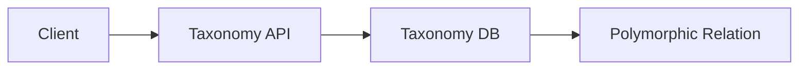

# Module Overview: Taxonomy

> Modul klasifikasi universal untuk pengelompokan entitas (Tagging, Categorization).

---

## Header & Navigation

- [Back to Module List](../../../README.md)
- [Link to Testing Scenario](../../testing/taxonomy/test-taxonomy.md)

---

## 1. Module Introduction

### 1.1 Brief Description
Modul ini menyediakan sistem klasifikasi terpusat yang agnostik terhadap entitas, memungkinkan fitur seperti Kategori Produk, Skill Karyawan, dan Label Konten dikelola di satu tempat.

### 1.2 Position & Role
- **Tipe:** Core Support Module (Shared Kernel).
- **Value:** Data Consistency & flexibility.

---

## 2. Feature List

| Fitur                                           | Deskripsi                      | Status |
| :---------------------------------------------- | :----------------------------- | :----- |
| [Taxonomy Management](./taxonomy-management.md) | Hierarchical Categories & Tags | Stable |

---

## 3. High-Level Architecture

---

## 4. Global Dependencies

- **Database:** Relational DB (FK integrity).

---
