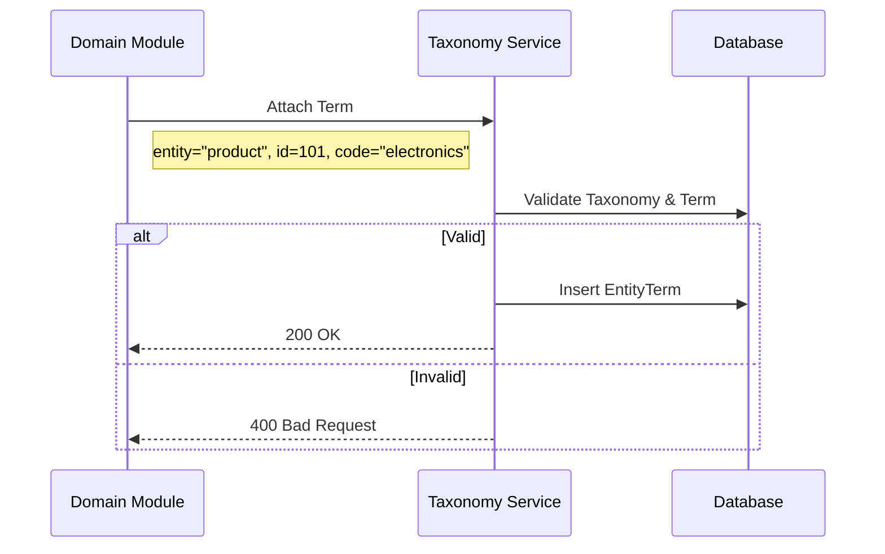
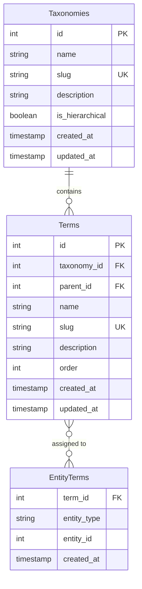

# Taxonomy Management

> Fitur pengelolaan klasifikasi, kategori, dan tagging terpusat.

---

## Header & Navigation

- [Back to Module Overview](./overview.md)
- [Link to API Specification](../../api/taxonomy/api-taxonomy.md)
- [Link to Testing Scenario](../../testing/taxonomy/test-taxonomy.md)

---

## 1. Feature Overview

- **Deskripsi singkat fitur:** Menyediakan mekanisme klasifikasi entitas yang fleksibel melalui struktur taksonomi (Hierarkis/Flat) dan *tagging* polimorfik.
- **Peran dalam modul:** Berfungsi sebagai *Single Source of Truth* untuk standarisasi nomenklatur dan pengelompokan data di seluruh sistem.
- **Nilai bisnis:** Mengeliminasi redundansi struktur data kategori, meningkatkan konsistensi pelaporan, dan memungkinkan navigasi konten yang lebih kaya.

---

## 2. User Stories

| ID        | Peran (Role) | Tujuan (Goal)                                                       | Manfaat (Benefit)                                                                                         |
| :-------- | :----------- | :------------------------------------------------------------------ | :-------------------------------------------------------------------------------------------------------- |
| US-TAX-01 | Admin        | Membuat definisi Taksonomi baru (misal: "Skill", "Kategori Produk") | Mempersiapkan struktur klasifikasi yang relevan untuk kebutuhan fitur baru tanpa mengubah skema database. |
| US-TAX-02 | Admin        | Menambah *Terms* baru ke dalam Taksonomi yang sudah ada             | Memperkaya opsi klasifikasi yang tersedia bagi pengguna akhir.                                            |
| US-TAX-03 | Sistem       | Melampirkan *Term* ke entitas bisnis secara polimorfik              | Mengklasifikasikan data (misal: memberikan skill ke karyawan) tanpa membuat tabel relasi khusus.          |
| US-TAX-04 | Pengguna     | Melakukan filter data berdasarkan *Term* spesifik                   | Menemukan item yang relevan dengan cepat melalui navigasi berbasis aspek (*faceted search*).              |

---

## 3. Business Flow & Rules

### 3.1 Business Flow

#### Term Attachment (Polymorphic)

### 3.2 Business Rules
- **Stable Codes:** Taxonomy & Term wajib punya `slug/code` yang unik dan stabil.
- **Polymorphic:** Tabel relasi menggunakan `entity_type` dan `entity_id`.
- **Validation:** Cegah duplikasi tag pada entitas yang sama.

---

## 4. Data Model

- **Taxonomy:** Namespace (misal `product_category`, `tags`).
- **Term:** Nilai (misal `electronics`, `fashion`).
- **EntityTerm:** Pivot table.

---

## 5. Compliance & Audit

- **Audit:** Perubahan struktur taksonomi (Taxonomy/Term) wajib dicatat aktor-nya.

---

## 6. Implementation Tasks

| ID        | Platform | Status | Deskripsi                                              |
| :-------- | :------- | :----- | :----------------------------------------------------- |
| TAX-BE-01 | Backend  | Todo   | Buat API CRUD Taxonomy & Terms                         |
| TAX-BE-02 | Backend  | Todo   | Implementasi Logika Pelampiran Polimorfik              |
| TAX-BE-03 | Backend  | Todo   | Optimasi Query (N+1 Problem)                           |
| TAX-FE-01 | Frontend | Todo   | Buat Manajer Taxonomy (UI Admin)                       |
| TAX-FE-02 | Frontend | Todo   | Buat Komponen "Tag Input" yang dapat digunakan kembali |
