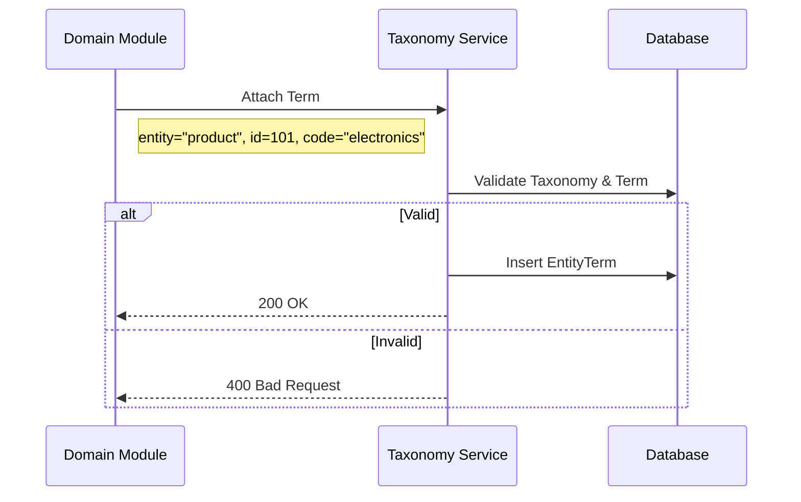
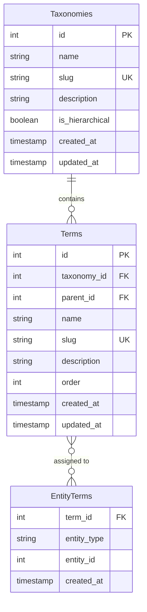

# Taxonomy Management

> Fitur pengelolaan klasifikasi, kategori, dan tagging terpusat.

---

## Header & Navigation

- [Back to Module Overview](./overview.md)
- [Link to API Specification](../../api/taxonomy/api-taxonomy.md)
- [Link to Testing Scenario](../../testing/taxonomy/test-taxonomy.md)

---

## 1. Feature Overview

- **Deskripsi singkat fitur:** Menyediakan mekanisme klasifikasi entitas yang fleksibel melalui struktur taksonomi (Hierarkis/Flat) dan *tagging* polimorfik.
- **Peran dalam modul:** Berfungsi sebagai *Single Source of Truth* untuk standarisasi nomenklatur dan pengelompokan data di seluruh sistem.
- **Nilai bisnis:** Mengeliminasi redundansi struktur data kategori, meningkatkan konsistensi pelaporan, dan memungkinkan navigasi konten yang lebih kaya.

---

## 2. User Stories

### US-TAX-01 — Definisi Taksonomi Baru

**Sebagai** Admin
**Saya ingin** membuat jenis taksonomi baru (misal: Skill, Kategori)
**Sehingga** saya bisa mengelompokkan data tanpa ubah kode

**Acceptance Criteria:**

* Input nama taksonomi dan slug unik
* Opsi hierarki (apakah taksonomi ini bertingkat atau flat)
* Opsi public/private visibility

### US-TAX-02 — Manajemen Terms

**Sebagai** Admin
**Saya ingin** menambah dan mengedit terms dalam taksonomi
**Sehingga** pilihan klasifikasi tersedia untuk user

**Acceptance Criteria:**

* CRUD Terms (Create, Read, Update, Delete)
* Support parent-child relationship untuk hierarki
* Bulk import terms (opsional)

### US-TAX-03 — Attach Term ke Entitas

**Sebagai** Sistem
**Saya ingin** menempelkan term ke entitas (assign tag/category)
**Sehingga** data terorganisir dengan baik

**Acceptance Criteria:**

* Support polymorphic relation (bisa attach ke User, Product, Article, dll)
* Validasi term harus ada di database
* Optimasi query untuk retrieving relation

### US-TAX-04 — Filter Data by Term

**Sebagai** Pengguna
**Saya ingin** memfilter data berdasarkan kategori/tag
**Sehingga** saya menemukan item yang relevan

**Acceptance Criteria:**

* API support filter query `?tag=php,laravel`
* Performance index yang cepat untuk filtering
* Support kombinasi filter (AND/OR logic)

---

## 3. Business Flow & Rules

### 3.1 Business Flow

#### Term Attachment (Polymorphic)

### 3.2 Business Rules
- **Stable Codes:** Taxonomy & Term wajib punya `slug/code` yang unik dan stabil.
- **Polymorphic:** Tabel relasi menggunakan `entity_type` dan `entity_id`.
- **Validation:** Cegah duplikasi tag pada entitas yang sama.

---

## 4. Data Model

> Diagram Entity Relationship untuk Taxonomy Management.

- **Taxonomy:** Namespace (misal `product_category`, `tags`).
- **Term:** Nilai (misal `electronics`, `fashion`).
- **EntityTerm:** Pivot table.

---

## 5. Compliance & Audit

- **Audit:** Perubahan struktur taksonomi (Taxonomy/Term) wajib dicatat aktor-nya.

---

## 6. Implementation Tasks

### 6.1 Backend

| Task ID   | Component  | Status | Description                                             |
| :-------- | :--------- | :----- | :------------------------------------------------------ |
| TAX-BE-01 | Migration  | Todo   | Create `taxonomies` and `terms` tables with indices.    |
| TAX-BE-02 | Migration  | Todo   | Create `entity_terms` polymorphic pivot table.          |
| TAX-BE-03 | Model      | Todo   | Setup `Taxonomy` & `Term` models with relations.        |
| TAX-BE-04 | Service    | Todo   | Implement `TaxonomyService` (CRUD & Attachment Logic).  |
| TAX-BE-05 | Controller | Todo   | Implement `TaxonomyController` with JSON:API standards. |
| TAX-BE-06 | Routes     | Todo   | Register API routes.                                    |
| TAX-BE-07 | Tests      | Todo   | Create Unit & Feature tests for Taxonomy ops.           |

### 6.2 Frontend

| Task ID   | Component   | Status | Description                               |
| :-------- | :---------- | :----- | :---------------------------------------- |
| TAX-FE-01 | State       | Todo   | Setup Taxonomy Store (Pinia/Context).     |
| TAX-FE-02 | API         | Todo   | Create `TaxonomyService` wrapper.         |
| TAX-FE-03 | Component   | Todo   | Create `TaxonomyManager` UI for Admin.    |
| TAX-FE-04 | Component   | Todo   | Create reusable `TagInput` component.     |
| TAX-FE-05 | Integration | Todo   | Integrate `TagInput` into existing forms. |
