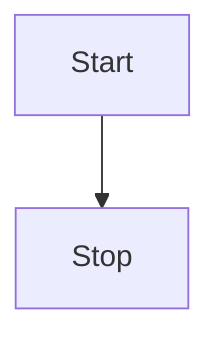

# Feature Specification: [Feature Name]

> Dokumen ini merinci logika dan spesifikasi fitur spesifik dalam modul.

---

## Header & Navigation

- [Back to Module Overview](./overview.md)
- [Link ke API Specification](../../api/<slug>/api-<slug>.md)

---

## 1. Feature Description

### 1.1 Description
[Jelaskan fitur ini secara mendalam]

### 1.2 Business Logic
[Jelaskan logika bisnis, flowchart, algoritma]

### 1.3 Data Handling
[Jelaskan bagaimana data diproses, validasi khusus, konversi tipe data]

---

## 2. Technical Details

### 2.1 Dependencies
[Service atau library apa yang dibutuhkan]

### 2.2 Configuration
[Config apa saja yang mempengaruhi fitur ini]

---
