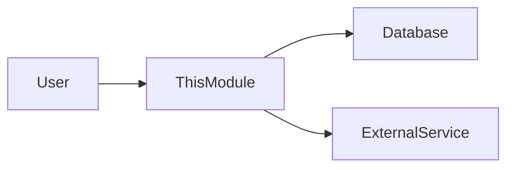

# [Nama Modul]

> Gunakan template ini sebagai halaman depan (landing page) untuk setiap Modul. Berisi ringkasan level tinggi dan daftar fitur.

---

## Header & Navigasi

- [Kembali ke Daftar Modul](../../../README.md)
- [Link ke Skenario Pengujian](../../testing/<module-name>/test-<module-name>.md)

---

## 1. Pengantar Modul

### 1.1 Deskripsi Singkat
[Jelaskan apa tanggung jawab utama modul ini dalam 1-2 kalimat]

### 1.2 Posisi & Peran
- **Tipe:** [Core / Support / Optional]
- **Value:** [Nilai bisnis utama]

---

## 2. Daftar Fitur (Feature List)

Modul ini terdiri dari fitur-fitur berikut. Silakan klik untuk melihat spesifikasi detail.

| Fitur                                   | Deskripsi                     | Status      |
| :-------------------------------------- | :---------------------------- | :---------- |
| [Nama Fitur](./feature-file.md)         | Penjelasan singkat fitur      | Stable/Beta |
| [User Management](./user-management.md) | CRUD user dan role assignment | Stable      |

---

## 3. Arsitektur Level Tinggi

Gambaran bagaimana modul ini berinteraksi dengan modul lain secara global.

---

## 4. Ketergantungan Global

- **Database:** [Nama DB]
- **Services:** [Service lain yang dibutuhkan]

---
