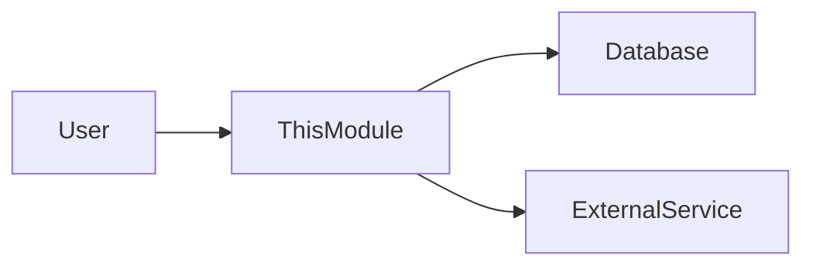

# [Module Name]

> Gunakan template ini sebagai halaman depan (landing page) untuk setiap Modul. Berisi ringkasan level tinggi dan daftar fitur.

---

## Header & Navigation

- [Back to Module List](../../../README.md)
- [Link to Testing Scenario](../../testing/<module-name>/test-<module-name>.md)

---

## 1. Module Introduction

### 1.1 Brief Description
[Jelaskan apa tanggung jawab utama modul ini dalam 1-2 kalimat]

### 1.2 Position & Role
- **Type:** [Core / Support / Optional]
- **Value:** [Nilai bisnis utama]

---

## 2. Feature List

Modul ini terdiri dari fitur-fitur berikut. Silakan klik untuk melihat spesifikasi detail.

| Feature                                 | Description                   | Status      |
| :-------------------------------------- | :---------------------------- | :---------- |
| [Feature Name](./feature-file.md)       | Penjelasan singkat fitur      | Stable/Beta |
| [User Management](./user-management.md) | CRUD user dan role assignment | Stable      |

---

## 3. High-Level Architecture

Gambaran bagaimana modul ini berinteraksi dengan modul lain secara global.

---

## 4. Global Dependencies

- **Database:** [Nama DB]
- **Services:** [Service lain yang dibutuhkan]

---
