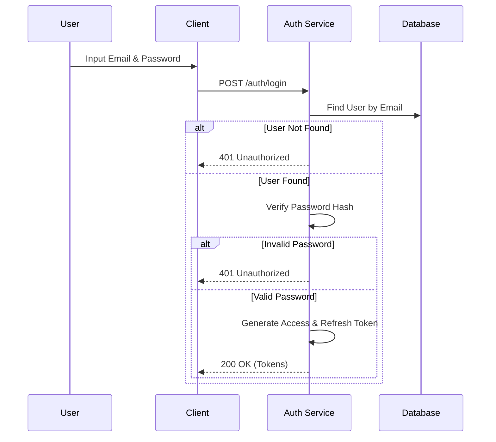
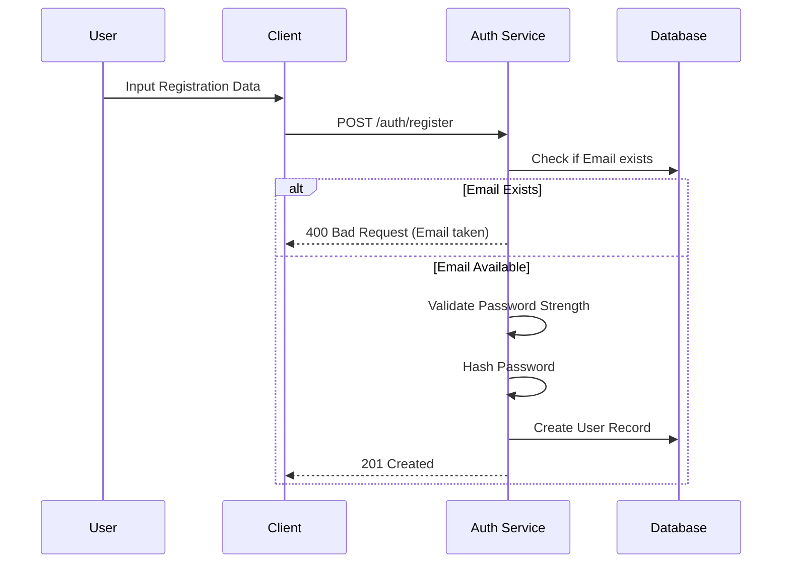
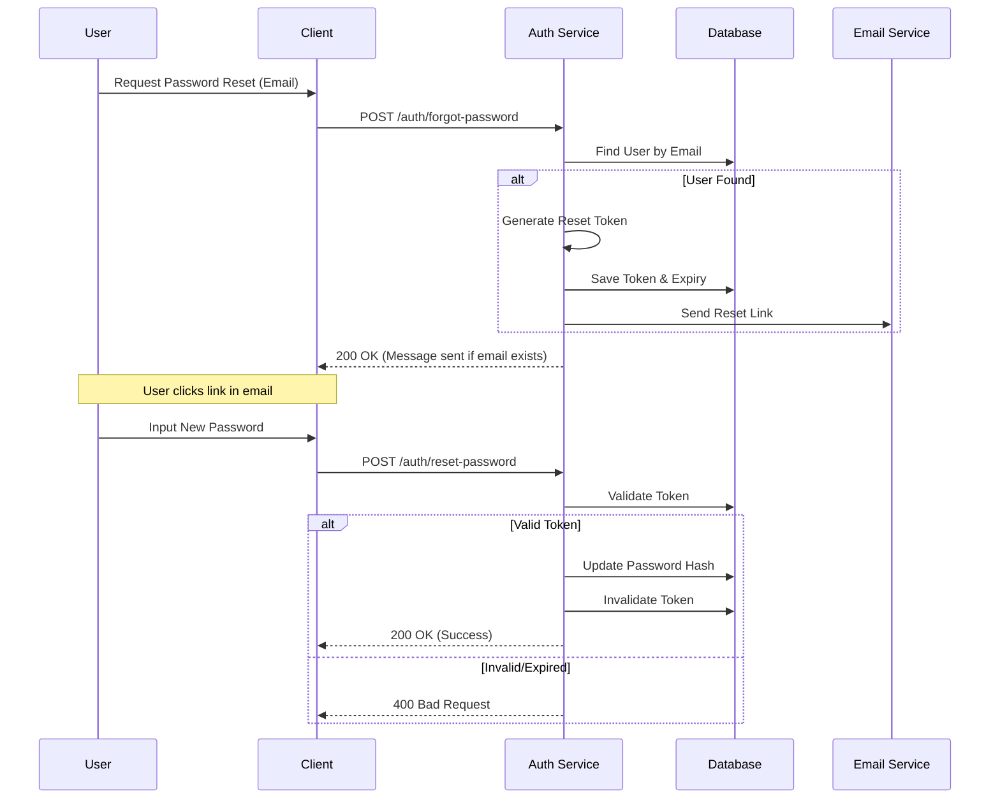

# Authentication Specification

> Dokumen ini menjelaskan detail spesifikasi teknis untuk fitur Authentication (Login, Register, Forgot Password).

---

## 1. User Stories

| ID | Role | Goal | Benefit |
| :--- | :--- | :--- | :--- |
| US-01 | Guest | Mendaftar akun baru | Dapat mengakses fitur sistem |
| US-02 | Guest | Melakukan login | Mendapatkan akses ke akun pribadi |
| US-03 | Guest | Mereset password yang lupa | Memulihkan akses ke akun |
| US-07 | User | Melakukan logout | Mengamankan akun saat selesai menggunakan |
| US-08 | User | Refresh Token | Memperpanjang sesi tanpa login ulang |

---

## 2. Business Flow

### 2.1 Login Flow



### 2.2 Register Flow



### 2.3 Forgot Password Flow



---

## 3. API Schema

### 3.1 Register
- **Endpoint:** `POST /api/v1/auth/register`
- **Request:**
  ```json
  {
    "email": "user@example.com",
    "password": "securePassword123",
    "full_name": "John Doe"
  }
  ```
- **Response (201 Created):**
  ```json
  {
    "id": "uuid-...",
    "email": "user@example.com",
    "message": "Registration successful"
  }
  ```

### 3.2 Login
- **Endpoint:** `POST /api/v1/auth/login`
- **Request:**
  ```json
  {
    "email": "user@example.com",
    "password": "securePassword123"
  }
  ```
- **Response (200 OK):**
  ```json
  {
    "access_token": "eyJhbG...",
    "refresh_token": "eyJhbG...",
    "expires_in": 3600
  }
  ```

### 3.3 Forgot Password
- **Endpoint:** `POST /api/v1/auth/forgot-password`
- **Request:** `{"email": "user@example.com"}`
- **Response:** `{"message": "If email exists, reset link sent."}`

### 3.4 Reset Password
- **Endpoint:** `POST /api/v1/auth/reset-password`
- **Request:**
  ```json
  {
    "token": "reset-token-xyz",
    "new_password": "newSecurePassword1"
  }
  ```
- **Response:** `{"message": "Password updated successfully."}`
