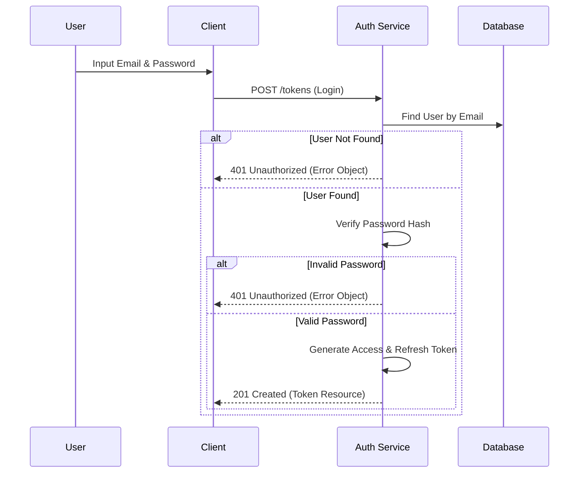
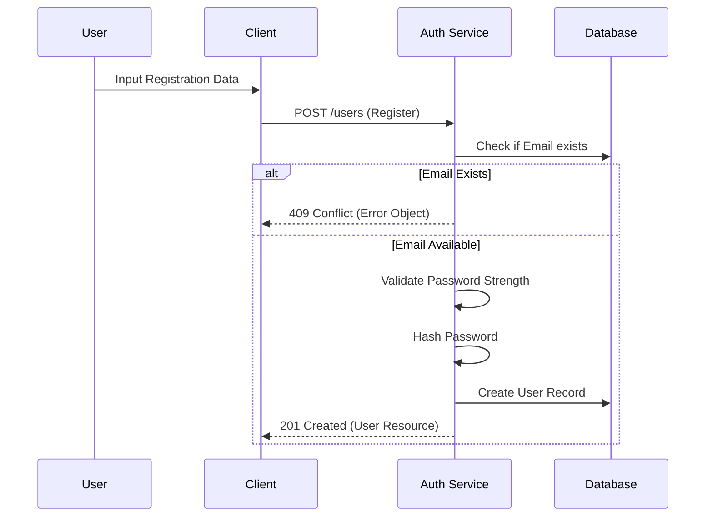
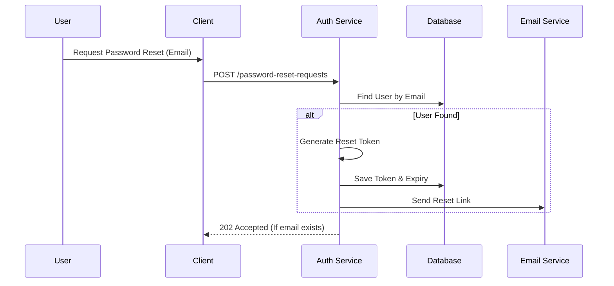

# Authentication Specification

> Dokumen ini menjelaskan detail spesifikasi teknis untuk fitur Authentication (Login, Register, Forgot Password).

---

## Header & Navigation

- [Back to IAM Overview](./overview.md)
- [Link ke All Modules](../../README.md)

---

## 1. Feature Overview

- **Deskripsi singkat:** Fitur untuk menangani verifikasi identitas pengguna (siapa mereka) dan pengelolaan sesi akses.
- **Posisi dalam modul:** Komponen inti dari IAM & Security.
- **Hubungan dengan domain bisnis utama:** Gerbang utama bagi pengguna untuk mengakses layanan.

---

## 2. Purpose & Business Value

### 2.1 Tanggung Jawab Utama
- Memvalidasi kredensial pengguna (email/password).
- Menerbitkan dan memvalidasi token akses (JWT).
- Mengelola pemulihan akun (lupa password).

### 2.2 Nilai Bisnis
- **Security:** Mencegah akses tidak sah melalui otentikasi yang kuat.
- **User Experience:** Memberikan akses aman dan persisten (refresh token).
- **Compliance:** Audit trail untuk setiap aktivitas login/logout.

---

## 3. Scope

### 3.1 In-Scope
- Registrasi pengguna baru.
- Login (Generate Token).
- Logout (Revoke Token).
- Refresh Token.
- Forgot & Reset Password.

### 3.2 Out-of-Scope
- SSO (Single Sign-On).
- MFA (Multi-Factor Authentication).

---

## 4. User Stories

| ID | Role | Goal | Benefit |
| :--- | :--- | :--- | :--- |
| US-01 | Guest | Mendaftar akun baru | Dapat mengakses fitur sistem |
| US-02 | Guest | Melakukan login | Mendapatkan akses ke akun pribadi |
| US-03 | Guest | Mereset password yang lupa | Memulihkan akses ke akun |
| US-07 | User | Melakukan logout | Mengamankan akun saat selesai menggunakan |
| US-08 | User | Refresh Token | Memperpanjang sesi tanpa login ulang |

---

## 5. Business Flow & Rules

### 5.1 Business Flow

#### Login Flow

#### Register Flow

#### Forgot Password Flow

### 5.2 Business Rules
- **Password Policy:** Minimal 8 karakter, kombinasi huruf besar, kecil, dan angka.
- **Session Timeout:** Access Token berlaku 1 jam, Refresh Token berlaku 30 hari.
- **Lockout:** Akun dikunci sementara setelah 5x percobaan login gagal (opsional/future).

---

## 6. Data Model

Referensi ke entitas utama yang terlibat:
- `Users`
- `Tokens` (Refresh Tokens, Reset Tokens)

Lihat [IAM Overview - ERD](./overview.md#6-data-model) untuk diagram lengkap.

---

## 7. API Specification

> Detail spesifikasi API dipisahkan ke dalam dokumen tersendiri.
> Silakan rujuk ke file [API Authentication](../../api/iam-security/api-authentication.md).

---

## 8. Dependencies

### 8.1 Required Modules
- **Database:** Penyimpanan user dan token.
- **Email Service:** Pengiriman link reset password.

---

## 9. Integration Points

### 9.1 Inbound
- **Public API:** Diakses oleh Frontend / Mobile App.

### 9.2 Outbound
- **Email Service:** `sendEmail(to, subject, body)`

---

## 10. Compliance & Audit

- **Encryption:** Password di-hash menggunakan Bcrypt/Argon2.
- **Logging:** Login sukses dan gagal dicatat (IP Address, User Agent).

---

## 11. Implementation Tasks

**Strict Rule:** Every backend task that involves a user interface must have a corresponding frontend task.

| Task ID | Platform | Status | Description |
| :--- | :--- | :--- | :--- |
| AUTH-01 | Backend | Todo | Implement `POST /users` (Register) |
| AUTH-02 | Frontend | Todo | Implement Register Page with validation |
| AUTH-03 | Backend | Todo | Implement `POST /tokens` (Login) |
| AUTH-04 | Frontend | Todo | Implement Login Page with token storage |
| AUTH-05 | Backend | Todo | Implement Password Reset Logic |
| AUTH-06 | Frontend | Todo | Implement Forgot Password & Reset Password Pages |
