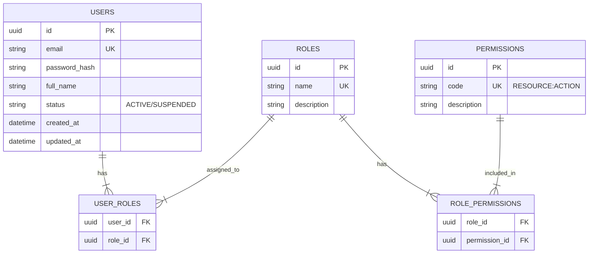

# IAM & Security Module Documentation

> Dokumen ini menjelaskan spesifikasi teknis dan fungsional untuk modul Identity and Access Management (IAM) & Security.

---

## Header & Navigation

- [Back to Module Overview](../README.md)
- [Link ke All Modules](../../README.md)

---

## 1. Module Overview

- **Deskripsi singkat modul:** Modul IAM & Security bertanggung jawab atas manajemen identitas pengguna, otentikasi (verifikasi identitas), dan otorisasi (hak akses) dalam sistem.
- **Posisi modul dalam sistem:** Core Module. Modul ini menjadi fondasi keamanan bagi modul-modul lain.
- **Hubungan dengan domain bisnis utama:** Melindungi data bisnis dan memastikan bahwa fitur hanya diakses oleh pihak yang berwenang.

---

## 2. Purpose & Business Value

### 2.1 Tanggung Jawab Utama
- Mengelola data pengguna (User Management).
- Mengelola peran dan hak akses (Role & Permission Management).
- Menangani proses Login, Register, dan Lupa Password.
- Memvalidasi token akses (Authorization).

### 2.2 Nilai Bisnis
- **Compliance:** Memenuhi standar keamanan data dan privasi pengguna (misal: GDPR/PDP).
- **Risk reduction:** Mencegah akses tidak sah yang berpotensi merugikan bisnis.
- **Operational efficiency:** Sentralisasi manajemen akses memudahkan administrasi.
- **Data accuracy:** Memastikan data pengguna tersimpan dengan struktur yang benar.

---

## 3. Scope

### 3.1 In-Scope
- **User Management:** Create, Read, Update, Delete, Suspend/Activate User.
- **Role Management:** CRUD Roles (e.g., Admin, User, Manager).
- **Permission Management:** CRUD Permissions, Assign Permissions to Roles.
- **Authentication:**
    - Register (Sign Up)
    - Login (Sign In)
    - Forgot Password & Reset Password
    - Logout
    - Refresh Token

### 3.2 Out-of-Scope
- **Biometric Authentication:** (Fase 2)
- **Social Login (Google/FB):** (Fase 2)
- **Multi-Factor Authentication (MFA):** (Fase 2)

---

## 4. User Stories

| ID | Role | Goal | Benefit |
| :--- | :--- | :--- | :--- |
| US-01 | Guest | Mendaftar akun baru | Dapat mengakses fitur sistem |
| US-02 | Guest | Melakukan login | Mendapatkan akses ke akun pribadi |
| US-03 | Guest | Mereset password yang lupa | Memulihkan akses ke akun |
| US-04 | Admin | Membuat Role baru | Mengelompokkan hak akses pengguna |
| US-05 | Admin | Menetapkan Permission ke Role | Mengatur apa yang bisa dilakukan oleh Role tertentu |
| US-06 | Admin | Mengelola User (Edit/Delete/Block) | Menjaga keamanan dan validitas data pengguna |

---

## 5. Business Flow & Rules

### 5.1 Business Flow

#### 5.1.1 Authentication Flow (Login)
1. User mengirim email & password.
2. System memvalidasi kredensial.
3. Jika valid, System mengembalikan `Access Token` dan `Refresh Token`.

#### 5.1.2 Registration Flow
1. User mengirim data diri (Email, Password, Name).
2. System memvalidasi format email dan kekuatan password.
3. System mengecek apakah email sudah terdaftar.
4. System membuat akun dengan status `Active` (atau `Pending Verification` jika perlu email verify).

#### 5.1.3 Forgot Password Flow
1. User request lupa password dengan email.
2. System mengirim link/token reset password ke email.
3. User menginput password baru menggunakan token tersebut.
4. System mengupdate password user.

### 5.2 Business Rules & Functional Requirements

#### 5.2.1 Domain Rules
- **Unique Email:** Email pengguna harus unik di seluruh sistem.
- **Password Policy:** Minimal 8 karakter, harus mengandung huruf dan angka (contoh).
- **Role Assignment:** Setiap user minimal memiliki 1 role (default: User).

---

## 6. Data Model

### 6.1 Entity Relationship Diagram (ERD)



### 6.2 Entity Definition

- **USERS:** Menyimpan identitas pengguna.
- **ROLES:** Menyimpan definisi peran (e.g., `SUPER_ADMIN`, `EDITOR`).
- **PERMISSIONS:** Menyimpan definisi hak akses granular (e.g., `USER:CREATE`, `ARTICLE:DELETE`).

---

## 7. Feature List

### 7.1 Feature Summary
- **Authentication System:** Secure JWT-based auth.
- **RBAC (Role-Based Access Control):** Flexible permission management.

### 7.2 Feature Details & API Schema

#### 7.2.1 Register
- **Endpoint:** `POST /api/v1/auth/register`
- **Request:**
  ```json
  {
    "email": "user@example.com",
    "password": "securePassword123",
    "full_name": "John Doe"
  }
  ```
- **Response (201 Created):**
  ```json
  {
    "id": "uuid-...",
    "email": "user@example.com",
    "message": "Registration successful"
  }
  ```

#### 7.2.2 Login
- **Endpoint:** `POST /api/v1/auth/login`
- **Request:**
  ```json
  {
    "email": "user@example.com",
    "password": "securePassword123"
  }
  ```
- **Response (200 OK):**
  ```json
  {
    "access_token": "eyJhbG...",
    "refresh_token": "eyJhbG...",
    "expires_in": 3600
  }
  ```

#### 7.2.3 Forgot Password
- **Endpoint:** `POST /api/v1/auth/forgot-password`
- **Request:** `{"email": "user@example.com"}`
- **Response:** `{"message": "If email exists, reset link sent."}`

#### 7.2.4 User Management (Admin)
- **Create User:** `POST /api/v1/users`
- **List Users:** `GET /api/v1/users`
- **Update User:** `PUT /api/v1/users/:id`
- **Delete User:** `DELETE /api/v1/users/:id`
- **Assign Role:** `POST /api/v1/users/:id/roles`

#### 7.2.5 Role & Permission Management (Admin)
- **Create Role:** `POST /api/v1/roles`
- **Assign Permission:** `POST /api/v1/roles/:id/permissions`
- **List Permissions:** `GET /api/v1/permissions`

---

## 8. Dependencies

### 8.1 Required Modules
- **Database Module:** Untuk koneksi ke database (PostgreSQL/MySQL).
- **Email Service:** Untuk mengirim email reset password & verifikasi.

---

## 10. Compliance & Audit

### 10.1 Regulatory Compliance
- Password harus di-hash (misal: bcrypt/argon2).
- Data sensitif tidak boleh dikirim via log.

### 10.3 Audit Trail Requirements
- Login activities (IP address, Timestamp).
- Role changes (Who changed who).

---

## 15. Implementation Tasks

| Task ID | Platform | Status | Description |
| :--- | :--- | :--- | :--- |
| IAM-01 | Backend | Todo | Setup database schema (Users, Roles, Permissions). |
| IAM-02 | Backend | Todo | Implement Register API. |
| IAM-03 | Backend | Todo | Implement Login API & JWT Generation. |
| IAM-04 | Backend | Todo | Implement Forgot Password Logic. |
| IAM-05 | Backend | Todo | Implement CRUD Users, Roles, Permissions. |
| IAM-06 | Backend | Todo | Middleware for Role/Permission Checking. |
