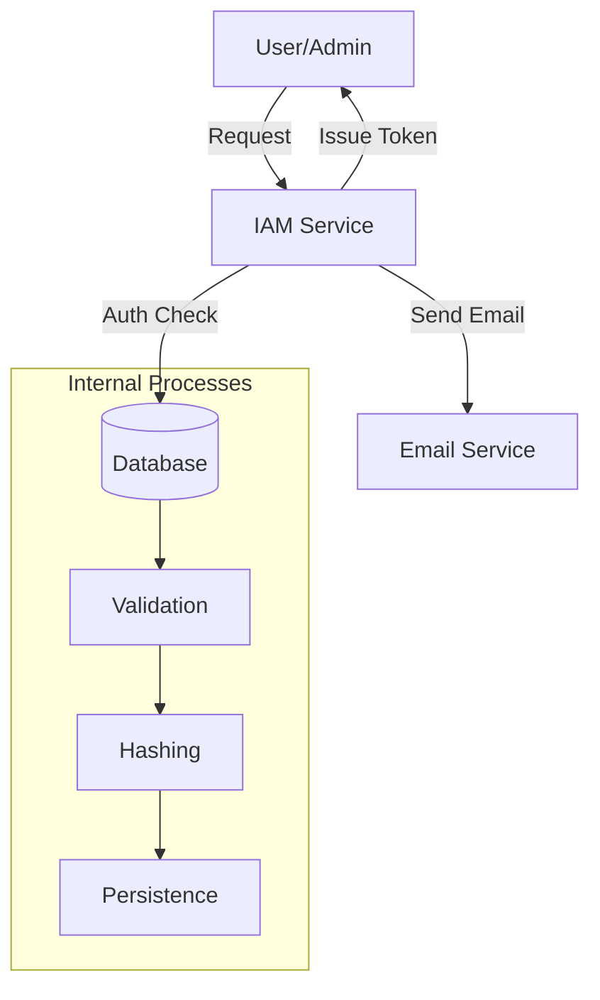
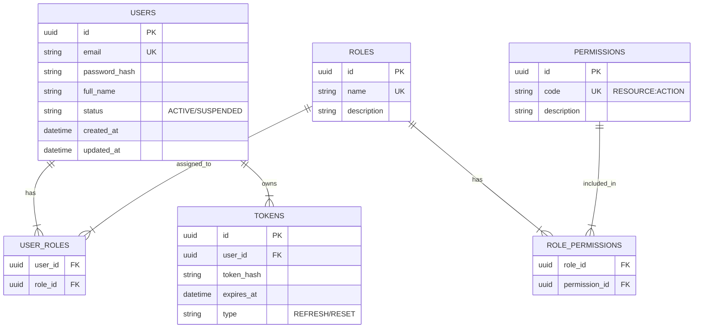

# IAM & Security Module Overview

> Dokumen ini memberikan gambaran umum untuk modul Identity and Access Management (IAM) & Security.

---

## Header & Navigation

- [Back to Module Overview](../README.md)
- [Link ke All Modules](../../README.md)

---

## 1. Module Overview

- **Deskripsi singkat modul:** Modul IAM & Security bertanggung jawab atas manajemen identitas pengguna, otentikasi (verifikasi identitas), dan otorisasi (hak akses) dalam sistem.
- **Posisi modul dalam sistem:** Core Module. Modul ini menjadi fondasi keamanan bagi modul-modul lain.
- **Hubungan dengan domain bisnis utama:** Melindungi data bisnis dan memastikan bahwa fitur hanya diakses oleh pihak yang berwenang.

---

## 2. Purpose & Business Value

### 2.1 Tanggung Jawab Utama
- Mengelola data pengguna, peran, dan hak akses.
- Menangani proses Login, Register, dan keamanan akun.
- Menyediakan mekanisme otentikasi (Token-based) untuk modul lain.

### 2.2 Nilai Bisnis
- **Compliance:** Memenuhi standar keamanan data dan privasi pengguna (misal: GDPR/PDP).
- **Risk reduction:** Mencegah akses tidak sah yang berpotensi merugikan bisnis.
- **Operational efficiency:** Sentralisasi manajemen akses memudahkan administrasi.
- **Data accuracy:** Memastikan integritas data identitas pengguna.
- **Strategic enablement:** Memungkinkan implementasi fitur berbasis peran (RBAC) di seluruh sistem.

---

## 3. Scope

### 3.1 In-Scope
- **Authentication:** Login, Register, Forgot/Reset Password, Logout, Refresh Token.
- **User Management:** CRUD Users, Activation/Deactivation.
- **Role & Permission:** CRUD Roles, Permission Assignment, Role Assignment.
- **Security:** Password Hashing, JWT Token Generation & Validation.

### 3.2 Out-of-Scope
- **Profile Management:** Detail profil pengguna (alamat, bio, dll) mungkin ditangani modul User Profile terpisah, namun data akun dasar ada di sini.
- **Third-party OAuth (MVP):** Login via Google/Facebook (fase selanjutnya).
- **MFA (Multi-Factor Authentication):** Belum termasuk dalam scope MVP.

---

## 4. User Stories

Daftar kebutuhan berbasis role.

| ID | Role | Goal | Benefit |
| :--- | :--- | :--- | :--- |
| US-01 | Guest | Mendaftar akun baru | Dapat mengakses fitur sistem |
| US-02 | Guest | Melakukan login | Mendapatkan akses ke akun pribadi |
| US-03 | Guest | Mereset password yang lupa | Memulihkan akses ke akun |
| US-04 | Admin | Membuat Role baru | Mengelompokkan hak akses pengguna |
| US-05 | Admin | Menetapkan Permission ke Role | Mengatur apa yang bisa dilakukan oleh Role tertentu |
| US-06 | Admin | Mengelola User (Edit/Delete/Block) | Menjaga keamanan dan validitas data pengguna |
| US-07 | User | Melakukan logout | Mengamankan akun saat selesai menggunakan |
| US-08 | User | Refresh Token | Memperpanjang sesi tanpa login ulang |
| US-09 | Admin | Melihat daftar user | Memantau pertumbuhan pengguna |
| US-10 | User | Mengupdate profil sendiri | Menjaga data diri tetap akurat |
| US-11 | Admin | Assign Role ke User | Memberikan wewenang kepada user |

---

## 5. Business Flow & Rules

### 5.1 Business Flow
Berikut adalah diagram konteks level tinggi untuk modul IAM. Untuk detail alur (Login, Register, dsb), lihat spesifikasi masing-masing fitur.

Detail Flows:
- [Authentication Flows](./authentication.md#2-business-flow)
- [User Management Flows](./user-management.md#2-business-flow)
- [Role Assignment Flows](./role-permission-management.md#2-business-flow)

### 5.2 Business Rules & Functional Requirements

#### 5.2.1 Domain Rules
- **Unique Email:** Setiap pengguna harus memiliki email yang unik.
- **Strong Password:** Password minimal 8 karakter, mengandung huruf besar, kecil, dan angka.
- **Token Expiry:** Access token berlaku 1 jam, Refresh token berlaku 30 hari.

#### 5.2.2 Financial / Operational Rules
- N/A for this module.

---

## 6. Data Model

### 6.1 Entity Relationship Diagram (ERD)

### 6.2 Entity Definition
- **Users:** Entitas utama pengguna.
- **Roles:** Definisi peran (e.g., Admin, Editor, Viewer).
- **Permissions:** Granular access control (e.g., `ARTICLE:CREATE`).
- **Tokens:** Menyimpan refresh token atau reset password token untuk validasi.

---

## 7. Feature List

### 7.1 Feature Summary
- **Authentication:** Login, Register, Logout, Password Recovery.
- **User Administration:** Manage users status and details.
- **RBAC:** Role-Based Access Control management.

### 7.2 Feature Details
Silakan merujuk ke dokumen spesifikasi detail berikut:
- **[Authentication Specification](./authentication.md)**
- **[User Management Specification](./user-management.md)**
- **[Role & Permission Management Specification](./role-permission-management.md)**

---

## 8. Dependencies

### 8.1 Required Modules
- **Database Module:** Koneksi ke database (PostgreSQL direkomendasikan).
- **Email Service:** Diperlukan untuk mengirim email verifikasi dan reset password.

### 8.2 Optional Modules
- **Notification Service:** Jika ingin mengirim notifikasi login via SMS/WA.

### 8.3 Data Dependencies
- **Data inbound:** User input (Email, Password).
- **Referenced entities:** None (IAM is foundational).

---

## 9. Integration Points

### 9.1 Inbound Integration
- **Source module:** Semua modul yang membutuhkan otentikasi.
- **Data:** Bearer Token (JWT).
- **Integration pattern:** Synchronous HTTP Call (Middleware Validation).

### 9.2 Outbound Integration
- **Target module:** Email Service.
- **Data exposed:** User Email, Token Link.

### 9.3 Published Events
- **Event name:** `USER_CREATED`
- **Trigger:** Pendaftaran sukses.
- **Payload:** `{ "user_id": "...", "email": "..." }`
- **Subscribers:** User Profile Module, Analytics.

---

## 10. Compliance & Audit

### 10.1 Regulatory Compliance
- **GDPR/PDP:** Data password harus di-hash (Bcrypt/Argon2). Data pribadi harus bisa dihapus (Right to be forgotten).

### 10.2 Data Retention & Archiving
- **Retention period:** Data user disimpan selama akun aktif.
- **Deletion:** Soft delete untuk menjaga referensi history, hard delete jika diminta user (sesuai regulasi).

### 10.3 Audit Trail Requirements
- **Audited fields:** Login attempts, Password changes, Role changes.
- **Actor:** User ID or IP Address.
- **Timestamp:** UTC.

---

## 11. Data Ownership & Lifecycle

### 11.1 Entity Ownership
- **Owner:** IAM Team / Security Admin.
- **Read / Write permission:** User can read/write own data. Admin can read/write all.

### 11.2 Lifecycle Status
- **Status list:** `PENDING_VERIFICATION`, `ACTIVE`, `SUSPENDED`, `DELETED`.
- **Transition diagram:** `PENDING` -> `ACTIVE` -> `SUSPENDED` -> `ACTIVE`.

### 11.3 Status Transition Rules
- **Trigger:** Admin action or Email Verification.
- **Validation:** Cannot suspend Super Admin.

### 11.4 Data Update Permissions
- **Role vs Field matrix:**
  - **User:** Can update `full_name`, `password`.
  - **Admin:** Can update `status`, `roles`.

---

## 12. Extensibility Notes

### 12.1 Configuration & Customization
- **JWT Secret:** Configurable via Environment Variable.
- **Token Expiry:** Configurable.

### 12.2 Future Enhancements
- SSO (Single Sign-On).
- MFA (Google Authenticator).

### 12.3 Integration Extensibility
- Custom Auth Providers (LDAP).

### 12.4 Localization & Multi-Region Support
- Error messages support i18n.

---

## 13. Mandatory Invariants
- `email` must always be unique in active users.
- A user must have at least one role (default: `USER`).
- Password hash must never be returned in API response.

---

## 14. UI/UX Requirements

### 14.1 Web / Admin
- Login Page: Simple, fast.
- User Table: Filterable, sortable.
- Role Manager: Drag and drop permission assignment (nice to have).

### 14.2 Mobile (if applicable)
- Biometric Login (future).

---

## 15. Implementation Tasks

| Task ID | Platform | Status | Description |
| :--- | :--- | :--- | :--- |
| IAM-01 | Backend | Todo | Setup database schema (Users, Roles, Permissions). |
| IAM-02 | Backend | Todo | Implement JSON:API compliant Authentication endpoints. |
| IAM-03 | Backend | Todo | Implement JSON:API compliant User Management endpoints. |
| IAM-04 | Backend | Todo | Implement JSON:API compliant Role & Permission endpoints. |
